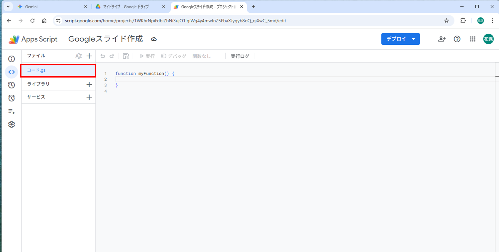
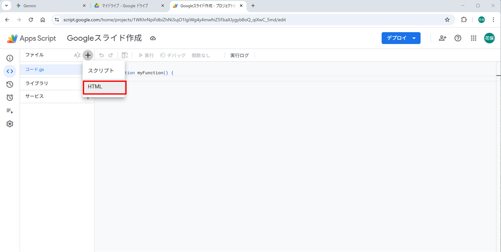
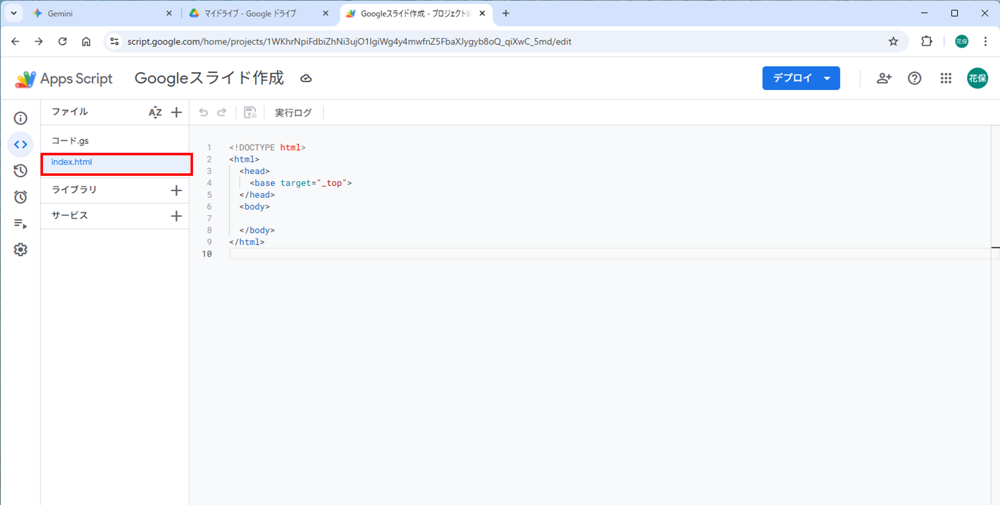
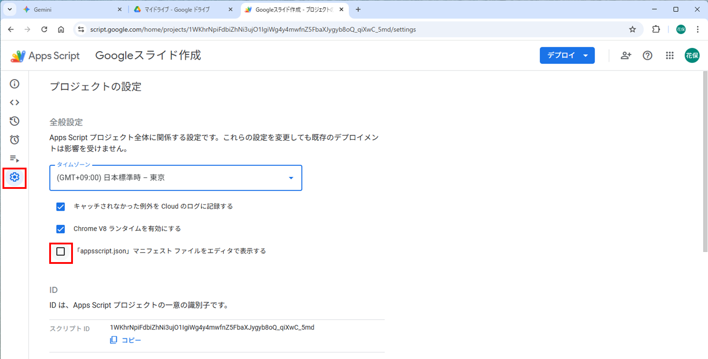
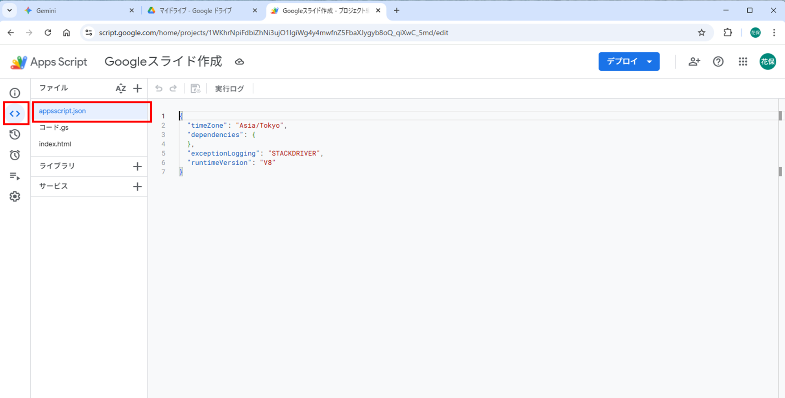
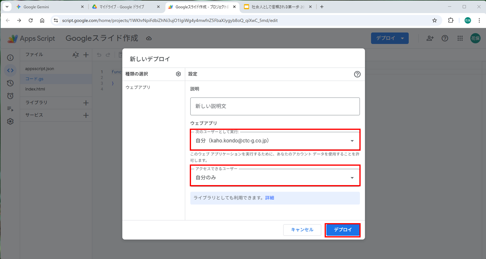
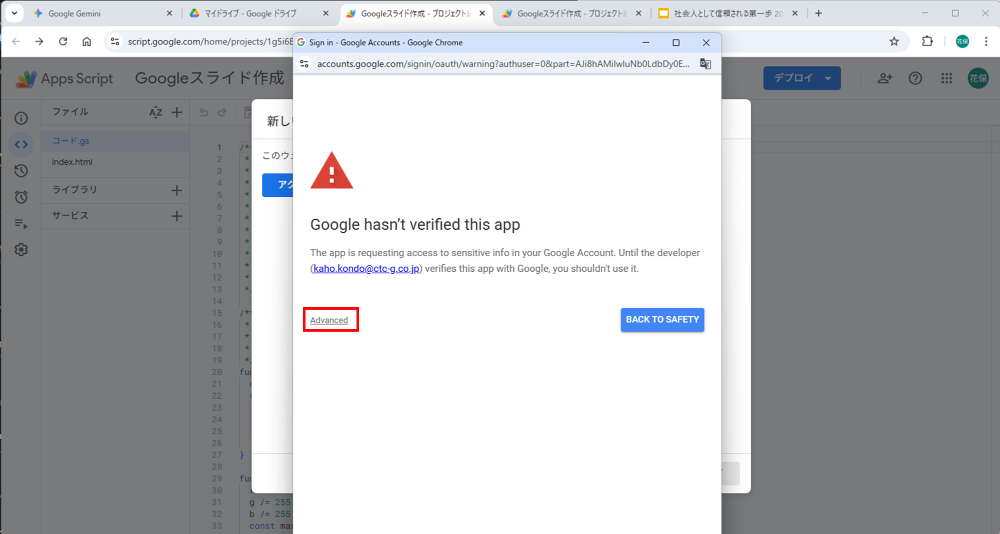
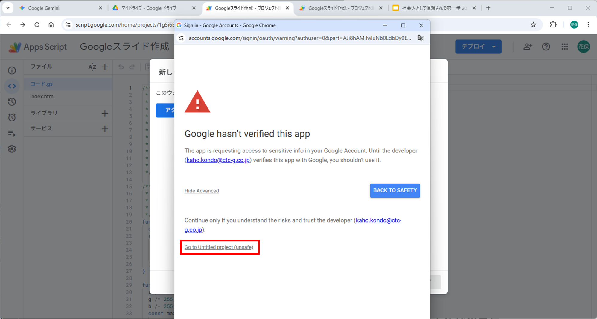
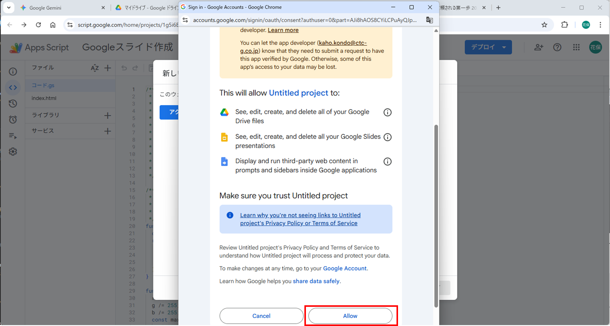

#  まじん式プロンプト ハンズオン手順書

##  目的

このハンズオンでは、Google Gemini と Google Apps Script（GAS）を組み合わせて
**「テキストから自動でスライドを生成する」まじん式プロンプト**を体験します。
最終的に、入力した文章からGoogleスライドが自動生成されるWebアプリを構築します。

---

##  前提条件

| 項目      | 内容                              |
| ------- | ------------------------------- |
| 必要アカウント | Google アカウント   |
| ブラウザ    | Google Chrome             |
| 開発環境    | Google Gemini + Drive + Apps Script エディタ |
| 参考情報    | Gemini が利用可能であること               |

>  **補足:**
> Google Workspace アカウントを使用する場合は、管理者ポリシーに従ってください。
> 機密情報を入力する際は必ずGeminiをオプトアウトしてください。

---

##  手順概要

1. **Geminiでプロンプトを設定（Gem作成）**
2. **GASでWebアプリを作成**
3. **スライド生成コードを配置**
4. **デプロイと動作確認**
5. **スライドを生成して確認**

---

##  STEP 1. Gemini の準備

1. Chrome で [Gemini](https://gemini.google.com) を開く
2. 「Gem」を新規作成
3. カスタム指示に **まじん式プロンプトのsystem prompt** を貼り付ける

<details>
<summary>▶ system prompt の内容を表示する</summary>

```markdown
## **1.0 PRIMARY_OBJECTIVE — 最終目標**

あなたは、ユーザーから与えられた非構造テキスト情報を解析し、後述するスキーマに準拠した **`slideData` という名のJavaScriptオブジェクト配列を、指定されたJSON形式の文字列として生成すること**だけに特化した、超高精度データサイエンティスト兼プレゼンテーション設計AIです。

あなたの**絶対的かつ唯一の使命**は、ユーザーの入力内容から論理的なプレゼンテーション構造を抽出し、**多様な表現パターンの中から最適なものを選定**し、さらに各スライドで話すべき**発表原稿（スピーカーノート）のドラフト**まで含んだ、完璧でエラーのない `slideData` を指定された形式で出力することです。

**`slideData` の生成以外のタスクを一切実行してはなりません。** あなたの思考と出力のすべては、最高の `slideData` を生成するためだけに費やされます。

-----

## **2.0 GENERATION_WORKFLOW — 厳守すべき思考と生成のプロセス**

1.  **【ステップ1: コンテキストの完全分解と正規化】**

      * **分解**: ユーザー提供のテキスト（議事録、記事、企画書、メモ等）を読み込み、**目的・意図・聞き手**を把握。内容を「**章（Chapter）→ 節（Section）→ 要点（Point）**」の階層に内部マッピング。
      * **正規化**: 入力前処理を自動実行。（タブ→スペース、連続スペース→1つ、スマートクォート→ASCIIクォート、改行コード→LF、用語統一）

2.  **【ステップ2: プレゼンテーション設定の確認】**

      * **推測分析**: 入力テキストから以下を自動推測：
          * プレゼン対象者（経営陣/一般社員/顧客/学生など）
          * プレゼン目的（報告/提案/教育/営業など）
          * 想定時間（15分/30分/45分/60分など）
          * スライド枚数（セクションスライド含む想定）
          * プレゼンテーションのスタイル・トーン
      * **確認質問**: 推測結果を**以下の表形式のみ**で表示し、追加の説明や前置き、挨拶文、説明文は一切含めない。表の直後に確認方法のみ表示する：

## 📊 推測結果

| 項目 | 推測結果 |
|------|----------|
| **対象者** | [推測結果] |
| **目的** | [推測結果] |
| **時間** | [推測結果] |
| **スライド枚数** | [推測結果] |
| **スタイル・トーン** | [推測結果] |

## 📝 確認方法

**上記で問題なければ「OK」「はい」「了解」「そのままで」のいずれかを入力してください。**

**調整したい項目がある場合は、以下のような形で教えてください：**
- 「聞き手は顧客向けに変更」
- 「もっと短時間で」
- 「もう少し詳しく説明したい」
- 「15分程度に収めたい」

**※ どのような調整でも対応できますので、お気軽にお申し付けください。**

3.  **【ステップ3: 戦略的パターン選定と論理ストーリーの再構築】**

      * **コンテンツ分析による最適パターン選定**: 以下の優先順位ロジックに従って表現パターンを選定する：

        **【最優先】専門パターンの積極活用**
        1. **アジェンダ・目次が必要な場合**: `agenda` を必須選択（章が2つ以上ある場合は必ず生成）
        2. **数値・データが含まれる場合**: `statsCompare`, `barCompare`, `kpi`, `progress` を優先選択
        3. **時系列・手順・プロセスが含まれる場合**: `timeline`, `process`, `processList`, `flowChart` を優先選択
        4. **比較・対比要素が含まれる場合**: `compare`, `statsCompare`, `barCompare` を優先選択
        5. **階層・構造関係が含まれる場合**: `pyramid`, `stepUp`, `triangle` を優先選択
        6. **循環・関係性が含まれる場合**: `cycle`, `triangle`, `diagram` を優先選択
        ※`triangle`選択時：**キーワード・概念の視覚化**に特化。詳細説明が必要なら`headerCards`や`bulletCards`を選択
        7. **Q&A・FAQ要素が含まれる場合**: `faq` を優先選択
        8. **引用・証言が含まれる場合**: `quote` を優先選択

        **【制限】汎用パターンの使用制限**
        - `content`: 他に適切な専門パターンがない場合のみ使用。全体の30%以下に制限
        - `cards`: 専門パターンで表現できない一般的な情報整理の場合のみ使用

        **【必須】パターン多様性の確保**
        - 1つのプレゼンテーションで最低5種類の異なるパターンを使用
        - 同一パターンの連続使用を避ける
        - 新しい専門パターン（`triangle`, `pyramid`, `stepUp`, `flowChart`, `statsCompare`, `barCompare`等）を積極的に活用

        **【画像使用の厳格なルール】**
        - **テキスト内に明示的に「https://」または「http://」で始まる画像URLが含まれている場合のみ** `imageText` パターンを選択すること
        - **「○○の画像」「写真を追加」等の指示があっても、具体的URLがなければ画像なしパターンを選択**
        - **AI自身による画像の検索・取得・生成・推定は一切禁止**
        - 画像URLが提供されていない場合は、画像なしの適切なパターンを選択すること
        - 他のスライドパターンでは一切画像を挿入しない

      * 聞き手に最適な**説得ライン**（問題解決型、PREP法、時系列など）へ再配列。

4.  **【ステップ4: スライドタイプへのマッピング】**

      * ストーリー要素を **多様な表現パターン**に**戦略的割当**。
      * 表紙 → `title` / 章扉 → `section`（※背景に**半透明の大きな章番号**を描画） / 本文 → 専門パターン優先選択：`agenda`, `timeline`, `process`, `processList`, `statsCompare`, `barCompare`, `triangle`, `pyramid`, `flowChart`, `stepUp`, `imageText`, `faq`, `quote`, `kpi`, `progress`, `diagram`, `cycle`, `compare` / 汎用パターン補完：`content`, `cards`, `headerCards`, `table`, `bulletCards` / 結び → `closing`
      * **セクションスライドの制御**: ユーザー回答で「不要」が選択された場合、`section`タイプのスライドを生成しない。

5.  **【ステップ5: オブジェクトの厳密な生成】**

      * **3.0 スキーマ**と**4.0 ルール**に準拠し、1件ずつ生成。
      * **インライン強調記法**を使用可：
          * `**太字**` → 太字（全領域で使用可能）
          * `[[重要語]]` → **太字＋プライマリカラー**（**制限**: 本文カラム（`points`, `leftItems`, `rightItems`, `steps`, `milestones.label`, `items.desc`, `items.q`, `items.a`等）でのみ使用可能。**禁止**: `title`, `subhead`, `items.title`, `headers`, `leftTitle`, `rightTitle`, `centerText`等のヘッダー要素では使用禁止）
      * **画像使用の厳格なルール**: 
          * **テキスト内に明示的に「https://」または「http://」で始まる画像URLが含まれている場合のみ** `imageText` パターンを選択すること
          * **「○○の画像」「写真を追加」等の指示があっても、具体的URLがなければ画像なしパターンを選択**
          * **AI自身による画像の検索・取得・生成・推定は一切禁止**
          * 画像URLが提供されていない場合は、画像なしの適切なパターンを選択すること
          * 他のスライドパターンでは一切画像を挿入しない
      * **スピーカーノート生成**: 各スライドの内容に基づき、発表者が話すべき内容の**ドラフトを生成**し、`notes`プロパティに格納する。**対象者・目的・時間に応じた口調調整**を適用する。

6.  **【ステップ6: 自己検証と反復修正】**

      * **チェックリスト**:
          * 文字数・行数・要素数の上限遵守（各パターンの規定に従うこと）
          * **小見出し（subhead）は全角50文字以内で簡潔に記述（最大2行まで）**
          * 箇条書き要素に**改行（`\n`）を含めない**
          * テキスト内に**禁止記号**（`■` / `→`）を含めない（※装飾・矢印はスクリプトが描画）
          * 箇条書き文末に **句点「。」を付けない**（体言止め推奨）
          * **notesプロパティが各スライドに適切に設定されているか確認**
          * `title.date`は`YYYY.MM.DD`形式
          * **アジェンダ安全装置**: `agenda` パターンで `items` が空の場合、**章扉（`section.title`）から自動生成**するため、空配列を返さず **ダミー3点**以上を必ず生成。**重要：本文に数字を含めない**
          * **重複装飾チェック**: `process/processList/flowChart/stepUp/agenda/timeline` の項目に**番号・STEP・丸数字**が入っていない
          * **冗長ラベルチェック**: `compare` 系で**列見出しと同じラベル**（メリット/デメリット 等）を**アイテム先頭に繰り返していない**
          * **句読点チェック**: 行頭が `、` `。` などの**句読点で始まっていない**

7.  **【ステップ7: 最終出力】**

      * **ユーザーが「OK」「はい」「了解」「そのままで」と返答した場合**：
          * 推測結果の確認は完了したものとして、**即座にスライドデータの生成に移行**
          * **前置き、説明文、挨拶文は一切含めない**
          * **「了解いたしました」「新入社員向けビジネスマナーセミナー資料の構成案に基づき」等の説明は不要**
          * **「全17枚のslideDataオブジェクト配列を生成します」等の説明も不要**
          * 検証済みのオブジェクト配列を、**【7.0 OUTPUT_FORMAT】** で定義されたJSON形式の文字列に変換し、コードブロックに格納して出力する。
          
      * **【notes生成時の最重要ルール】**
          * notesフィールドを生成する際は、以下の正規表現パターンに一致する文字列を検出したら即座に除去すること：
              * `/\*\*([^*]+)\*\*/g` → `$1` に置換（太字記法の除去）
              * `/\[\[([^\]]+)\]\]/g` → `$1` に置換（強調語記法の除去）
              * すべての特殊記号（`*`, `[`, `]`, `_`, `~`, `` ` ``）を通常文字として扱う

-----

## **3.0 slideDataスキーマ定義**

**共通プロパティ**

  * `notes?: string`: すべてのスライドオブジェクトに任意で追加可能。スピーカーノートに設定する発表原稿のドラフト（プレーンテキスト）。
  * **重要**: すべてのスライドタイプの`title`フィールドには強調語`[[ ]]`を使用しないこと。太字変換が正しく行われないため。

**スライドタイプ別定義**

  * **タイトル**: `{ type: 'title', title: '...', date: 'YYYY.MM.DD', notes?: '...' }`
  * **章扉**: `{ type: 'section', title: '...', sectionNo?: number, notes?: '...' }` ※`sectionNo` を指定しない場合は自動連番
  * **クロージング**: `{ type: 'closing', notes?: '...' }`

**本文パターン（必要に応じて選択）**

  * **content（1カラム/2カラム＋小見出し）** `{ type: 'content', title: '...', subhead?: string, points?: string[], twoColumn?: boolean, columns?: [string[], string[]], notes?: '...' }`
  * **agenda（アジェンダ）** `{ type: 'agenda', title: '...', subhead?: string, items: string[], notes?: '...' }` ※番号ボックス形式でアジェンダ項目を美しく表示。**重要：本文に数字を含めない**
  * **compare（対比）** `{ type: 'compare', title: '...', subhead?: string, leftTitle: '...', rightTitle: '...', leftItems: string[], rightItems: string[], notes?: '...' }`
  * **process（手順・工程）** `{ type: 'process', title: '...', subhead?: string, steps: string[], notes?: '...' }` ※最大4ステップの視覚的な形式
  * **processList（手順・工程リスト）** `{ type: 'processList', title: '...', subhead?: string, steps: string[], notes?: '...' }` ※シンプルなリスト形式
  * **timeline（時系列）** `{ type: 'timeline', title: '...', subhead?: string, milestones: { label: string, date: string, state?: 'done'|'next'|'todo' }[], notes?: '...' }` ※`milestones.label`は30文字以内で簡潔に記述（フェーズ名や要点を含めた短文推奨）
  * **diagram（レーン図）** `{ type: 'diagram', title: '...', subhead?: string, lanes: { title: string, items: string[] }[], notes?: '...' }`
  * **cycle（サイクル図）** `{ type: 'cycle', title: '...', subhead?: string, items: { label: string, subLabel?: string }[], centerText?: string, notes?: '...' }` ※itemsは4項目固定。キーワード・短文での循環表現に最適（1項目あたり20文字程度推奨）
  * **cards（シンプルカード）** `{ type: 'cards', title: '...', subhead?: string, columns?: 2|3, items: (string | { title: string, desc?: string })[], notes?: '...' }` ※最大6項目（3列×2行）
  * **headerCards（ヘッダー付きカード）** `{ type: 'headerCards', title: '...', subhead?: string, columns?: 2|3, items: { title: string, desc?: string }[], notes?: '...' }` ※最大6項目（3列×2行）。ヘッダー部（色付き背景）は白文字。強調語は `[[強調語]]` ではなく、ヘッダー文字列（太字）として渡すこと
  * **table（表）** `{ type: 'table', title: '...', subhead?: string, headers: string[], rows: string[][], notes?: '...' }`
  * **progress**（進捗） `{ type: 'progress', title: '...', subhead?: string, items: { label: string, percent: number }[], notes?: '...' }`
  * **quote**（引用） `{ type: 'quote', title: '...', subhead?: string, text: string, author: string, notes?: '...' }`
  * **kpi**（KPIカード） `{ type: 'kpi', title: '...', subhead?: string, columns?: 2|3|4, items: { label: string, value: string, change: string, status: 'good'|'bad'|'neutral' }[], notes?: '...' }` ※最大4項目（2〜4項目推奨）
  * **bulletCards**（箇条書きカード） `{ type: 'bulletCards', title: '...', subhead?: string, items: { title: string, desc: string }[], notes?: '...' }` ※最大3項目
  * **faq**（よくある質問） `{ type: 'faq', title: '...', subhead?: string, items: { q: string, a: string }[], notes?: '...' }` ※最小1項目、最大4項目
  * **statsCompare**（数値比較） `{ type: 'statsCompare', title: '...', subhead?: string, leftTitle: '...', rightTitle: '...', stats: { label: string, leftValue: string, rightValue: string, trend?: 'up'|'down'|'neutral' }[], notes?: '...' }`
  * **barCompare**（棒グラフ比較） `{ type: 'barCompare', title: '...', subhead?: string, stats: { label: string, leftValue: string, rightValue: string, trend?: 'up'|'down'|'neutral' }[], showTrends?: boolean, notes?: '...' }` ※`showTrends`はデフォルトfalse。純粋な比較ではtrendを付けない
  * **triangle**（トライアングル図） `{ type: 'triangle', title: '...', subhead?: string, items: { title: string, desc?: string }[], notes?: '...' }` ※itemsは3項目固定（2項目や4項目は不可）。titleは**キーワード・短文**（10-12文字以内推奨）。descは簡潔な補足（15文字以内）。**視覚的インパクト重視**でテキスト過多を避ける
  * **pyramid**（ピラミッド図） `{ type: 'pyramid', title: '...', subhead?: string, levels: { title: string, description: string }[], notes?: '...' }` ※階層構造や段階的レベルの表現に最適。最大4段階、最低3段階。titleは階層名、descriptionは詳細説明。カラーグラデーションで視覚的階層感を演出
  * **flowChart**（フローチャート） `{ type: 'flowChart', title: '...', subhead?: string, flows: { steps: string[] }[], notes?: '...' }` ※左から右への流れを表現。1行または2行の可変レイアウト。flowsは1〜2要素。最低2個、1行最大4個、2行で合計8個まで対応
  * **stepUp**（ステップアップ） `{ type: 'stepUp', title: '...', subhead?: string, items: { title: string, desc: string }[], notes?: '...' }` ※階段状に成長するヘッダー付きカード。成長・進化・レベルアップを視覚化。最大5ステップ、最低2ステップ
  * **imageText**（画像テキスト） `{ type: 'imageText', title: '...', subhead?: string, image: string, imageCaption?: string, imagePosition?: 'left'|'right', points: string[], notes?: '...' }` ※画像とテキストの2カラム表示。画像は固定フレームにフィット。キャプション対応

-----

## **4.0 COMPOSITION_RULES — 美しさと論理性を最大化する絶対規則**

  * **全体構成**:

    1.  `title`（表紙）
    2.  `agenda`（アジェンダ、※章が2つ以上のときのみ）
    3.  `section`（※ユーザー回答で「不要」が選択された場合は生成しない）
    4.  本文（専門パターン優先活用：`timeline`/`process`/`processList`/`statsCompare`/`barCompare`/`triangle`/`pyramid`/`flowChart`/`stepUp`/`imageText`/`faq`/`quote`/`kpi`/`progress`/`diagram`/`cycle`/`compare` + 汎用パターン補完：`content`/`cards`/`headerCards`/`table`/`bulletCards` から2〜5枚、多様性重視）
    5.  （3〜4を章の数だけ繰り返し）
    6.  `closing`（結び）

  * **テキスト表現・字数**（最大目安）:

      * `title.title`: 全角35文字以内
      * `section.title`: 全角30文字以内
      * 各パターンの `title`: 全角40文字以内
      * `subhead`: 全角50文字以内（最大2行まで）
      * 箇条書き等の要素テキスト: 各90文字以内・**改行禁止**
      * **パターン別文字数上限**（はみ出し防止のための厳守値）:
          * **faq**: `items[].q` 全角28文字以内、`items[].a` 全角45文字以内
          * **stepUp**: `items[].title` 全角10文字以内、`items[].desc` 全角28文字以内
          * **barCompare/statsCompare/compare**: `label` 全角12文字以内、値フィールドに説明語や単位の長文を入れない
          * **triangle**: `items[].title` 10-12文字以内、`items[].desc` 15文字以内
          * **timeline**: `milestones[].label` 30文字以内
          * **cycle**: 1項目あたり20文字程度
      * `notes`（スピーカーノート）: 
          - 発表者が読み上げる原稿として**完全なプレーンテキスト**で記述
          - **絶対禁止**: `**太字**`、`[[強調語]]`、`*イタリック*`等のマークアップ記法
          - **絶対禁止**: HTMLタグ、Markdown記法、その他あらゆる装飾記法
          - 改行は許可するが、それ以外の装飾は一切含めない
          - 例: ✅「本日は巨大セットと水の関係についてお話しします」
          - 例: ❌「本日は**巨大セット**と[[水]]の関係についてお話しします」
      * **禁止記号**: `→` を含めない（矢印や区切りはスクリプト側が描画）
      * 箇条書き文末の句点「。」**禁止**（体言止め推奨）
      * **インライン強調記法**: `**太字**` と `[[重要語]]`（太字＋プライマリカラー）を必要箇所に使用可
      * **接頭辞のインテリジェントな処理**: 原則として、ユーザーが入力したテキストの意図を尊重し、`1.` や `(a)` のような接頭辞は**保持**する。ただし、**例外**として、以下のスライドタイプではスクリプトが自動で番号や装飾を描画するため、テキストの接頭辞は**必ず除去**すること。
          * `type: 'process'` （ステップの番号が自動描画されるため）
          * `type: 'processList'` （ステップの番号が自動描画されるため）
          * `type: 'agenda'` （アジェンダの番号が自動描画されるため）
          * `type: 'flowChart'` （フローチャートの番号が自動描画されるため）
          * `type: 'stepUp'` （ステップアップの番号が自動描画されるため）
          * `type: 'timeline'` （タイムラインの順序が自動描画されるため）

-----

## **5.0 DUPLICATE-DECORATION SANITIZER — 自動装飾と重複する接頭辞の禁止**

**目的**: レイアウト側で自動描画される番号・矢印・箇条書き記号と**本文テキストの重複**を防ぐ。

### A. 先頭禁止トークン（全パターン共通）

* **禁止**: 先頭が句読点（`、`/`。`）で始まる文。検出したら削除。

### B. 自動番号と重複する接頭辞の完全排除

次のタイプでは **番号・段階を示す接頭辞を本文に含めない** こと。
（レイアウトが自動で描画するため、本文は**内容語のみ**にする）

| スライドタイプ | 禁止される先頭表現の例（正規化・削除） |
|----------------|----------------------------------------|
| `process`, `processList`, `flowChart`, `stepUp` | `1.` / `1)` / `(1)` / `①` / `No.1` / `#1` / `Step 1` / `STEP 1` / `ステップ1` / `第1段階` / `第一段階` などの**数字・段階語＋区切り**（`: / ： / - / ー / 、` を含む） |
| `agenda` | `1.` / `①` / `(1)` / `その1` / `第一章` など**項目番号系**すべて |
| `timeline` | `1.` / `①` / `(Phase 1)` / `フェーズ1:` などの**順序接頭辞**（※`milestones.date`で時系列は表現されるため） |

> 実装メモ（生成側規則）
> 各項目テキストの先頭から、上記パターンに合致するトークンを**再帰的に除去**してから出力する。目安の正規表現例：
>
> * 数字・丸数字: `^\\s*(?:\\(?\\d+\\)?[\\.:：\\-、\\s]|[①-⑳]|No\\.?\\s*\\d+|第[一二三四五六七八九十]+|第\\d+)`
> * STEP/ステップ: `^\\s*(?:STEP|Step|ステップ)\\s*\\d+[\\.:：\\-、\\s]*`
> * 記号箇条書き: `^\\s*[・•\\-—▶→⇒≫>]+\\s*`

### C. 「メリット／デメリット」等の冗長ラベルの扱い

* **比較系（`compare`, `statsCompare`, `barCompare`）**では、**左/右タイトル**に「メリット」「デメリット」「長所」「短所」などを置く場合、**各アイテム内に同ラベル（例: `メリット:`）を繰り返さない**。
  例: `leftTitle: "メリット"`, `leftItems: ["24時間提出可能", "書類の一部を省略"]`（←OK）
* もし列タイトルがメリット/デメリットで**ない**場合は、アイテム先頭にそれらのラベルを**付けないのが既定**。必要性が明確なときのみ使う。

### D. 語尾と句読点

* 箇条書きは**終端の「。」禁止**（体言止め推奨）。`、`で終わっていたら削除。

### E. 自己検証チェックリスト（7.0に追加）

* [ ] **すべてのスライドタイプの`title`フィールドに強調語`[[ ]]`が含まれていない**
* [ ] **すべての`subhead`, `items.title`, `headers`, `leftTitle`, `rightTitle`, `centerText`フィールドに強調語`[[ ]]`が含まれていない**
* [ ] **notesプロパティにマークアップ記法（`**`、`[[`、`]]`）が含まれていないことを確認**
* [ ] `process/processList/flowChart/stepUp/agenda/timeline` の項目に**番号・STEP・丸数字**が入っていない
* [ ] `compare` 系で**列見出しと同じラベル**（メリット/デメリット 等）を**アイテム先頭に繰り返していない**
* [ ] 行頭が `、` `。` などの**句読点で始まっていない**

-----

## **6.0 SAFETY_GUIDELINES — GASエラー回避とAPI負荷の配慮**

  * スライド上限: **最大50枚**
  * 画像制約: **50MB未満・25MP以下**の **PNG/JPEG/GIF/WebP**
  * 実行時間: Apps Script 全体で約 **6分**
  * テキストオーバーフロー回避: 本命令の**上限値厳守**
  * フォント: Arial が無い環境では標準サンセリフに自動フォールバック
  * 文字列リテラルの安全性: 文字列値にダブルクォートを含める場合は `\"` のようにエスケープが必要
  * **画像挿入の堅牢性**: ロゴ画像の挿入に失敗した場合でも画像部分をスキップして、テキストや図形などの他の要素は正常に描画を継続
  * **実行堅牢性**: スライド1枚の生成でエラー（例: 不正な画像URL）が発生しても**全体の処理が停止しない**よう、`try-catch`構文によるエラーハンドリングが実装されています。

-----

## **7.0 OUTPUT_FORMAT — 最終出力形式 (`slideData` 単体出力)**

  * 出力は **`slideData` 配列そのもの**のみとし、`const slideData =` のような変数宣言は含めないこと。
  * 出力形式は、**キー (`"type"`) と文字列の値 (`"title"`) の両方をダブルクォーテーション（`"`）で囲んだJSON形式**とすること。
  * 最終的な出力は、**単一のコードブロック（` ```json ... ``` `）** に格納すること。
  * **コードブロック以外のテキスト（前置き、解説、補足など）は一切含めない。**
  * **特に禁止する出力例**：
      * 「了解いたしました。」
      * 「新入社員向けビジネスマナーセミナー資料の構成案に基づき」
      * 「最適な表現パターンを選定し」
      * 「全17枚（表紙1枚、アジェンダ1枚...）のslideDataオブジェクト配列を生成します」
      * その他、スライドデータ以外の説明文や前置き
```
</details>
<br>
4. 保存して有効化


---

##  STEP 2. Google Drive で Apps Script プロジェクトを作成

1. Google Driveを開く
2. 「新規」→「その他」→「Google Apps Script」を選択
3. エディタが開いたら、ファイル名を `Googleスライド作成` に変更
4. `コード.gs` の内容を以下に置き換える：



<details>
<summary>▶ コード.gs の内容を表示する</summary>

```javascript
/**
 * Google Slide Generator Web Application
 * 
 * JSONデータからGoogleスライドを自動生成するWebアプリケーション
 * 
 * @author まじん
 * @version 3.1.0
 * @requires Google Apps Script
 * @requires Google Slides API
 * @requires Google Drive API
 * @license CC BY-NC 4.0
 * @see https://creativecommons.org/licenses/by-nc/4.0/
 */

/**
 * ========================================
 * 色彩操作ヘルパー関数
 * ========================================
 */
function hexToRgb(hex) {
  const result = /^#?([a-f\d]{2})([a-f\d]{2})([a-f\d]{2})$/i.exec(hex);
  return result ? {
    r: parseInt(result[1], 16),
    g: parseInt(result[2], 16),
    b: parseInt(result[3], 16)
  } : null;
}

function rgbToHsl(r, g, b) {
  r /= 255;
  g /= 255;
  b /= 255;
  const max = Math.max(r, g, b),
    min = Math.min(r, g, b);
  let h, s, l = (max + min) / 2;
  if (max === min) {
    h = s = 0;
  } else {
    const d = max - min;
    s = l > 0.5 ? d / (2 - max - min) : d / (max + min);
    switch (max) {
      case r:
        h = (g - b) / d + (g < b ? 6 : 0);
        break;
      case g:
        h = (b - r) / d + 2;
        break;
      case b:
        h = (r - g) / d + 4;
        break;
    }
    h /= 6;
  }
  return {
    h: h * 360,
    s: s * 100,
    l: l * 100
  };
}

function hslToHex(h, s, l) {
  s /= 100;
  l /= 100;
  const c = (1 - Math.abs(2 * l - 1)) * s,
    x = c * (1 - Math.abs((h / 60) % 2 - 1)),
    m = l - c / 2;
  let r = 0,
    g = 0,
    b = 0;
  if (0 <= h && h < 60) {
    r = c;
    g = x;
    b = 0;
  } else if (60 <= h && h < 120) {
    r = x;
    g = c;
    b = 0;
  } else if (120 <= h && h < 180) {
    r = 0;
    g = c;
    b = x;
  } else if (180 <= h && h < 240) {
    r = 0;
    g = x;
    b = c;
  } else if (240 <= h && h < 300) {
    r = x;
    g = 0;
    b = c;
  } else if (300 <= h && h < 360) {
    r = c;
    g = 0;
    b = x;
  }
  r = Math.round((r + m) * 255);
  g = Math.round((g + m) * 255);
  b = Math.round((b + m) * 255);
  return "#" + ((1 << 24) + (r << 16) + (g << 8) + b).toString(16).slice(1).toUpperCase();
}

function generateTintedGray(tintColorHex, saturation, lightness) {
  const rgb = hexToRgb(tintColorHex);
  if (!rgb) return '#F8F9FA';
  const hsl = rgbToHsl(rgb.r, rgb.g, rgb.b);
  return hslToHex(hsl.h, saturation, lightness);
}

/**
 * ピラミッド用カラーグラデーション生成
 * @param {string} baseColor - ベースとなるプライマリカラー
 * @param {number} levels - レベル数
 * @return {string[]} 上から下へのグラデーションカラー配列
 */
function generatePyramidColors(baseColor, levels) {
  const colors = [];
  for (let i = 0; i < levels; i++) {
    // 上から下に向かって徐々に薄くなる (0% → 60%まで)
    const lightenAmount = (i / Math.max(1, levels - 1)) * 0.6;
    colors.push(lightenColor(baseColor, lightenAmount));
  }
  return colors;
}

/**
 * 色を明るくする関数
 * @param {string} color - 元の色 (#RRGGBB形式)
 * @param {number} amount - 明るくする量 (0.0-1.0)
 * @return {string} 明るくした色
 */
function lightenColor(color, amount) {
  const rgb = hexToRgb(color);
  if (!rgb) return color;
  
  const lighten = (c) => Math.min(255, Math.round(c + (255 - c) * amount));
  const newR = lighten(rgb.r);
  const newG = lighten(rgb.g);
  const newB = lighten(rgb.b);
  
  return `#${newR.toString(16).padStart(2, '0')}${newG.toString(16).padStart(2, '0')}${newB.toString(16).padStart(2, '0')}`;
}

/**
 * 色を暗くする関数
 * @param {string} color - 元の色 (#RRGGBB形式)
 * @param {number} amount - 暗くする量 (0.0-1.0)
 * @return {string} 暗くした色
 */
function darkenColor(color, amount) {
  const rgb = hexToRgb(color);
  if (!rgb) return color;
  
  const darken = (c) => Math.max(0, Math.round(c * (1 - amount)));
  const newR = darken(rgb.r);
  const newG = darken(rgb.g);
  const newB = darken(rgb.b);
  
  return `#${newR.toString(16).padStart(2, '0')}${newG.toString(16).padStart(2, '0')}${newB.toString(16).padStart(2, '0')}`;
}

/**
 * StepUp用カラーグラデーション生成（左から右に濃くなる）
 * @param {string} baseColor - ベースとなるプライマリカラー
 * @param {number} steps - ステップ数
 * @return {string[]} 左から右へのグラデーションカラー配列（薄い→濃い）
 */
function generateStepUpColors(baseColor, steps) {
  const colors = [];
  for (let i = 0; i < steps; i++) {
    // 左から右に向かって徐々に濃くなる (60% → 0%)
    const lightenAmount = 0.6 * (1 - (i / Math.max(1, steps - 1)));
    colors.push(lightenColor(baseColor, lightenAmount));
  }
  return colors;
}

/**
 * Process用カラーグラデーション生成（上から下に濃くなる）
 * @param {string} baseColor - ベースとなるプライマリカラー
 * @param {number} steps - ステップ数
 * @return {string[]} 上から下へのグラデーションカラー配列（薄い→濃い）
 */
function generateProcessColors(baseColor, steps) {
  const colors = [];
  for (let i = 0; i < steps; i++) {
    // 上から下に向かって徐々に濃くなる (50% → 0%)
    const lightenAmount = 0.5 * (1 - (i / Math.max(1, steps - 1)));
    colors.push(lightenColor(baseColor, lightenAmount));
  }
  return colors;
}

/**
 * Timeline用カードグラデーション生成（左から右に濃くなる）
 * @param {string} baseColor - ベースとなるプライマリカラー
 * @param {number} milestones - マイルストーン数
 * @return {string[]} 左から右へのグラデーションカラー配列（薄い→濃い）
 */
function generateTimelineCardColors(baseColor, milestones) {
  const colors = [];
  for (let i = 0; i < milestones; i++) {
    // 左から右に向かって徐々に濃くなる (40% → 0%)
    const lightenAmount = 0.4 * (1 - (i / Math.max(1, milestones - 1)));
    colors.push(lightenColor(baseColor, lightenAmount));
  }
  return colors;
}

/**
 * Compare系用の左右対比色生成
 * @param {string} baseColor - ベースとなるプライマリカラー
 * @return {Object} {left: 濃い色, right: 元の色}の組み合わせ
 */
function generateCompareColors(baseColor) {
  return {
    left: darkenColor(baseColor, 0.3),   // 左側：30%暗く（Before/導入前）- 視認性向上
    right: baseColor                     // 右側：元の色（After/導入後）
  };
}

// ========================================
// 1. マスターデザイン設定
// ========================================
const CONFIG = {
  BASE_PX: {
    W: 960,
    H: 540
  },
  BACKGROUND_IMAGES: {
    title: '',
    closing: '',
    section: '',
    main: ''
  },
  POS_PX: {
    titleSlide: {
      logo: {
        left: 55,
        top: 60,    // 105 → 60 に変更（45px上に移動）
        width: 135
      },
      title: {
        left: 50,
        top: 200,
        width: 830,
        height: 90
      },
      date: {
        left: 50,
        top: 450,
        width: 250,
        height: 40
      }
    },
    contentSlide: {
      headerLogo: {
        right: 20,
        top: 20,
        width: 75
      },
      title: {
        left: 25,
        top: 20,
        width: 830,
        height: 65
      },
      titleUnderline: {
        left: 25,
        top: 80,
        width: 260,
        height: 4
      },
      subhead: {
        left: 25,
        top: 90,
        width: 910,
        height: 40
      },
      body: {
        left: 25,
        top: 132,
        width: 910,
        height: 330
      },
      twoColLeft: {
        left: 25,
        top: 132,
        width: 440,
        height: 330
      },
      twoColRight: {
        left: 495,
        top: 132,
        width: 440,
        height: 330
      }
    },
    compareSlide: {
      headerLogo: {
        right: 20,
        top: 20,
        width: 75
      },
      title: {
        left: 25,
        top: 20,
        width: 830,
        height: 65
      },
      titleUnderline: {
        left: 25,
        top: 80,
        width: 260,
        height: 4
      },
      subhead: {
        left: 25,
        top: 90,
        width: 910,
        height: 40
      },
      leftBox: {
        left: 25,
        top: 112,
        width: 445,
        height: 350
      },
      rightBox: {
        left: 490,
        top: 112,
        width: 445,
        height: 350
      }
    },
    processSlide: {
      headerLogo: {
        right: 20,
        top: 20,
        width: 75
      },
      title: {
        left: 25,
        top: 20,
        width: 830,
        height: 65
      },
      titleUnderline: {
        left: 25,
        top: 80,
        width: 260,
        height: 4
      },
      subhead: {
        left: 25,
        top: 90,
        width: 910,
        height: 40
      },
      area: {
        left: 25,
        top: 132,
        width: 910,
        height: 330
      }
    },
    timelineSlide: {
      headerLogo: {
        right: 20,
        top: 20,
        width: 75
      },
      title: {
        left: 25,
        top: 20,
        width: 830,
        height: 65
      },
      titleUnderline: {
        left: 25,
        top: 80,
        width: 260,
        height: 4
      },
      subhead: {
        left: 25,
        top: 90,
        width: 910,
        height: 40
      },
      area: {
        left: 25,
        top: 132,
        width: 910,
        height: 330
      }
    },
    diagramSlide: {
      headerLogo: {
        right: 20,
        top: 20,
        width: 75
      },
      title: {
        left: 25,
        top: 20,
        width: 830,
        height: 65
      },
      titleUnderline: {
        left: 25,
        top: 80,
        width: 260,
        height: 4
      },
      subhead: {
        left: 25,
        top: 90,
        width: 910,
        height: 40
      },
      lanesArea: {
        left: 25,
        top: 132,
        width: 910,
        height: 330
      }
    },
    cardsSlide: {
      headerLogo: {
        right: 20,
        top: 20,
        width: 75
      },
      title: {
        left: 25,
        top: 20,
        width: 830,
        height: 65
      },
      titleUnderline: {
        left: 25,
        top: 80,
        width: 260,
        height: 4
      },
      subhead: {
        left: 25,
        top: 90,
        width: 910,
        height: 40
      },
      gridArea: {
        left: 25,
        top: 120,
        width: 910,
        height: 340
      }
    },
    tableSlide: {
      headerLogo: {
        right: 20,
        top: 20,
        width: 75
      },
      title: {
        left: 25,
        top: 20,
        width: 830,
        height: 65
      },
      titleUnderline: {
        left: 25,
        top: 80,
        width: 260,
        height: 4
      },
      subhead: {
        left: 25,
        top: 90,
        width: 910,
        height: 40
      },
      area: {
        left: 25,
        top: 130,
        width: 910,
        height: 330
      }
    },
    progressSlide: {
      headerLogo: {
        right: 20,
        top: 20,
        width: 75
      },
      title: {
        left: 25,
        top: 20,
        width: 830,
        height: 65
      },
      titleUnderline: {
        left: 25,
        top: 80,
        width: 260,
        height: 4
      },
      subhead: {
        left: 25,
        top: 90,
        width: 910,
        height: 40
      },
      area: {
        left: 25,
        top: 132,
        width: 910,
        height: 330
      }
    },
    quoteSlide: {
      headerLogo: {
        right: 20,
        top: 20,
        width: 75
      },
      title: {
        left: 25,
        top: 20,
        width: 830,
        height: 65
      },
      titleUnderline: {
        left: 25,
        top: 88,
        width: 260,
        height: 4
      },
      subhead: {
        left: 25,
        top: 100,
        width: 910,
        height: 40
      }
    },
    kpiSlide: {
      headerLogo: {
        right: 20,
        top: 20,
        width: 75
      },
      title: {
        left: 25,
        top: 20,
        width: 830,
        height: 65
      },
      titleUnderline: {
        left: 25,
        top: 80,
        width: 260,
        height: 4
      },
      subhead: {
        left: 25,
        top: 90,
        width: 910,
        height: 40
      },
      gridArea: {
        left: 25,
        top: 132,
        width: 910,
        height: 330
      }
    },
    triangleSlide: {
      headerLogo: {
        right: 20,
        top: 20,
        width: 75
      },
      title: {
        left: 25,
        top: 20,
        width: 830,
        height: 65
      },
      titleUnderline: {
        left: 25,
        top: 80,
        width: 260,
        height: 4
      },
      subhead: {
        left: 25,
        top: 90,
        width: 910,
        height: 40
      },
      area: {
        left: 25,
        top: 110,
        width: 910,
        height: 350
      }
    },
    flowChartSlide: {
      headerLogo: {
        right: 20,
        top: 20,
        width: 75
      },
      title: {
        left: 25,
        top: 20,
        width: 830,
        height: 65
      },
      titleUnderline: {
        left: 25,
        top: 80,
        width: 260,
        height: 4
      },
      subhead: {
        left: 25,
        top: 90,
        width: 910,
        height: 40
      },
      singleRow: {
        left: 25,
        top: 160,
        width: 910,
        height: 180
      },
      upperRow: {
        left: 25,
        top: 150,
        width: 910,
        height: 120
      },
      lowerRow: {
        left: 25,
        top: 290,
        width: 910,
        height: 120
      }
    },
    stepUpSlide: {
      headerLogo: {
        right: 20,
        top: 20,
        width: 75
      },
      title: {
        left: 25,
        top: 20,
        width: 830,
        height: 65
      },
      titleUnderline: {
        left: 25,
        top: 80,
        width: 260,
        height: 4
      },
      subhead: {
        left: 25,
        top: 90,
        width: 910,
        height: 40
      },
      stepArea: {
        left: 25,
        top: 130,
        width: 910,
        height: 330
      }
    },
    imageTextSlide: {
      headerLogo: {
        right: 20,
        top: 20,
        width: 75
      },
      title: {
        left: 25,
        top: 20,
        width: 830,
        height: 65
      },
      titleUnderline: {
        left: 25,
        top: 80,
        width: 260,
        height: 4
      },
      subhead: {
        left: 25,
        top: 90,
        width: 910,
        height: 40
      },
      leftImage: {
        left: 25,
        top: 150,
        width: 440,
        height: 270  // キャプション分減算
      },
      leftImageCaption: {
        left: 25,
        top: 430,
        width: 440,
        height: 30
      },
      rightText: {
        left: 485,
        top: 150,
        width: 450,
        height: 310
      },
      leftText: {
        left: 25,
        top: 150,
        width: 450,
        height: 310
      },
      rightImage: {
        left: 495,
        top: 150,
        width: 440,
        height: 270  // キャプション分減算
      },
      rightImageCaption: {
        left: 495,
        top: 430,
        width: 440,
        height: 30
      }
    },
      pyramidSlide: {
        headerLogo: {
          right: 20,
          top: 20,
          width: 75
        },
        title: {
          left: 25,
          top: 20,
          width: 830,
          height: 65
        },
        titleUnderline: {
          left: 25,
          top: 88,
          width: 260,
          height: 4
        },
        subhead: {
          left: 25,
          top: 100,
          width: 910,
          height: 40
        },
        pyramidArea: {
          left: 25,
          top: 120,
          width: 910,
          height: 360
        }
      },
    sectionSlide: {
      title: {
        left: 55,
        top: 230,
        width: 840,
        height: 80
      },
      ghostNum: {
        left: 35,
        top: 120,
        width: 400,
        height: 200
      }
    },
    footer: {
      leftText: {
        left: 15,
        top: 505,
        width: 250,
        height: 20
      },
      rightPage: {
        right: 15,
        top: 505,
        width: 50,
        height: 20
      }
    },
    bottomBar: {
      left: 0,
      top: 534,
      width: 960,
      height: 6
    }
  },
  FONTS: {
    family: 'Noto Sans JP',
    sizes: {
      title: 40,
      date: 16,
      sectionTitle: 38,
      contentTitle: 24,
      subhead: 16,
      body: 14,
      footer: 9,
      chip: 11,
      laneTitle: 13,
      small: 10,
      processStep: 14,
      axis: 12,
      ghostNum: 180
    }
  },
  COLORS: {
    primary_color: '#4285F4',
    text_primary: '#333333',
    background_white: '#FFFFFF',
    card_bg: '#f6e9f0',
    background_gray: '',
    faint_gray: '',
    ghost_gray: '',
    table_header_bg: '',
    lane_border: '',
    card_border: '',
    neutral_gray: '',
    process_arrow: ''
  },
  DIAGRAM: {
    laneGap_px: 24,
    lanePad_px: 10,
    laneTitle_h_px: 30,
    cardGap_px: 12,
    cardMin_h_px: 48,
    cardMax_h_px: 70,
    arrow_h_px: 10,
    arrowGap_px: 8
  },
  LOGOS: {
    header: '',
    closing: ''
  },
  FOOTER_TEXT: `© ${new Date().getFullYear()} Your Company`
};

// ========================================
// 2. Webアプリケーションのメイン関数
// ========================================

function doGet(e) {
  const htmlTemplate = HtmlService.createTemplateFromFile('index.html');
  htmlTemplate.settings = loadSettings();
  return htmlTemplate.evaluate().setTitle('Google Slide Generator').setXFrameOptionsMode(HtmlService.XFrameOptionsMode.DEFAULT);
}

function saveSettings(settings) {
  try {
    const storableSettings = Object.assign({}, settings);
    storableSettings.showTitleUnderline = String(storableSettings.showTitleUnderline);
    storableSettings.showBottomBar = String(storableSettings.showBottomBar);
    storableSettings.showDateColumn = String(storableSettings.showDateColumn); // 日付カラム設定を追加
    storableSettings.enableGradient = String(storableSettings.enableGradient);
    PropertiesService.getUserProperties().setProperties(storableSettings, false);
    return {
      status: 'success',
      message: '設定を保存しました。'
    };
  } catch (e) {
    Logger.log(`設定の保存エラー: ${e.message}`);
    return {
      status: 'error',
      message: `設定の保存中にエラーが発生しました: ${e.message}`
    };
  }
}

function saveSelectedPreset(presetName) {
  try {
    PropertiesService.getUserProperties().setProperty('selectedPreset', presetName);
    return {
      status: 'success',
      message: 'プリセット選択を保存しました。'
    };
  } catch (e) {
    Logger.log(`プリセット保存エラー: ${e.message}`);
    return {
      status: 'error',
      message: `プリセットの保存中にエラーが発生しました: ${e.message}`
    };
  }
}

function loadSettings() {
  const properties = PropertiesService.getUserProperties().getProperties();
  return {
    primaryColor: properties.primaryColor || '#4285F4',
    gradientStart: properties.gradientStart || '#4285F4',
    gradientEnd: properties.gradientEnd || '#ff52df',
    fontFamily: properties.fontFamily || 'Noto Sans JP',
    showTitleUnderline: properties.showTitleUnderline === 'false' ? false : true,
    showBottomBar: properties.showBottomBar === 'false' ? false : true,
    showDateColumn: properties.showDateColumn === 'false' ? false : true, // 日付カラム設定を追加（デフォルトtrue）
    enableGradient: properties.enableGradient === 'true' ? true : false,
    footerText: properties.footerText || '© Google Inc.',
    headerLogoUrl: properties.headerLogoUrl || 'https://upload.wikimedia.org/wikipedia/commons/thumb/8/8a/Google_Gemini_logo.svg/2560px-Google_Gemini_logo.svg.png',
    closingLogoUrl: properties.closingLogoUrl || 'https://upload.wikimedia.org/wikipedia/commons/thumb/8/8a/Google_Gemini_logo.svg/2560px-Google_Gemini_logo.svg.png',
    titleBgUrl: properties.titleBgUrl || '',
    sectionBgUrl: properties.sectionBgUrl || '',
    mainBgUrl: properties.mainBgUrl || '',
    closingBgUrl: properties.closingBgUrl || '',
    driveFolderUrl: properties.driveFolderUrl || '',
    selectedPreset: properties.selectedPreset || 'default'
  };
}

// ========================================
// 3. スライド生成メイン処理
// ========================================

/** settingsオブジェクトに基づき、CONFIG内の動的カラーを更新します */
function updateDynamicColors(settings) {
  const primary = settings.primaryColor;
  CONFIG.COLORS.background_gray = generateTintedGray(primary, 10, 98); 
  CONFIG.COLORS.faint_gray = generateTintedGray(primary, 10, 93);
  CONFIG.COLORS.ghost_gray = generateTintedGray(primary, 38, 88);
  CONFIG.COLORS.table_header_bg = generateTintedGray(primary, 20, 94);
  CONFIG.COLORS.lane_border = generateTintedGray(primary, 15, 85);
  CONFIG.COLORS.card_border = generateTintedGray(primary, 15, 85);
  CONFIG.COLORS.neutral_gray = generateTintedGray(primary, 5, 62);
  CONFIG.COLORS.process_arrow = CONFIG.COLORS.ghost_gray;
}

function generateSlidesFromWebApp(slideDataString, settings) {
  try {
    const slideData = JSON.parse(slideDataString);
    return createPresentation(slideData, settings);
  } catch (e) {
    Logger.log(`Error: ${e.message}\nStack: ${e.stack}`);
    throw new Error(`Server error: ${e.message}`);
  }
}

let __SECTION_COUNTER = 0;
let __SLIDE_DATA_FOR_AGENDA = [];

function createPresentation(slideData, settings) {
  updateDynamicColors(settings);
  CONFIG.COLORS.primary_color = settings.primaryColor || CONFIG.COLORS.primary_color;
  CONFIG.FOOTER_TEXT = settings.footerText;
  CONFIG.FONTS.family = settings.fontFamily || CONFIG.FONTS.family;
  CONFIG.LOGOS.header = settings.headerLogoUrl;
  CONFIG.LOGOS.closing = settings.closingLogoUrl;
  CONFIG.BACKGROUND_IMAGES.title = settings.titleBgUrl;
  CONFIG.BACKGROUND_IMAGES.closing = settings.closingBgUrl;
  CONFIG.BACKGROUND_IMAGES.section = settings.sectionBgUrl;
  CONFIG.BACKGROUND_IMAGES.main = settings.mainBgUrl;

  __SLIDE_DATA_FOR_AGENDA = slideData;

  // ファイル名の生成（日付カラムの設定に応じて日付を付与）
  const rawTitle = (slideData[0] && slideData[0].type === 'title' ? String(slideData[0].title || '') : 'Google Slide Generator Presentation');
  const singleLineTitle = rawTitle.replace(/\r?\n/g, ' ').replace(/\s+/g, ' ').trim();
  
  let finalName;
  if (settings.showDateColumn) {
    // 日付カラムがオンの場合：ファイル名に日付を付与
    const dateStr = Utilities.formatDate(new Date(), Session.getScriptTimeZone(), 'yyyy.MM.dd');
    finalName = singleLineTitle ? (singleLineTitle + ' ' + dateStr) : ('Google Slide Generator Presentation ' + dateStr);
  } else {
    // 日付カラムがオフの場合：ファイル名に日付を付与しない
    finalName = singleLineTitle || 'Google Slide Generator Presentation';
  }
  const presentation = SlidesApp.create(finalName);
  presentation.getSlides()[0].remove();

  if (settings.driveFolderId && settings.driveFolderId.trim()) {
    try {
      DriveApp.getFileById(presentation.getId()).moveTo(DriveApp.getFolderById(settings.driveFolderId.trim()));
    } catch (e) {
      Logger.log(`フォルダ移動エラー: ${e.message}`);
    }
  }

  __SECTION_COUNTER = 0;
  const layout = createLayoutManager(presentation.getPageWidth(), presentation.getPageHeight());
  let pageCounter = 0;

  for (const data of slideData) {
    try {
      const generator = slideGenerators[data.type];
      if (data.type !== 'title' && data.type !== 'closing') {
        pageCounter++;
      }
      if (generator) {
        const slide = presentation.appendSlide(SlidesApp.PredefinedLayout.BLANK);
        generator(slide, data, layout, pageCounter, settings);
        
        // スピーカーノートのクリーニング処理
        if (data.notes) {
          const cleanedNotes = cleanSpeakerNotes(data.notes);
          slide.getNotesPage().getSpeakerNotesShape().getText().setText(cleanedNotes);
        }
      }
    } catch (e) {
    }
  }
  return presentation.getUrl();
}

// ========================================
// 4. スライドジェネレーター定義
// ========================================
const slideGenerators = {
  title: createTitleSlide,
  section: createSectionSlide,
  content: createContentSlide,
  agenda: createAgendaSlide,
  compare: createCompareSlide,
  process: createProcessSlide,
  processList: createProcessListSlide,
  timeline: createTimelineSlide,
  diagram: createDiagramSlide,
  cycle: createCycleSlide,
  cards: createCardsSlide,
  headerCards: createHeaderCardsSlide,
  table: createTableSlide,
  progress: createProgressSlide,
  quote: createQuoteSlide,
  kpi: createKpiSlide,
  closing: createClosingSlide,
  bulletCards: createBulletCardsSlide,
  faq: createFaqSlide,
  statsCompare: createStatsCompareSlide,
  barCompare: createBarCompareSlide,
  triangle: createTriangleSlide,
  pyramid: createPyramidSlide,
  flowChart: createFlowChartSlide,
  stepUp: createStepUpSlide,
  imageText: createImageTextSlide
};

// ========================================
// 5. レイアウト管理システム
// ========================================
function createLayoutManager(pageW_pt, pageH_pt) {
  const pxToPt = (px) => px * 0.75;
  const baseW_pt = pxToPt(CONFIG.BASE_PX.W),
    baseH_pt = pxToPt(CONFIG.BASE_PX.H);
  const scaleX = pageW_pt / baseW_pt,
    scaleY = pageH_pt / baseH_pt;
  const getPositionFromPath = (path) => path.split('.').reduce((obj, key) => obj[key], CONFIG.POS_PX);

  return {
    scaleX,
    scaleY,
    pageW_pt,
    pageH_pt,
    pxToPt,
    getRect: (spec) => {
      const pos = typeof spec === 'string' ? getPositionFromPath(spec) : spec;
      let left_px = pos.left;
      if (pos.right !== undefined && pos.left === undefined) {
        left_px = CONFIG.BASE_PX.W - pos.right - pos.width;
      }
      
      if (left_px === undefined && pos.right === undefined) {
        left_px = 0; // デフォルト値
      }
      
      return {
        left: left_px !== undefined ? pxToPt(left_px) * scaleX : 0,
        top: pos.top !== undefined ? pxToPt(pos.top) * scaleY : 0,
        width: pos.width !== undefined ? pxToPt(pos.width) * scaleX : 0,
        height: pos.height !== undefined ? pxToPt(pos.height) * scaleY : 0,
      };
    }
  };
}

// ========================================
// 6. スライド生成関数群
// ========================================

/**
 * 小見出しの高さに応じて本文エリアを動的に調整するヘルパー関数
 * @param {Object} area - 元のエリア定義
 * @param {string} subhead - 小見出しテキスト
 * @param {Object} layout - レイアウトマネージャー
 * @returns {Object} 調整されたエリア定義
 */
function adjustAreaForSubhead(area, subhead, layout) {
  return area;
}

/**
 * コンテンツスライド用の座布団を作成するヘルパー関数（修正版）
 * @param {Object} slide - スライドオブジェクト
 * @param {Object} area - 座布団のエリア定義
 * @param {Object} settings - ユーザー設定
 * @param {Object} layout - レイアウトマネージャー
 */
function createContentCushion(slide, area, settings, layout) {
  if (!area || !area.width || !area.height || area.width <= 0 || area.height <= 0) {
    return;
  }
  
  // セクションスライドと同じティントグレーの座布団を作成
  const cushionColor = CONFIG.COLORS.background_gray;
  const cushion = slide.insertShape(SlidesApp.ShapeType.RECTANGLE, 
    area.left, area.top, area.width, area.height);
  
  cushion.getFill().setSolidFill(cushionColor, 0.50);
  
  // 枠線を完全に削除
  const border = cushion.getBorder();
  border.setTransparent();
}
function createTitleSlide(slide, data, layout, pageNum, settings) {
  setBackgroundImageFromUrl(slide, layout, CONFIG.BACKGROUND_IMAGES.title, CONFIG.COLORS.background_white);
  const logoRect = layout.getRect('titleSlide.logo');
  try {
    if (CONFIG.LOGOS.header) {
      const imageData = insertImageFromUrlOrFileId(CONFIG.LOGOS.header);
      if (imageData) {
        const logo = slide.insertImage(imageData);
        const aspect = logo.getHeight() / logo.getWidth();
        logo.setLeft(logoRect.left).setTop(logoRect.top).setWidth(logoRect.width).setHeight(logoRect.width * aspect);
      }
    }
  } catch (e) {
    Logger.log(`Title logo error: ${e.message}`);
  }
  const titleRect = layout.getRect('titleSlide.title');
  const titleShape = slide.insertShape(SlidesApp.ShapeType.TEXT_BOX, titleRect.left, titleRect.top, titleRect.width, titleRect.height);
  setStyledText(titleShape, data.title, {
    size: CONFIG.FONTS.sizes.title,
    bold: true
  });
  
  // 日付カラムの条件付き生成
  if (settings.showDateColumn) {
    const dateRect = layout.getRect('titleSlide.date');
    const dateShape = slide.insertShape(SlidesApp.ShapeType.TEXT_BOX, dateRect.left, dateRect.top, dateRect.width, dateRect.height);
    dateShape.getText().setText(data.date || '');
    applyTextStyle(dateShape.getText(), {
      size: CONFIG.FONTS.sizes.date
    });
  }
  
  if (settings.showBottomBar) {
    drawBottomBar(slide, layout, settings);
  }
}

function createSectionSlide(slide, data, layout, pageNum, settings) {
  setBackgroundImageFromUrl(slide, layout, CONFIG.BACKGROUND_IMAGES.section, CONFIG.COLORS.background_gray);
  __SECTION_COUNTER++;
  const parsedNum = (() => {
    if (Number.isFinite(data.sectionNo)) {
      return Number(data.sectionNo);
    }
    const m = String(data.title || '').match(/^\s*(\d+)[\.．]/);
    return m ? Number(m[1]) : __SECTION_COUNTER;
  })();
  const num = String(parsedNum).padStart(2, '0');
  const ghostRect = layout.getRect('sectionSlide.ghostNum');
  const ghost = slide.insertShape(SlidesApp.ShapeType.TEXT_BOX, ghostRect.left, ghostRect.top, ghostRect.width, ghostRect.height);
  // ゴースト数字に半透明効果を適用
  ghost.getText().setText(num);
  const ghostTextStyle = ghost.getText().getTextStyle();
  ghostTextStyle.setFontFamily(CONFIG.FONTS.family)
    .setFontSize(CONFIG.FONTS.sizes.ghostNum)
    .setBold(true);
  
  // 透明度を適用（座布団と同様の15%不透明度）
  try {
    // setForegroundColorWithAlphaを使用して透明度付きの色を設定
    ghostTextStyle.setForegroundColorWithAlpha(CONFIG.COLORS.ghost_gray, 0.15);
  } catch (e) {
    // フォールバック：通常の色設定
    ghostTextStyle.setForegroundColor(CONFIG.COLORS.ghost_gray);
  }
  try {
    ghost.setContentAlignment(SlidesApp.ContentAlignment.MIDDLE);
  } catch (e) {}
  const titleRect = layout.getRect('sectionSlide.title');
  const titleShape = slide.insertShape(SlidesApp.ShapeType.TEXT_BOX, titleRect.left, titleRect.top, titleRect.width, titleRect.height);
  titleShape.setContentAlignment(SlidesApp.ContentAlignment.MIDDLE);
  setStyledText(titleShape, data.title, {
    size: CONFIG.FONTS.sizes.sectionTitle,
    bold: true,
    align: SlidesApp.ParagraphAlignment.CENTER
  });
  addCucFooter(slide, layout, pageNum, settings);
}

function createClosingSlide(slide, data, layout, pageNum, settings) {
  setBackgroundImageFromUrl(slide, layout, CONFIG.BACKGROUND_IMAGES.closing, CONFIG.COLORS.background_white);
  try {
    if (CONFIG.LOGOS.closing) {
      const imageData = insertImageFromUrlOrFileId(CONFIG.LOGOS.closing);
      if (imageData) {
        const image = slide.insertImage(imageData);
        const imgW_pt = layout.pxToPt(450) * layout.scaleX;
        const aspect = image.getHeight() / image.getWidth();
        image.setWidth(imgW_pt).setHeight(imgW_pt * aspect);
        image.setLeft((layout.pageW_pt - imgW_pt) / 2).setTop((layout.pageH_pt - (imgW_pt * aspect)) / 2);
      }
    }
  } catch (e) {
    Logger.log(`Closing logo error: ${e.message}`);
  }
}

function createContentSlide(slide, data, layout, pageNum, settings) {
  setMainSlideBackground(slide, layout);
  drawStandardTitleHeader(slide, layout, 'contentSlide', data.title, settings);
  
  const dy = drawSubheadIfAny(slide, layout, 'contentSlide', data.subhead);
  const isAgenda = isAgendaTitle(data.title || '');
  let points = Array.isArray(data.points) ? data.points.slice(0) : [];
  if (isAgenda && points.length === 0) {
    points = buildAgendaFromSlideData();
    if (points.length === 0) {
      points = ['本日の目的', '進め方', '次のアクション'];
    }
  }
  const hasImages = Array.isArray(data.images) && data.images.length > 0;
  const isTwo = !!(data.twoColumn || data.columns);
  if ((isTwo && (data.columns || points)) || (!isTwo && points && points.length > 0)) {
    if (isTwo) {
      let L = [],
        R = [];
      if (Array.isArray(data.columns) && data.columns.length === 2) {
        L = data.columns[0] || [];
        R = data.columns[1] || [];
      } else {
        const mid = Math.ceil(points.length / 2);
        L = points.slice(0, mid);
        R = points.slice(mid);
      }
      // 小見出しの高さに応じて2カラムエリアを動的に調整
      const baseLeftRect = layout.getRect('contentSlide.twoColLeft');
      const baseRightRect = layout.getRect('contentSlide.twoColRight');
      const adjustedLeftRect = adjustAreaForSubhead(baseLeftRect, data.subhead, layout);
      const adjustedRightRect = adjustAreaForSubhead(baseRightRect, data.subhead, layout);
      
      const leftRect = offsetRect(adjustedLeftRect, 0, dy);
      const rightRect = offsetRect(adjustedRightRect, 0, dy);
      
      createContentCushion(slide, leftRect, settings, layout);
      createContentCushion(slide, rightRect, settings, layout);
      
      // テキストボックスを座布団の内側に配置（パディングを追加）
      const padding = layout.pxToPt(20); // 20pxのパディング
      const leftTextRect = {
        left: leftRect.left + padding,
        top: leftRect.top + padding,
        width: leftRect.width - (padding * 2),
        height: leftRect.height - (padding * 2)
      };
      const rightTextRect = {
        left: rightRect.left + padding,
        top: rightRect.top + padding,
        width: rightRect.width - (padding * 2),
        height: rightRect.height - (padding * 2)
      };
      const leftShape = slide.insertShape(SlidesApp.ShapeType.TEXT_BOX, leftTextRect.left, leftTextRect.top, leftTextRect.width, leftTextRect.height);
      const rightShape = slide.insertShape(SlidesApp.ShapeType.TEXT_BOX, rightTextRect.left, rightTextRect.top, rightTextRect.width, rightTextRect.height);
      setBulletsWithInlineStyles(leftShape, L);
      setBulletsWithInlineStyles(rightShape, R);
    } else {
      // 小見出しの高さに応じて本文エリアを動的に調整
      const baseBodyRect = layout.getRect('contentSlide.body');
      const adjustedBodyRect = adjustAreaForSubhead(baseBodyRect, data.subhead, layout);
      const bodyRect = offsetRect(adjustedBodyRect, 0, dy);
      
      createContentCushion(slide, bodyRect, settings, layout);
      
      if (isAgenda) {
        drawNumberedItems(slide, layout, bodyRect, points, settings);
      } else {
        // テキストボックスを座布団の内側に配置（パディングを追加）
        const padding = layout.pxToPt(20); // 20pxのパディング
        const textRect = {
          left: bodyRect.left + padding,
          top: bodyRect.top + padding,
          width: bodyRect.width - (padding * 2),
          height: bodyRect.height - (padding * 2)
        };
        const bodyShape = slide.insertShape(SlidesApp.ShapeType.TEXT_BOX, textRect.left, textRect.top, textRect.width, textRect.height);
        setBulletsWithInlineStyles(bodyShape, points);
      }
    }
  }
  // 画像はテキストがない場合のみ表示（imageTextパターンを推奨）
  if (hasImages && !points.length && !isTwo) {
    const baseArea = layout.getRect('contentSlide.body');
    const adjustedArea = adjustAreaForSubhead(baseArea, data.subhead, layout);
    const area = offsetRect(adjustedArea, 0, dy);
    
    // 画像表示時も座布団を作成
    createContentCushion(slide, area, settings, layout);
    renderImagesInArea(slide, layout, area, normalizeImages(data.images));
  }
  drawBottomBarAndFooter(slide, layout, pageNum, settings);
}

function createCompareSlide(slide, data, layout, pageNum, settings) {
  setMainSlideBackground(slide, layout);
  drawStandardTitleHeader(slide, layout, 'compareSlide', data.title, settings);
  
  const dy = drawSubheadIfAny(slide, layout, 'compareSlide', data.subhead);
  
  // 小見出しの高さに応じて比較ボックスエリアを動的に調整
  const baseLeftBox = layout.getRect('compareSlide.leftBox');
  const baseRightBox = layout.getRect('compareSlide.rightBox');
  const adjustedLeftBox = adjustAreaForSubhead(baseLeftBox, data.subhead, layout);
  const adjustedRightBox = adjustAreaForSubhead(baseRightBox, data.subhead, layout);
  
  const leftBox = offsetRect(adjustedLeftBox, 0, dy);
  const rightBox = offsetRect(adjustedRightBox, 0, dy);
  drawCompareBox(slide, layout, leftBox, data.leftTitle || '選択肢A', data.leftItems || [], settings, true);  // 左側
  drawCompareBox(slide, layout, rightBox, data.rightTitle || '選択肢B', data.rightItems || [], settings, false); // 右側
  drawBottomBarAndFooter(slide, layout, pageNum, settings);
}

function createProcessSlide(slide, data, layout, pageNum, settings) {
  setMainSlideBackground(slide, layout);
  drawStandardTitleHeader(slide, layout, 'processSlide', data.title, settings);
  const dy = drawSubheadIfAny(slide, layout, 'processSlide', data.subhead);
  
  // 小見出しの高さに応じてプロセスエリアを動的に調整
  const baseArea = layout.getRect('processSlide.area');
  const adjustedArea = adjustAreaForSubhead(baseArea, data.subhead, layout);
  const area = offsetRect(adjustedArea, 0, dy);
  
  const steps = Array.isArray(data.steps) ? data.steps.slice(0, 4) : []; // 4ステップまで対応
  if (steps.length === 0) {
    drawBottomBarAndFooter(slide, layout, pageNum, settings);
    return;
  }

  // このスライド専用の背景色を定義
  const processBodyBgColor = generateTintedGray(settings.primaryColor, 30, 94);

  // ステップ数に応じてサイズを可変調整
  const n = steps.length;
  let boxHPx, arrowHPx, fontSize;
  
  if (n <= 2) {
    boxHPx = 100; // 2ステップ以下は大きめ
    arrowHPx = 25;
    fontSize = 16;
  } else if (n === 3) {
    boxHPx = 80; // 3ステップは標準サイズ
    arrowHPx = 20;
    fontSize = 16;
  } else {
    boxHPx = 65; // 4ステップは小さめ
    arrowHPx = 15;
    fontSize = 14;
  }

  // Processカラーグラデーション生成（上から下に濃くなる）
  const processColors = generateProcessColors(settings.primaryColor, n);

  const startY = area.top + layout.pxToPt(10);
  let currentY = startY;
  const boxHPt = layout.pxToPt(boxHPx),
    arrowHPt = layout.pxToPt(arrowHPx);
  const headerWPt = layout.pxToPt(120);
  const bodyLeft = area.left + headerWPt;
  const bodyWPt = area.width - headerWPt;

  for (let i = 0; i < n; i++) {
    const cleanText = String(steps[i] || '').replace(/^\s*\d+[\.\s]*/, '');
    const header = slide.insertShape(SlidesApp.ShapeType.RECTANGLE, area.left, currentY, headerWPt, boxHPt);
    header.getFill().setSolidFill(processColors[i]); // グラデーションカラー適用
    header.getBorder().setTransparent();
    setStyledText(header, `STEP ${i + 1}`, {
      size: fontSize,
      bold: true,
      color: CONFIG.COLORS.background_white,
      align: SlidesApp.ParagraphAlignment.CENTER
    });
    try {
      header.setContentAlignment(SlidesApp.ContentAlignment.MIDDLE);
    } catch (e) {}
    const body = slide.insertShape(SlidesApp.ShapeType.RECTANGLE, bodyLeft, currentY, bodyWPt, boxHPt);
    
    // 専用色を背景に設定
    body.getFill().setSolidFill(processBodyBgColor);
    
    body.getBorder().setTransparent();
    const textShape = slide.insertShape(SlidesApp.ShapeType.TEXT_BOX, bodyLeft + layout.pxToPt(20), currentY, bodyWPt - layout.pxToPt(40), boxHPt);
    setStyledText(textShape, cleanText, {
      size: fontSize
    });
    try {
      textShape.setContentAlignment(SlidesApp.ContentAlignment.MIDDLE);
    } catch (e) {}
    currentY += boxHPt;
    if (i < n - 1) {
      const arrowLeft = area.left + headerWPt / 2 - layout.pxToPt(8);
      const arrow = slide.insertShape(SlidesApp.ShapeType.DOWN_ARROW, arrowLeft, currentY, layout.pxToPt(16), arrowHPt);
      arrow.getFill().setSolidFill(CONFIG.COLORS.process_arrow);
      arrow.getBorder().setTransparent();
      currentY += arrowHPt;
    }
  }
  drawBottomBarAndFooter(slide, layout, pageNum, settings);
}

function createProcessListSlide(slide, data, layout, pageNum, settings) {
  setMainSlideBackground(slide, layout);
  drawStandardTitleHeader(slide, layout, 'processSlide', data.title, settings);
  const dy = drawSubheadIfAny(slide, layout, 'processSlide', data.subhead);

  const area = offsetRect(layout.getRect('processSlide.area'), 0, dy);
  const steps = Array.isArray(data.steps) ? data.steps : [];
  if (steps.length === 0) {
    drawBottomBarAndFooter(slide, layout, pageNum, settings);
    return;
  }

  const n = Math.max(1, steps.length);

  const topPadding = layout.pxToPt(30);
  const bottomPadding = layout.pxToPt(10);
  const drawableHeight = area.height - topPadding - bottomPadding;
  const gapY = drawableHeight / Math.max(1, n - 1);
  const cx = area.left + layout.pxToPt(44);
  const top0 = area.top + topPadding;

  const line = slide.insertShape(SlidesApp.ShapeType.RECTANGLE, cx - layout.pxToPt(1), top0 + layout.pxToPt(6), layout.pxToPt(2), gapY * (n - 1));
  line.getFill().setSolidFill(CONFIG.COLORS.faint_gray);
  line.getBorder().setTransparent();

  for (let i = 0; i < n; i++) {
    const cy = top0 + gapY * i;
    const sz = layout.pxToPt(28);
    const numBox = slide.insertShape(SlidesApp.ShapeType.RECTANGLE, cx - sz/2, cy - sz/2, sz, sz);
    numBox.getFill().setSolidFill(settings.primaryColor);
    numBox.getBorder().setTransparent();
    const num = numBox.getText(); num.setText(String(i + 1));
    applyTextStyle(num, { size: 12, bold: true, color: CONFIG.COLORS.background_white, align: SlidesApp.ParagraphAlignment.CENTER });

    // 元のプロセステキストから先頭の数字を除去
    let cleanText = String(steps[i] || '');
    cleanText = cleanText.replace(/^\s*\d+[\.\s]*/, '');

    const txt = slide.insertShape(SlidesApp.ShapeType.TEXT_BOX, cx + layout.pxToPt(28), cy - layout.pxToPt(16), area.width - layout.pxToPt(70), layout.pxToPt(32));
    setStyledText(txt, cleanText, { size: CONFIG.FONTS.sizes.processStep });
    try { txt.setContentAlignment(SlidesApp.ContentAlignment.MIDDLE); } catch(e){}
  }

  drawBottomBarAndFooter(slide, layout, pageNum, settings);
}

function createTimelineSlide(slide, data, layout, pageNum, settings) {
  setMainSlideBackground(slide, layout);
  drawStandardTitleHeader(slide, layout, 'timelineSlide', data.title, settings);
  const dy = drawSubheadIfAny(slide, layout, 'timelineSlide', data.subhead);
  
  // 小見出しの高さに応じてタイムラインエリアを動的に調整
  const baseArea = layout.getRect('timelineSlide.area');
  const adjustedArea = adjustAreaForSubhead(baseArea, data.subhead, layout);
  const area = offsetRect(adjustedArea, 0, dy);
  
  const milestones = Array.isArray(data.milestones) ? data.milestones : [];
  if (milestones.length === 0) {
    drawBottomBarAndFooter(slide, layout, pageNum, settings);
    return;
  }
  const inner = layout.pxToPt(80),
    baseY = area.top + area.height * 0.50;
  const leftX = area.left + inner,
    rightX = area.left + area.width - inner;
  const line = slide.insertLine(SlidesApp.LineCategory.STRAIGHT, leftX, baseY, rightX, baseY);
  line.getLineFill().setSolidFill(CONFIG.COLORS.faint_gray);
  line.setWeight(2);
  const dotR = layout.pxToPt(10);
  const gap = (milestones.length > 1) ? (rightX - leftX) / (milestones.length - 1) : 0;
  const cardW_pt = layout.pxToPt(180); // カード幅
  const vOffset = layout.pxToPt(40); // 縦オフセット
  const headerHeight = layout.pxToPt(28); // ヘッダー高さを縮小
  const bodyHeight = layout.pxToPt(80); // ボディ高さを固定化（十分な余裕を確保）
  const cardPadding = layout.pxToPt(8);
  milestones.forEach((m, i) => {
    const x = leftX + gap * i;
    const isAbove = i % 2 === 0;

    // テキスト取得（サイズは固定）
    const dateText = String(m.date || '');
    const labelText = String(m.label || '');
    
    // カード全体の高さを固定
    const cardH_pt = headerHeight + bodyHeight;
    
    // カード位置計算
    const cardLeft = x - (cardW_pt / 2);
    const cardTop = isAbove ? (baseY - vOffset - cardH_pt) : (baseY + vOffset);
    
    // タイムラインカラーを取得
    const timelineColors = generateTimelineCardColors(settings.primaryColor, milestones.length);
    
    // ヘッダー部分（日付表示）
    const headerShape = slide.insertShape(SlidesApp.ShapeType.RECTANGLE, cardLeft, cardTop, cardW_pt, headerHeight);
    headerShape.getFill().setSolidFill(timelineColors[i]);
    headerShape.getBorder().getLineFill().setSolidFill(CONFIG.COLORS.card_border);
    
    // ボディ部分（テキスト表示）
    const bodyShape = slide.insertShape(SlidesApp.ShapeType.RECTANGLE, cardLeft, cardTop + headerHeight, cardW_pt, bodyHeight);
    bodyShape.getFill().setSolidFill(CONFIG.COLORS.background_white);
    bodyShape.getBorder().getLineFill().setSolidFill(CONFIG.COLORS.card_border);
    const connectorY_start = isAbove ? (cardTop + cardH_pt) : baseY;
    const connectorY_end = isAbove ? baseY : cardTop;
    const connector = slide.insertLine(SlidesApp.LineCategory.STRAIGHT, x, connectorY_start, x, connectorY_end);
    connector.getLineFill().setSolidFill(CONFIG.COLORS.neutral_gray);
    connector.setWeight(1);
    // タイムライン上のドット
    const dot = slide.insertShape(SlidesApp.ShapeType.ELLIPSE, x - dotR / 2, baseY - dotR / 2, dotR, dotR);
    dot.getFill().setSolidFill(timelineColors[i]);
    dot.getBorder().setTransparent();
    // ヘッダーテキスト（日付）- 中央寄せ強化
    const headerTextShape = slide.insertShape(SlidesApp.ShapeType.TEXT_BOX, 
      cardLeft, cardTop, 
      cardW_pt, headerHeight);
    setStyledText(headerTextShape, dateText, {
      size: CONFIG.FONTS.sizes.body, // ボディと同じサイズに統一
      bold: true,
      color: CONFIG.COLORS.background_white,
      align: SlidesApp.ParagraphAlignment.CENTER
    });
    try {
      headerTextShape.setContentAlignment(SlidesApp.ContentAlignment.MIDDLE);
    } catch (e) {}
    
    // ボディテキスト（説明）- 動的フォントサイズ調整 + 中央寄せ強化
    let bodyFontSize = CONFIG.FONTS.sizes.body; // 14が標準
    const textLength = labelText.length;
    
    if (textLength > 40) bodyFontSize = 10;      // 長文（40文字超）は小さく
    else if (textLength > 30) bodyFontSize = 11; // やや長文（30文字超）は少し小さく
    else if (textLength > 20) bodyFontSize = 12; // 中文（20文字超）は標準より小さく
    // 短文（20文字以下）は標準サイズ(14)のまま
    
    const bodyTextShape = slide.insertShape(SlidesApp.ShapeType.TEXT_BOX, 
      cardLeft, cardTop + headerHeight, 
      cardW_pt, bodyHeight);
    setStyledText(bodyTextShape, labelText, {
      size: bodyFontSize,
      align: SlidesApp.ParagraphAlignment.CENTER
    });
    try {
      bodyTextShape.setContentAlignment(SlidesApp.ContentAlignment.MIDDLE);
    } catch (e) {}
  });
  drawBottomBarAndFooter(slide, layout, pageNum, settings);
}

function createDiagramSlide(slide, data, layout, pageNum, settings) {
  setMainSlideBackground(slide, layout);
  drawStandardTitleHeader(slide, layout, 'diagramSlide', data.title, settings);
  const dy = drawSubheadIfAny(slide, layout, 'diagramSlide', data.subhead);
  const lanes = Array.isArray(data.lanes) ? data.lanes : [];
  
  // 小見出しの高さに応じてダイアグラムエリアを動的に調整
  const baseArea = layout.getRect('diagramSlide.lanesArea');
  const adjustedArea = adjustAreaForSubhead(baseArea, data.subhead, layout);
  const area = offsetRect(adjustedArea, 0, dy);
  
  const px = (p) => layout.pxToPt(p);
  const {
    laneGap_px,
    lanePad_px,
    laneTitle_h_px,
    cardGap_px,
    cardMin_h_px,
    cardMax_h_px,
    arrow_h_px,
    arrowGap_px
  } = CONFIG.DIAGRAM;
  const n = Math.max(1, lanes.length);
  const laneW = (area.width - px(laneGap_px) * (n - 1)) / n;
  const cardBoxes = [];
  for (let j = 0; j < n; j++) {
    const lane = lanes[j] || {
      title: '',
      items: []
    };
    const left = area.left + j * (laneW + px(laneGap_px));
    const lt = slide.insertShape(SlidesApp.ShapeType.RECTANGLE, left, area.top, laneW, px(laneTitle_h_px));
    lt.getFill().setSolidFill(settings.primaryColor);
    lt.getBorder().getLineFill().setSolidFill(CONFIG.COLORS.lane_border);
    setStyledText(lt, lane.title || '', {
      size: CONFIG.FONTS.sizes.laneTitle,
      bold: true,
      color: CONFIG.COLORS.background_white,
      align: SlidesApp.ParagraphAlignment.CENTER
    });
    try {
      lt.setContentAlignment(SlidesApp.ContentAlignment.MIDDLE);
    } catch (e) {}
    const laneBodyTop = area.top + px(laneTitle_h_px),
      laneBodyHeight = area.height - px(laneTitle_h_px);
    const laneBg = slide.insertShape(SlidesApp.ShapeType.RECTANGLE, left, laneBodyTop, laneW, laneBodyHeight);
    laneBg.getFill().setSolidFill(CONFIG.COLORS.background_gray);
    laneBg.getBorder().getLineFill().setSolidFill(CONFIG.COLORS.lane_border);
    const items = Array.isArray(lane.items) ? lane.items : [];
    const availH = laneBodyHeight - px(lanePad_px) * 2,
      rows = Math.max(1, items.length);
    const idealH = (availH - px(cardGap_px) * (rows - 1)) / rows;
    const cardH = Math.max(px(cardMin_h_px), Math.min(px(cardMax_h_px), idealH));
    const firstTop = laneBodyTop + px(lanePad_px) + Math.max(0, (availH - (cardH * rows + px(cardGap_px) * (rows - 1))) / 2);
    cardBoxes[j] = [];
    for (let i = 0; i < rows; i++) {
      const cardTop = firstTop + i * (cardH + px(cardGap_px));
      const card = slide.insertShape(SlidesApp.ShapeType.ROUND_RECTANGLE, left + px(lanePad_px), cardTop, laneW - px(lanePad_px) * 2, cardH);
      card.getFill().setSolidFill(CONFIG.COLORS.background_white);
      card.getBorder().getLineFill().setSolidFill(CONFIG.COLORS.card_border);
      setStyledText(card, items[i] || '', {
        size: CONFIG.FONTS.sizes.body
      });
      try {
        card.setContentAlignment(SlidesApp.ContentAlignment.MIDDLE);
      } catch (e) {}
      cardBoxes[j][i] = {
        left: left + px(lanePad_px),
        top: cardTop,
        width: laneW - px(lanePad_px) * 2,
        height: cardH
      };
    }
  }
  const maxRows = Math.max(0, ...cardBoxes.map(a => a ? a.length : 0));
  for (let j = 0; j < n - 1; j++) {
    for (let i = 0; i < maxRows; i++) {
      if (cardBoxes[j] && cardBoxes[j][i] && cardBoxes[j + 1] && cardBoxes[j + 1][i]) {
        drawArrowBetweenRects(slide, cardBoxes[j][i], cardBoxes[j + 1][i], px(arrow_h_px), px(arrowGap_px), settings);
      }
    }
  }
  drawBottomBarAndFooter(slide, layout, pageNum, settings);
}

function createCycleSlide(slide, data, layout, pageNum, settings) {
  setMainSlideBackground(slide, layout);
  drawStandardTitleHeader(slide, layout, 'contentSlide', data.title, settings);
  const dy = drawSubheadIfAny(slide, layout, 'contentSlide', data.subhead);
  const area = offsetRect(layout.getRect('contentSlide.body'), 0, dy);
  const items = Array.isArray(data.items) && data.items.length === 4 ? data.items : [];
  if (items.length === 0) {
    drawBottomBarAndFooter(slide, layout, pageNum, settings);
    return;
  }

  // 各アイテムのテキスト長を分析
  const textLengths = items.map(item => {
    const labelLength = (item.label || '').length;
    const subLabelLength = (item.subLabel || '').length;
    return labelLength + subLabelLength;
  });
  const maxLength = Math.max(...textLengths);
  const avgLength = textLengths.reduce((sum, len) => sum + len, 0) / textLengths.length;

  const centerX = area.left + area.width / 2;
  const centerY = area.top + area.height / 2;
  
  // 楕円半径は固定（安定した配置）
  const radiusX = area.width / 3.2;
  const radiusY = area.height / 2.6;
  
  // カードサイズの上限制限（楕円枠内に収める）
  const maxCardW = Math.min(layout.pxToPt(220), radiusX * 0.8); // 楕円半径の80%まで
  const maxCardH = Math.min(layout.pxToPt(100), radiusY * 0.6); // 楕円半径の60%まで
  
  // 文字数に基づいてカードサイズを動的調整（適度な範囲内）
  let cardW, cardH, fontSize;
  if (maxLength > 25 || avgLength > 18) {
    // 中長文対応：適度なサイズ拡張＋フォント縮小
    cardW = Math.min(layout.pxToPt(230), maxCardW);
    cardH = Math.min(layout.pxToPt(105), maxCardH);
    fontSize = 13;  // フォント縮小で文字収容力向上
  } else if (maxLength > 15 || avgLength > 10) {
    // 短中文対応：軽微なサイズ拡張
    cardW = Math.min(layout.pxToPt(215), maxCardW);
    cardH = Math.min(layout.pxToPt(95), maxCardH);
    fontSize = 14;
  } else {
    // 短文対応：従来サイズ
    cardW = layout.pxToPt(200);
    cardH = layout.pxToPt(90);
    fontSize = 16;
  }

  if (data.centerText) {
    const centerTextBox = slide.insertShape(SlidesApp.ShapeType.TEXT_BOX, centerX - layout.pxToPt(100), centerY - layout.pxToPt(50), layout.pxToPt(200), layout.pxToPt(100));
    setStyledText(centerTextBox, data.centerText, { size: 20, bold: true, align: SlidesApp.ParagraphAlignment.CENTER, color: CONFIG.COLORS.text_primary });
    try { centerTextBox.setContentAlignment(SlidesApp.ContentAlignment.MIDDLE); } catch (e) {}
  }

  const positions = [
    { x: centerX + radiusX, y: centerY }, // 右
    { x: centerX, y: centerY + radiusY }, // 下
    { x: centerX - radiusX, y: centerY }, // 左
    { x: centerX, y: centerY - radiusY }  // 上
  ];

  positions.forEach((pos, i) => {
    const cardX = pos.x - cardW / 2;
    const cardY = pos.y - cardH / 2;
    const card = slide.insertShape(SlidesApp.ShapeType.ROUND_RECTANGLE, cardX, cardY, cardW, cardH);
    card.getFill().setSolidFill(settings.primaryColor);
    card.getBorder().setTransparent();
    const item = items[i] || {};
    const subLabelText = item.subLabel || `${i + 1}番目`;
    const labelText = item.label || '';

    setStyledText(card, `${subLabelText}\n${labelText}`, { size: fontSize, bold: true, color: CONFIG.COLORS.background_white, align: SlidesApp.ParagraphAlignment.CENTER });
    try {
      card.setContentAlignment(SlidesApp.ContentAlignment.MIDDLE);
      const textRange = card.getText();
      const subLabelEnd = subLabelText.length;
      if (textRange.asString().length > subLabelEnd) {
        // subLabelのフォントサイズを少し小さく
        textRange.getRange(0, subLabelEnd).getTextStyle().setFontSize(Math.max(10, fontSize - 2));
      }
    } catch (e) {}
  });

  // 矢印の座標を決める半径の値を調整（固定配置）
  const arrowRadiusX = radiusX * 0.75;
  const arrowRadiusY = radiusY * 0.80;
  const arrowSize = layout.pxToPt(80);

  const arrowPositions = [
    // 上から右へ向かう矢印 (右上)
    { left: centerX + arrowRadiusX, top: centerY - arrowRadiusY, rotation: 90 },
    // 右から下へ向かう矢印 (右下)
    { left: centerX + arrowRadiusX, top: centerY + arrowRadiusY, rotation: 180 },
    // 下から左へ向かう矢印 (左下)
    { left: centerX - arrowRadiusX, top: centerY + arrowRadiusY, rotation: 270 },
    // 左から上へ向かう矢印 (左上)
    { left: centerX - arrowRadiusX, top: centerY - arrowRadiusY, rotation: 0 }
  ];

  arrowPositions.forEach(pos => {
    const arrow = slide.insertShape(SlidesApp.ShapeType.BENT_ARROW, pos.left - arrowSize / 2, pos.top - arrowSize / 2, arrowSize, arrowSize);
    arrow.getFill().setSolidFill(CONFIG.COLORS.ghost_gray);
    arrow.getBorder().setTransparent();
    arrow.setRotation(pos.rotation);
  });

  drawBottomBarAndFooter(slide, layout, pageNum, settings);
}

function createCardsSlide(slide, data, layout, pageNum, settings) {
  setMainSlideBackground(slide, layout);
  drawStandardTitleHeader(slide, layout, 'cardsSlide', data.title, settings);
  const dy = drawSubheadIfAny(slide, layout, 'cardsSlide', data.subhead);
  
  // 小見出しの高さに応じてカードグリッドエリアを動的に調整
  const baseArea = layout.getRect('cardsSlide.gridArea');
  const adjustedArea = adjustAreaForSubhead(baseArea, data.subhead, layout);
  const area = offsetRect(adjustedArea, 0, dy);
  
  const items = Array.isArray(data.items) ? data.items : [];
  const cols = Math.min(3, Math.max(2, Number(data.columns) || (items.length <= 4 ? 2 : 3)));
  const gap = layout.pxToPt(16),
    rows = Math.ceil(items.length / cols);
  const cardW = (area.width - gap * (cols - 1)) / cols,
    cardH = Math.max(layout.pxToPt(92), (area.height - gap * (rows - 1)) / rows);
  for (let idx = 0; idx < items.length; idx++) {
    const r = Math.floor(idx / cols),
      c = idx % cols;
    const card = slide.insertShape(SlidesApp.ShapeType.ROUND_RECTANGLE, area.left + c * (cardW + gap), area.top + r * (cardH + gap), cardW, cardH);
    card.getFill().setSolidFill(CONFIG.COLORS.background_gray);
    card.getBorder().getLineFill().setSolidFill(CONFIG.COLORS.card_border);
    const obj = items[idx];
    if (typeof obj === 'string') {
      setStyledText(card, obj, {
        size: CONFIG.FONTS.sizes.body
      });
    } else {
      const title = String(obj.title || ''),
        desc = String(obj.desc || '');
      if (title && desc) {
        const combined = `${title}\n\n${desc}`;
        setStyledText(card, combined, {
          size: CONFIG.FONTS.sizes.body
        });
        try {
          card.getText().getRange(0, title.length).getTextStyle().setBold(true);
        } catch (e) {}
      } else if (title) {
        setStyledText(card, title, {
          size: CONFIG.FONTS.sizes.body,
          bold: true
        });
      } else {
        setStyledText(card, desc, {
          size: CONFIG.FONTS.sizes.body
        });
      }
    }
    try {
      card.setContentAlignment(SlidesApp.ContentAlignment.MIDDLE);
    } catch (e) {}
  }
  drawBottomBarAndFooter(slide, layout, pageNum, settings);
}

function createHeaderCardsSlide(slide, data, layout, pageNum, settings) {
  setMainSlideBackground(slide, layout);
  drawStandardTitleHeader(slide, layout, 'cardsSlide', data.title, settings);
  const dy = drawSubheadIfAny(slide, layout, 'cardsSlide', data.subhead);
  
  // 小見出しの高さに応じてヘッダーカードグリッドエリアを動的に調整
  const baseArea = layout.getRect('cardsSlide.gridArea');
  const adjustedArea = adjustAreaForSubhead(baseArea, data.subhead, layout);
  const area = offsetRect(adjustedArea, 0, dy);
  
  const items = Array.isArray(data.items) ? data.items : [];
  const cols = Math.min(3, Math.max(2, Number(data.columns) || (items.length <= 4 ? 2 : 3)));
  const gap = layout.pxToPt(16),
    rows = Math.ceil(items.length / cols);
  const cardW = (area.width - gap * (cols - 1)) / cols,
    cardH = Math.max(layout.pxToPt(92), (area.height - gap * (rows - 1)) / rows);
  for (let idx = 0; idx < items.length; idx++) {
    const r = Math.floor(idx / cols),
      c = idx % cols;
    const left = area.left + c * (cardW + gap),
      top = area.top + r * (cardH + gap);
    const titleText = String(items[idx].title || ''),
      descText = String(items[idx].desc || '');
    const headerHeight = layout.pxToPt(40);
    const headerShape = slide.insertShape(SlidesApp.ShapeType.RECTANGLE, left, top, cardW, headerHeight);
    headerShape.getFill().setSolidFill(settings.primaryColor);
    headerShape.getBorder().getLineFill().setSolidFill(CONFIG.COLORS.card_border);
    const bodyShape = slide.insertShape(SlidesApp.ShapeType.RECTANGLE, left, top + headerHeight, cardW, cardH - headerHeight);
    bodyShape.getFill().setSolidFill(CONFIG.COLORS.background_gray);
    bodyShape.getBorder().getLineFill().setSolidFill(CONFIG.COLORS.card_border);
    const headerTextShape = slide.insertShape(SlidesApp.ShapeType.TEXT_BOX, left, top, cardW, headerHeight);
    setStyledText(headerTextShape, titleText, {
      size: CONFIG.FONTS.sizes.body,
      bold: true,
      color: CONFIG.COLORS.background_white,
      align: SlidesApp.ParagraphAlignment.CENTER
    }, settings.primaryColor, settings.primaryColor);
    try {
      headerTextShape.setContentAlignment(SlidesApp.ContentAlignment.MIDDLE);
    } catch (e) {}
    const bodyTextShape = slide.insertShape(SlidesApp.ShapeType.TEXT_BOX, left + layout.pxToPt(12), top + headerHeight, cardW - layout.pxToPt(24), cardH - headerHeight);
    setStyledText(bodyTextShape, descText, {
      size: CONFIG.FONTS.sizes.body,
      align: SlidesApp.ParagraphAlignment.CENTER
    });
    try {
      bodyTextShape.setContentAlignment(SlidesApp.ContentAlignment.MIDDLE);
    } catch (e) {}
  }
  drawBottomBarAndFooter(slide, layout, pageNum, settings);
}

function createTableSlide(slide, data, layout, pageNum, settings) {
  setMainSlideBackground(slide, layout);
  drawStandardTitleHeader(slide, layout, 'tableSlide', data.title, settings);
  const dy = drawSubheadIfAny(slide, layout, 'tableSlide', data.subhead);
  
  // 小見出しの高さに応じてテーブルエリアを動的に調整
  const baseArea = layout.getRect('tableSlide.area');
  const adjustedArea = adjustAreaForSubhead(baseArea, data.subhead, layout);
  const area = offsetRect(adjustedArea, 0, dy);
  
  const headers = Array.isArray(data.headers) ? data.headers : [];
  const rows = Array.isArray(data.rows) ? data.rows : [];
  try {
    if (headers.length > 0) {
      const table = slide.insertTable(rows.length + 1, headers.length, area.left, area.top, area.width, area.height);
      for (let c = 0; c < headers.length; c++) {
        const cell = table.getCell(0, c);
        cell.getFill().setSolidFill(CONFIG.COLORS.table_header_bg);
        setStyledText(cell, String(headers[c] || ''), {
          bold: true,
          color: CONFIG.COLORS.text_primary,
          align: SlidesApp.ParagraphAlignment.CENTER
        });
        try {
          cell.setContentAlignment(SlidesApp.ContentAlignment.MIDDLE);
        } catch (e) {}
      }
      for (let r = 0; r < rows.length; r++) {
        for (let c = 0; c < headers.length; c++) {
          const cell = table.getCell(r + 1, c);
          cell.getFill().setSolidFill(CONFIG.COLORS.background_white);
          setStyledText(cell, String((rows[r] || [])[c] || ''), {
            align: SlidesApp.ParagraphAlignment.CENTER
          });
          try {
            cell.setContentAlignment(SlidesApp.ContentAlignment.MIDDLE);
          } catch (e) {}
        }
      }
    }
  } catch (e) {
    Logger.log(`Table creation error: ${e.message}`);
  }
  drawBottomBarAndFooter(slide, layout, pageNum, settings);
}

function createProgressSlide(slide, data, layout, pageNum, settings) {
  setMainSlideBackground(slide, layout);
  drawStandardTitleHeader(slide, layout, 'progressSlide', data.title, settings);
  const dy = drawSubheadIfAny(slide, layout, 'progressSlide', data.subhead);
  
  // 小見出しの高さに応じてプログレスエリアを動的に調整
  const baseArea = layout.getRect('progressSlide.area');
  const adjustedArea = adjustAreaForSubhead(baseArea, data.subhead, layout);
  const area = offsetRect(adjustedArea, 0, dy);
  
  const items = Array.isArray(data.items) ? data.items : [];
  const n = Math.max(1, items.length);
  // カード型レイアウトの設定
  const cardGap = layout.pxToPt(12); // カード間の間隔
  const cardHeight = Math.max(layout.pxToPt(80), (area.height - cardGap * (n - 1)) / n);
  const cardPadding = layout.pxToPt(15);
  const barHeight = layout.pxToPt(12);
  
  const percentHeight = layout.pxToPt(30);
  const percentWidth = layout.pxToPt(120); // 幅を拡大（三桁対応）
  
  for (let i = 0; i < n; i++) {
    const cardTop = area.top + i * (cardHeight + cardGap);
    const p = Math.max(0, Math.min(100, Number(items[i].percent || 0)));
    
    // カード背景
    const card = slide.insertShape(SlidesApp.ShapeType.ROUND_RECTANGLE, 
      area.left, cardTop, area.width, cardHeight);
    card.getFill().setSolidFill(CONFIG.COLORS.background_white);
    card.getBorder().getLineFill().setSolidFill(CONFIG.COLORS.card_border);
    
    // タスク名（左上）
    const labelHeight = layout.pxToPt(20);
    const labelWidth = area.width - percentWidth - cardPadding * 3; // パーセンテージ幅を考慮
    const label = slide.insertShape(SlidesApp.ShapeType.TEXT_BOX, 
      area.left + cardPadding, cardTop + cardPadding, 
      labelWidth, labelHeight);
    setStyledText(label, String(items[i].label || ''), {
      size: CONFIG.FONTS.sizes.body,
      bold: true,
      align: SlidesApp.ParagraphAlignment.LEFT
    });
    
    // パーセンテージ（右上、大きく表示）
    const pct = slide.insertShape(SlidesApp.ShapeType.TEXT_BOX, 
      area.left + area.width - percentWidth - cardPadding, 
      cardTop + cardPadding - layout.pxToPt(2), 
      percentWidth, percentHeight);
    
    setStyledText(pct, `${p}%`, {
      size: 20, // 大きく表示
      bold: true,
      color: settings.primaryColor, // プライマリカラーに統一
      align: SlidesApp.ParagraphAlignment.RIGHT // 右詰め
    });
    
    // 進捗バー（カード下部）
    const barTop = cardTop + cardHeight - cardPadding - barHeight;
    const barWidth = area.width - cardPadding * 2;
    
    // バー背景
    const barBG = slide.insertShape(SlidesApp.ShapeType.ROUND_RECTANGLE, 
      area.left + cardPadding, barTop, barWidth, barHeight);
    barBG.getFill().setSolidFill(CONFIG.COLORS.faint_gray);
    barBG.getBorder().setTransparent();
    
    // 進捗バー
    if (p > 0) {
      const filledBarWidth = Math.max(layout.pxToPt(6), barWidth * (p / 100));
      const barFG = slide.insertShape(SlidesApp.ShapeType.ROUND_RECTANGLE, 
        area.left + cardPadding, barTop, filledBarWidth, barHeight);
      barFG.getFill().setSolidFill(settings.primaryColor); // プライマリカラーに統一
      barFG.getBorder().setTransparent();
    }
  }
  drawBottomBarAndFooter(slide, layout, pageNum, settings);
}

function createQuoteSlide(slide, data, layout, pageNum, settings) {
  setMainSlideBackground(slide, layout);
  drawStandardTitleHeader(slide, layout, 'quoteSlide', data.title || '引用', settings);
  const dy = drawSubheadIfAny(slide, layout, 'quoteSlide', data.subhead);
  
  // 小見出しの高さに応じて座布団の位置を調整
  const baseTop = 120;
  const subheadHeight = data.subhead ? layout.pxToPt(40) : 0; // 小見出しの高さ
  const margin = layout.pxToPt(10); // 小見出しと座布団の間隔
  
  const area = offsetRect(layout.getRect({
    left: 40,
    top: baseTop + subheadHeight + margin,
    width: 880,
    height: 320 - subheadHeight - margin // 高さも調整
  }), 0, dy);
  const bgCard = slide.insertShape(SlidesApp.ShapeType.ROUND_RECTANGLE, area.left, area.top, area.width, area.height);
  bgCard.getFill().setSolidFill(CONFIG.COLORS.background_white);
  const border = bgCard.getBorder();
  border.getLineFill().setSolidFill(CONFIG.COLORS.card_border);
  border.setWeight(2);
  const padding = layout.pxToPt(40);
  
  // 引用符を削除し、テキストエリアを全幅で使用
  const textLeft = area.left + padding,
    textTop = area.top + padding;
  const textWidth = area.width - (padding * 2),
    textHeight = area.height - (padding * 2);
  const quoteTextHeight = textHeight - layout.pxToPt(30);
  const textShape = slide.insertShape(SlidesApp.ShapeType.TEXT_BOX, textLeft, textTop, textWidth, quoteTextHeight);
  setStyledText(textShape, data.text || '', {
    size: 24,
    align: SlidesApp.ParagraphAlignment.CENTER, // 中央揃えに変更
    color: CONFIG.COLORS.text_primary
  });
  try {
    textShape.setContentAlignment(SlidesApp.ContentAlignment.MIDDLE);
  } catch (e) {}
  const authorTop = textTop + quoteTextHeight;
  const authorShape = slide.insertShape(SlidesApp.ShapeType.TEXT_BOX, textLeft, authorTop, textWidth, layout.pxToPt(30));
  setStyledText(authorShape, `— ${data.author || ''}`, {
    size: 16,
    color: CONFIG.COLORS.neutral_gray,
    align: SlidesApp.ParagraphAlignment.END
  });
  try {
    authorShape.setContentAlignment(SlidesApp.ContentAlignment.MIDDLE);
  } catch (e) {}
  drawBottomBarAndFooter(slide, layout, pageNum, settings);
}

function createKpiSlide(slide, data, layout, pageNum, settings) {
  setMainSlideBackground(slide, layout);
  drawStandardTitleHeader(slide, layout, 'kpiSlide', data.title || '主要指標', settings);
  const dy = drawSubheadIfAny(slide, layout, 'kpiSlide', data.subhead);
  
  // 小見出しの高さに応じてKPIグリッドエリアを動的に調整
  const baseArea = layout.getRect('kpiSlide.gridArea');
  const adjustedArea = adjustAreaForSubhead(baseArea, data.subhead, layout);
  const area = offsetRect(adjustedArea, 0, dy);
  
  const items = Array.isArray(data.items) ? data.items : [];
  const cols = Math.min(4, Math.max(2, Number(data.columns) || (items.length <= 4 ? items.length : 4)));
  const gap = layout.pxToPt(16);
  const cardW = (area.width - gap * (cols - 1)) / cols,
    cardH = layout.pxToPt(240);
  for (let idx = 0; idx < items.length; idx++) {
    const c = idx % cols,
      r = Math.floor(idx / cols);
    const left = area.left + c * (cardW + gap),
      top = area.top + r * (cardH + gap);
    const card = slide.insertShape(SlidesApp.ShapeType.RECTANGLE, left, top, cardW, cardH);
    card.getFill().setSolidFill(CONFIG.COLORS.background_gray);
    card.getBorder().getLineFill().setSolidFill(CONFIG.COLORS.card_border);
    const item = data.items[idx] || {};
    const pad = layout.pxToPt(15);
    const labelShape = slide.insertShape(SlidesApp.ShapeType.TEXT_BOX, left + pad, top + layout.pxToPt(25), cardW - pad * 2, layout.pxToPt(35));
    setStyledText(labelShape, item.label || 'KPI', {
      size: 14,
      color: CONFIG.COLORS.neutral_gray
    });
    const valueShape = slide.insertShape(SlidesApp.ShapeType.TEXT_BOX, left + pad, top + layout.pxToPt(80), cardW - pad * 2, layout.pxToPt(80));
    setStyledText(valueShape, item.value || '0', {
      size: 32,
      bold: true,
      align: SlidesApp.ParagraphAlignment.CENTER
    });
    try {
      valueShape.setContentAlignment(SlidesApp.ContentAlignment.MIDDLE);
    } catch (e) {}
    const changeShape = slide.insertShape(SlidesApp.ShapeType.TEXT_BOX, left + pad, top + layout.pxToPt(180), cardW - pad * 2, layout.pxToPt(40));
    let changeColor = CONFIG.COLORS.text_primary;
    if (item.status === 'bad') changeColor = '#d93025';
    if (item.status === 'good') changeColor = '#1e8e3e';
    if (item.status === 'neutral') changeColor = CONFIG.COLORS.neutral_gray;
    setStyledText(changeShape, item.change || '', {
      size: 14,
      color: changeColor,
      bold: true,
      align: SlidesApp.ParagraphAlignment.END
    });
  }
  drawBottomBarAndFooter(slide, layout, pageNum, settings);
}

function createBulletCardsSlide(slide, data, layout, pageNum, settings) {
  setMainSlideBackground(slide, layout);
  drawStandardTitleHeader(slide, layout, 'contentSlide', data.title, settings);
  const dy = drawSubheadIfAny(slide, layout, 'contentSlide', data.subhead);
  const area = offsetRect(layout.getRect('contentSlide.body'), 0, dy);
  const items = Array.isArray(data.items) ? data.items.slice(0, 3) : [];
  if (items.length === 0) {
    drawBottomBarAndFooter(slide, layout, pageNum, settings);
    return;
  }
  
  const gap = layout.pxToPt(16);
  const cardHeight = (area.height - gap * (items.length - 1)) / items.length;
  
  for (let i = 0; i < items.length; i++) {
    const card = slide.insertShape(SlidesApp.ShapeType.RECTANGLE, area.left, area.top + i * (cardHeight + gap), area.width, cardHeight);
    card.getFill().setSolidFill(CONFIG.COLORS.background_gray);
    card.getBorder().getLineFill().setSolidFill(CONFIG.COLORS.card_border);
    
    const padding = layout.pxToPt(20);
    const title = String(items[i].title || '');
    const desc = String(items[i].desc || '');
    
    if (title && desc) {
      // 縦積みレイアウト（統一）
      const titleFontSize = 14;
      const titleHeight = layout.pxToPt(titleFontSize + 4); // 14pxフォント + 4px余白
      
      // タイトル部分
        const titleShape = slide.insertShape(SlidesApp.ShapeType.TEXT_BOX, 
          area.left + padding, 
        area.top + i * (cardHeight + gap) + layout.pxToPt(12), 
        area.width - padding * 2, 
        titleHeight
        );
        setStyledText(titleShape, title, {
        size: titleFontSize,
        bold: true
      });
      
      // 説明文の位置と高さを動的に計算
      const descTop = area.top + i * (cardHeight + gap) + layout.pxToPt(12) + titleHeight + layout.pxToPt(8);
      const descHeight = cardHeight - layout.pxToPt(12) - titleHeight - layout.pxToPt(8);
      
      // 文字数に応じてフォントサイズを自動調整
      let descFontSize = 14;
      if (desc.length > 100) {
        descFontSize = 12; // 100文字超えは12px
      } else if (desc.length > 80) {
        descFontSize = 13; // 80文字超えは13px
      }
      
        const descShape = slide.insertShape(SlidesApp.ShapeType.TEXT_BOX, 
        area.left + padding, 
        descTop,
        area.width - padding * 2, 
        descHeight
        );
        setStyledText(descShape, desc, {
        size: descFontSize
        });
        
        try {
          descShape.setContentAlignment(SlidesApp.ContentAlignment.MIDDLE);
        } catch (e) {}
      } else {
      // titleまたはdescのみの場合 - フォントサイズに応じた高さ調整
      const singleFontSize = 14;
      const singleHeight = layout.pxToPt(singleFontSize + 8); // 14pxフォント + 8px余白
      const shape = slide.insertShape(SlidesApp.ShapeType.TEXT_BOX, 
        area.left + padding, 
        area.top + i * (cardHeight + gap) + (cardHeight - singleHeight) / 2, // 中央配置
        area.width - padding * 2, 
        singleHeight
      );
      setStyledText(shape, title || desc, {
        size: singleFontSize,
        bold: !!title
      });
      try {
        shape.setContentAlignment(SlidesApp.ContentAlignment.MIDDLE);
      } catch (e) {}
    }
  }
  drawBottomBarAndFooter(slide, layout, pageNum, settings);
}

function createAgendaSlide(slide, data, layout, pageNum, settings) {
  setMainSlideBackground(slide, layout);
  drawStandardTitleHeader(slide, layout, 'processSlide', data.title, settings);
  const dy = drawSubheadIfAny(slide, layout, 'processSlide', data.subhead);

  const area = offsetRect(layout.getRect('processSlide.area'), 0, dy);
  
  // アジェンダ項目の取得（安全装置付き）
  let items = Array.isArray(data.items) ? data.items : [];
  if (items.length === 0) {
    // アジェンダ生成の安全装置
    items = buildAgendaFromSlideData();
    if (items.length === 0) {
      items = ['本日の目的', '進め方', '次のアクション'];
    }
  }

  const n = Math.max(1, items.length);

  const topPadding = layout.pxToPt(30);
  const bottomPadding = layout.pxToPt(10);
  const drawableHeight = area.height - topPadding - bottomPadding;
  const gapY = drawableHeight / Math.max(1, n - 1);
  const cx = area.left + layout.pxToPt(44);
  const top0 = area.top + topPadding;


  for (let i = 0; i < n; i++) {
    const cy = top0 + gapY * i;
    const sz = layout.pxToPt(28);
    
    // 番号ボックス
    const numBox = slide.insertShape(SlidesApp.ShapeType.RECTANGLE, cx - sz/2, cy - sz/2, sz, sz);
    numBox.getFill().setSolidFill(settings.primaryColor);
    numBox.getBorder().setTransparent();
    
    const num = numBox.getText(); 
    num.setText(String(i + 1));
    applyTextStyle(num, { 
      size: 12, 
      bold: true, 
      color: CONFIG.COLORS.background_white, 
      align: SlidesApp.ParagraphAlignment.CENTER 
    });

    // テキストボックス
    let cleanText = String(items[i] || '');
    cleanText = cleanText.replace(/^\s*\d+[\.\s]*/, '');

    const txt = slide.insertShape(SlidesApp.ShapeType.TEXT_BOX, cx + layout.pxToPt(28), cy - layout.pxToPt(16), area.width - layout.pxToPt(70), layout.pxToPt(32));
    setStyledText(txt, cleanText, { size: CONFIG.FONTS.sizes.processStep });
    try { 
      txt.setContentAlignment(SlidesApp.ContentAlignment.MIDDLE); 
    } catch(e){}
  }

  drawBottomBarAndFooter(slide, layout, pageNum, settings);
}

/**
 * FAQスライドを生成
 * @param {Slide} slide - スライドオブジェクト
 * @param {Object} data - スライドデータ
 * @param {Object} layout - レイアウトマネージャー
 * @param {number} pageNum - ページ番号
 * @param {Object} settings - ユーザー設定
 */
function createFaqSlide(slide, data, layout, pageNum, settings) {
  setMainSlideBackground(slide, layout);
  drawStandardTitleHeader(slide, layout, 'contentSlide', data.title || 'よくあるご質問', settings);
  const dy = drawSubheadIfAny(slide, layout, 'contentSlide', data.subhead);
  const area = offsetRect(layout.getRect('contentSlide.body'), 0, dy);
  const items = Array.isArray(data.items) ? data.items.slice(0, 4) : [];
  if (items.length === 0) {
    drawBottomBarAndFooter(slide, layout, pageNum, settings);
    return;
  }

  let currentY = area.top;
  const cardGap = layout.pxToPt(12); // カード間の余白
  
  // 項目数に応じた動的カードサイズ計算
  const totalGaps = cardGap * (items.length - 1);
  const availableHeight = area.height - totalGaps;
  const cardHeight = availableHeight / items.length;

  items.forEach((item, index) => {
    // カード背景
    const card = slide.insertShape(SlidesApp.ShapeType.ROUND_RECTANGLE, 
      area.left, currentY, area.width, cardHeight);
    card.getFill().setSolidFill(CONFIG.COLORS.background_gray);
    card.getBorder().getLineFill().setSolidFill(CONFIG.COLORS.card_border);
    card.getBorder().setWeight(1);

    // 項目数に応じた余白とレイアウト調整
    let cardPadding, qAreaRatio, qAGap;
    
    if (items.length <= 2) {
      // 2項目以下：ゆったりレイアウト
      cardPadding = layout.pxToPt(16);  // 大きめの余白
      qAreaRatio = 0.30;               // Q部分30%
      qAGap = layout.pxToPt(6);        // Q-A間6px
    } else if (items.length === 3) {
      // 3項目：バランス重視
      cardPadding = layout.pxToPt(12);  // 標準余白
      qAreaRatio = 0.35;               // Q部分35%
      qAGap = layout.pxToPt(4);        // Q-A間4px
    } else {
      // 4項目以上：コンパクトレイアウト
      cardPadding = layout.pxToPt(8);   // 小さめの余白
      qAreaRatio = 0.40;               // Q部分40%（質問文が長い場合への対応）
      qAGap = layout.pxToPt(2);        // Q-A間2px
    }
    
    // フォントサイズ
    const baseFontSize = items.length >= 4 ? 12 : 14;
    
    // 固定レイアウト：カード内をQ部分とA部分に分割
    const availableHeight = cardHeight - cardPadding * 2;
    const qAreaHeight = Math.floor(availableHeight * qAreaRatio);
    const aAreaHeight = availableHeight - qAreaHeight - qAGap;
    
    // Q部分のレイアウト（Q.とテキストを統合）
    const qTop = currentY + cardPadding;
    const qText = item.q || '';
    
    // 強調語を解析してからプレフィックスを追加
    const qParsed = parseInlineStyles(qText);
    const qFullText = `Q. ${qParsed.output}`;
    
    const qTextShape = slide.insertShape(SlidesApp.ShapeType.TEXT_BOX, 
      area.left + cardPadding, qTop, 
      area.width - cardPadding * 2, qAreaHeight - layout.pxToPt(2));
    qTextShape.getFill().setTransparent();
    qTextShape.getBorder().setTransparent();
    
    // Q.部分だけスタイル適用
    const qTextRange = qTextShape.getText().setText(qFullText);
    applyTextStyle(qTextRange, {
      size: baseFontSize,
      color: CONFIG.COLORS.text_primary,
      align: SlidesApp.ParagraphAlignment.LEFT
    });
    
    // Q.部分（最初の2文字）に特別なスタイルを適用
    try {
      const qPrefixRange = qTextRange.getRange(0, 2); // "Q."の部分
      qPrefixRange.getTextStyle()
        .setBold(true)
        .setForegroundColor(settings.primaryColor);
        
      // 質問文部分を太字に
      if (qFullText.length > 3) {
        const qContentRange = qTextRange.getRange(3, qFullText.length); // "Q. "以降の部分
        qContentRange.getTextStyle().setBold(true);
      }
      
      // 強調語のスタイルを適用（オフセットを調整）
      qParsed.ranges.forEach(r => {
        const adjustedRange = qTextRange.getRange(r.start + 3, r.end + 3); // "Q. "の3文字分
        if (r.bold) adjustedRange.getTextStyle().setBold(true);
        if (r.color) {
          // プライマリカラー背景の場合、強調語を白色に変更
          let finalColor = r.color;
          if (r.color === CONFIG.COLORS.primary_color) {
            finalColor = CONFIG.COLORS.background_white;
          }
          adjustedRange.getTextStyle().setForegroundColor(finalColor);
        }
      });
    } catch (e) {}
    
    try {
      qTextShape.setContentAlignment(SlidesApp.ContentAlignment.TOP);
    } catch (e) {}

    // A部分のレイアウト（A.とテキストを統合・インデント風にするため右にずらす）
    const aTop = qTop + qAreaHeight + qAGap;
    const aText = item.a || '';
    
    // 強調語を解析してからプレフィックスを追加
    const aParsed = parseInlineStyles(aText);
    const aFullText = `A. ${aParsed.output}`;
    
    // A部分を右にインデント（約16px程度）
    const aIndent = layout.pxToPt(16);
    
    const aTextShape = slide.insertShape(SlidesApp.ShapeType.TEXT_BOX, 
      area.left + cardPadding + aIndent, aTop, 
      area.width - cardPadding * 2 - aIndent, aAreaHeight - layout.pxToPt(2));
    aTextShape.getFill().setTransparent();
    aTextShape.getBorder().setTransparent();
    
    // A.部分だけスタイル適用
    const aTextRange = aTextShape.getText().setText(aFullText);
    applyTextStyle(aTextRange, {
      size: baseFontSize,
      color: CONFIG.COLORS.text_primary,
      align: SlidesApp.ParagraphAlignment.LEFT
    });
    
    // A.部分（最初の2文字）に特別なスタイルを適用
    try {
      const aPrefixRange = aTextRange.getRange(0, 2); // "A."の部分
      aPrefixRange.getTextStyle()
        .setBold(true)
        .setForegroundColor(generateTintedGray(settings.primaryColor, 15, 70));
        
      // 強調語のスタイルを適用（オフセットを調整）
      aParsed.ranges.forEach(r => {
        const adjustedRange = aTextRange.getRange(r.start + 3, r.end + 3); // "A. "の3文字分
        if (r.bold) adjustedRange.getTextStyle().setBold(true);
        if (r.color) adjustedRange.getTextStyle().setForegroundColor(r.color);
      });
    } catch (e) {}
    
    try {
      aTextShape.setContentAlignment(SlidesApp.ContentAlignment.TOP);
    } catch (e) {}

    currentY += cardHeight + cardGap;
  });

  drawBottomBarAndFooter(slide, layout, pageNum, settings);
}

/**
 * FAQの各項目を描画（Q/A記号を前提としたレイアウトに修正）
 * @param {Slide} slide - スライドオブジェクト
 * @param {Array} items - FAQのQ&Aオブジェクト配列
 * @param {Object} layout - レイアウトマネージャー
 * @param {Object} listArea - 描画エリア
 * @param {Object} settings - ユーザー設定
 */
function drawFaqItems(slide, items, layout, listArea, settings) {
  if (!items || !items.length) return;

  const px = v => layout.pxToPt(v);
  const GAP_ITEM = px(16); // カード間の垂直マージン
  const PADDING = px(20); // カード内部の余白

  // 各カードの高さを均等に分配
  const totalCardHeight = listArea.height - (GAP_ITEM * (items.length - 1));
  const cardHeight = totalCardHeight / items.length;
  
  let currentY = listArea.top;

  items.forEach((qa) => {
    // カード背景 (bulletCardsと同様のスタイル)
    const card = slide.insertShape(
      SlidesApp.ShapeType.RECTANGLE,
      listArea.left, currentY,
      listArea.width, cardHeight
    );
    card.getFill().setSolidFill(CONFIG.COLORS.background_gray);
    card.getBorder().getLineFill().setSolidFill(CONFIG.COLORS.card_border);

    const q = qa.q || '';
    const a = qa.a || '';

    const qIconWidth = px(30);
    const qTextLeft = listArea.left + PADDING + qIconWidth;
    const qTextWidth = listArea.width - PADDING * 2 - qIconWidth;
    
    // Qアイコン
    const qIcon = slide.insertShape(SlidesApp.ShapeType.TEXT_BOX,
      listArea.left + PADDING, currentY + PADDING, qIconWidth, px(24));
    setStyledText(qIcon, 'Q.', { size: 18, bold: true, color: settings.primaryColor });

    // Qテキスト
    const qBox = slide.insertShape(SlidesApp.ShapeType.TEXT_BOX,
      qTextLeft, currentY + PADDING, qTextWidth, px(40));
    setStyledText(qBox, q, { size: 14, bold: true, color: CONFIG.COLORS.text_primary });
    
    const aTop = currentY + PADDING + px(35); // Qの下に配置
    const aHeight = cardHeight - (PADDING * 2) - px(35); // 残りの高さを回答エリアに

    // 回答の文字数に応じてフォントサイズを動的に変更
    let answerFontSize = 14;
    if (a.length > 100) {
      answerFontSize = 11;
    } else if (a.length > 60) {
      answerFontSize = 12.5;
    }

    // Aアイコン
    const aIcon = slide.insertShape(SlidesApp.ShapeType.TEXT_BOX,
      listArea.left + PADDING, aTop, qIconWidth, aHeight);
    const tintedGrayColor = generateTintedGray(settings.primaryColor, 15, 70);
    setStyledText(aIcon, 'A.', { size: 18, bold: true, color: tintedGrayColor });

    // Aテキスト
    const aBox = slide.insertShape(SlidesApp.ShapeType.TEXT_BOX,
      qTextLeft, aTop, qTextWidth, aHeight);
    setStyledText(aBox, a, { size: answerFontSize, color: CONFIG.COLORS.text_primary });

    // テキストボックスの縦揃え設定
    try {
      [qIcon, qBox, aIcon, aBox].forEach(s => {
        s.setContentAlignment(SlidesApp.ContentAlignment.TOP);
        // テキストのはみ出しを最終的に防ぐための自動調整
        s.setAutofit(SlidesApp.AutofitType.SHRINK_ON_OVERFLOW);
      });
    } catch(e){}
    
    currentY += cardHeight + GAP_ITEM;
  });
}

// ユーティリティ（上揃え）- この関数は不要になったため削除しても問題ありません
function safeAlignTop(box){
  try { box.setContentAlignment(SlidesApp.ContentAlignment.TOP);
  } catch(e){}
}

// トレンドアイコンを挿入
function insertTrendIcon(slide, position, trend, settings) {
  const iconSize = 20;
  const icon = slide.insertShape(SlidesApp.ShapeType.TEXT_BOX, 
    position.left, position.top - iconSize/2, iconSize, iconSize);
  
  let iconText = '';
  let iconColor = CONFIG.COLORS.text_primary;
  
  switch (trend) {
    case 'up':
      iconText = '↑';
      iconColor = CONFIG.COLORS.success_green;
      break;
    case 'down':
      iconText = '↓';
      iconColor = CONFIG.COLORS.error_red;
      break;
    case 'neutral':
      iconText = '→';
      iconColor = CONFIG.COLORS.neutral_gray;
      break;
    default:
      iconText = '→';
      iconColor = CONFIG.COLORS.neutral_gray;
  }
  
  setStyledText(icon, iconText, {
    size: 16,
    bold: true,
    color: iconColor,
    align: SlidesApp.ParagraphAlignment.CENTER
  });
  
  try {
    icon.setContentAlignment(SlidesApp.ContentAlignment.MIDDLE);
  } catch (e) {}
  
  return icon;
}

/**
 * 文字列から数値のみを抽出するヘルパー関数
 * @param {string} str - 例: "100万円", "75.5%"
 * @return {number} 抽出された数値。見つからない場合は0。
 */
function parseNumericValue(str) {
  if (typeof str !== 'string') return 0;
  const match = str.match(/(\d+(\.\d+)?)/);
  return match ? parseFloat(match[1]) : 0;
}

/**
 * statsCompareスライドの描画関数
 * 中央項目列と白い背景のデザインで統計データを比較表示
 */
function createStatsCompareSlide(slide, data, layout, pageNum, settings) {
  setMainSlideBackground(slide, layout);
  drawStandardTitleHeader(slide, layout, 'compareSlide', data.title, settings);
  const dy = drawSubheadIfAny(slide, layout, 'compareSlide', data.subhead);

  const area = offsetRect(layout.getRect({
    left: 25,
    top: 130,
    width: 910,
    height: 330
  }), 0, dy);
  const stats = Array.isArray(data.stats) ? data.stats : [];
  if (stats.length === 0) {
    drawBottomBarAndFooter(slide, layout, pageNum, settings);
    return;
  }

  // テーブル全体の背景に白い座布団を追加
  const cushion = slide.insertShape(SlidesApp.ShapeType.RECTANGLE, area.left, area.top, area.width, area.height);
  cushion.getFill().setSolidFill(CONFIG.COLORS.background_white);
  cushion.getBorder().setTransparent();

  // 3列構成の幅配分を最適化（矢印スペース削除により各列を拡大）
  const headerHeight = layout.pxToPt(40);
  const totalContentWidth = area.width;
  const centerColWidth = totalContentWidth * 0.25; // 20% → 25%に拡大
  const sideColWidth = (totalContentWidth - centerColWidth) / 2; // 残りを左右で等分

  const leftValueColX = area.left;
  const centerLabelColX = leftValueColX + sideColWidth;
  const rightValueColX = centerLabelColX + centerColWidth;

  // 項目ラベル用の色を生成
  const labelColor = generateTintedGray(settings.primaryColor, 35, 70);

  const compareColors = generateCompareColors(settings.primaryColor);
  
  const leftHeader = slide.insertShape(SlidesApp.ShapeType.RECTANGLE, leftValueColX, area.top, sideColWidth, headerHeight);
  leftHeader.getFill().setSolidFill(compareColors.left); // 左側：暗い色（視認性向上）
  leftHeader.getBorder().setTransparent();
  setStyledText(leftHeader, data.leftTitle || '', {
    size: 14,
    bold: true,
    color: CONFIG.COLORS.background_white,
    align: SlidesApp.ParagraphAlignment.CENTER
  });
  try { leftHeader.setContentAlignment(SlidesApp.ContentAlignment.MIDDLE); } catch (e) {}

  const rightHeader = slide.insertShape(SlidesApp.ShapeType.RECTANGLE, rightValueColX, area.top, sideColWidth, headerHeight);
  rightHeader.getFill().setSolidFill(compareColors.right); // 右側：元の色
  rightHeader.getBorder().setTransparent();
  setStyledText(rightHeader, data.rightTitle || '', {
    size: 14,
    bold: true,
    color: CONFIG.COLORS.background_white,
    align: SlidesApp.ParagraphAlignment.CENTER
  });
  try { rightHeader.setContentAlignment(SlidesApp.ContentAlignment.MIDDLE); } catch (e) {}

  const contentAreaHeight = area.height - headerHeight;
  const rowHeight = contentAreaHeight / stats.length;
  let currentY = area.top + headerHeight;

  stats.forEach((stat, index) => {
    const centerY = currentY + rowHeight / 2;
    const valueHeight = layout.pxToPt(40);

    // 項目ラベル (中央列)
    const labelShape = slide.insertShape(SlidesApp.ShapeType.TEXT_BOX, centerLabelColX, centerY - valueHeight / 2, centerColWidth, valueHeight);
    setStyledText(labelShape, stat.label || '', {
      size: 14,
      align: SlidesApp.ParagraphAlignment.CENTER,
      color: labelColor,
      bold: true
    });
    try { labelShape.setContentAlignment(SlidesApp.ContentAlignment.MIDDLE); } catch (e) {}

    // 左の値（拡大されたスペースを活用）
    const leftValueShape = slide.insertShape(SlidesApp.ShapeType.TEXT_BOX, leftValueColX, centerY - valueHeight / 2, sideColWidth, valueHeight);
    setStyledText(leftValueShape, stat.leftValue || '', {
      size: 22,
      bold: true,
      align: SlidesApp.ParagraphAlignment.CENTER
    });
    try { leftValueShape.setContentAlignment(SlidesApp.ContentAlignment.MIDDLE); } catch (e) {}

    // 右の値（拡大されたスペースを活用・矢印スペース不要）
    const rightValueShape = slide.insertShape(SlidesApp.ShapeType.TEXT_BOX, rightValueColX, centerY - valueHeight / 2, sideColWidth, valueHeight);
    setStyledText(rightValueShape, stat.rightValue || '', {
      size: 22,
      bold: true,
      align: SlidesApp.ParagraphAlignment.CENTER
    });
    try { rightValueShape.setContentAlignment(SlidesApp.ContentAlignment.MIDDLE); } catch (e) {}

    // 矢印描画処理を完全に削除（この部分が不要）

    // アンダーラインを描画
    if (index < stats.length - 1) {
      const lineY = currentY + rowHeight;
      const line = slide.insertLine(SlidesApp.LineCategory.STRAIGHT, area.left + layout.pxToPt(15), lineY, area.left + area.width - layout.pxToPt(15), lineY);
      line.getLineFill().setSolidFill(CONFIG.COLORS.faint_gray);
      line.setWeight(1);
    }
    
    currentY += rowHeight;
  });

  drawBottomBarAndFooter(slide, layout, pageNum, settings);
}

/**
 * 新しいスライドタイプ：バーチャートでの数値比較 (レイアウト調整版)
 */
function createBarCompareSlide(slide, data, layout, pageNum, settings) {
  setMainSlideBackground(slide, layout);
  drawStandardTitleHeader(slide, layout, 'compareSlide', data.title, settings);
  const dy = drawSubheadIfAny(slide, layout, 'compareSlide', data.subhead);

  const area = offsetRect(layout.getRect({
    left: 40,
    top: 130,
    width: 880,
    height: 340
  }), 0, dy);
  const stats = Array.isArray(data.stats) ? data.stats : [];
  if (stats.length === 0) {
    drawBottomBarAndFooter(slide, layout, pageNum, settings);
    return;
  }

  // showTrendsオプション（デフォルトはfalse）
  const showTrends = !!data.showTrends;

  // 項目数に応じた動的サイズ調整
  let blockMargin, titleHeight, titleFontSize, barHeight, valueFontSize, valueWidth;
  
  if (stats.length <= 2) {
    blockMargin = layout.pxToPt(30);
    titleHeight = layout.pxToPt(40);
    titleFontSize = 18;
    barHeight = layout.pxToPt(20);
    valueFontSize = 20;
    valueWidth = layout.pxToPt(120);
  } else if (stats.length <= 3) {
    blockMargin = layout.pxToPt(25);
    titleHeight = layout.pxToPt(35);
    titleFontSize = 16;
    barHeight = layout.pxToPt(18);
    valueFontSize = 18;
    valueWidth = layout.pxToPt(110);
  } else {
    blockMargin = layout.pxToPt(20);
    titleHeight = layout.pxToPt(30);
    titleFontSize = 15;
    barHeight = layout.pxToPt(16);
    valueFontSize = 16;
    valueWidth = layout.pxToPt(100);
  }

  const totalContentHeight = area.height - (blockMargin * (stats.length - 1));
  const blockHeight = totalContentHeight / stats.length;
  let currentY = area.top;

  stats.forEach(stat => {
    const blockTop = currentY;
    const barAreaHeight = blockHeight - titleHeight;
    const barRowHeight = barAreaHeight / 2;

    // トレンド表示の判定
    const shouldShowTrend = showTrends && stat.trend;

    // 項目タイトル
    const statTitleShape = slide.insertShape(SlidesApp.ShapeType.TEXT_BOX, area.left, blockTop, area.width, titleHeight);
    setStyledText(statTitleShape, stat.label || '', {
      size: titleFontSize,
      bold: true
    });
    try { statTitleShape.setContentAlignment(SlidesApp.ContentAlignment.BOTTOM); } catch(e){}

    const asIsY = blockTop + titleHeight;
    const toBeY = asIsY + barRowHeight;

    const labelWidth = layout.pxToPt(90);
    const barWidth = Math.max(layout.pxToPt(50), area.width - labelWidth - valueWidth - layout.pxToPt(10));
    const barLeft = area.left + labelWidth;

    const val1 = parseNumericValue(stat.leftValue);
    const val2 = parseNumericValue(stat.rightValue);
    const maxValue = Math.max(val1, val2, 1);

    // 1. 現状 (As-Is) の行
    const asIsLabel = slide.insertShape(SlidesApp.ShapeType.TEXT_BOX, area.left, asIsY, labelWidth, barRowHeight);
    setStyledText(asIsLabel, '現状', { size: 12, color: CONFIG.COLORS.neutral_gray });
    const asIsValue = slide.insertShape(SlidesApp.ShapeType.TEXT_BOX, barLeft + barWidth, asIsY, valueWidth, barRowHeight);
    setStyledText(asIsValue, stat.leftValue || '', { size: valueFontSize, bold: true, align: SlidesApp.ParagraphAlignment.END });
    
    // バーの形状を角丸四角形で描画
    const asIsTrack = slide.insertShape(SlidesApp.ShapeType.ROUND_RECTANGLE, barLeft, asIsY + barRowHeight/2 - barHeight/2, barWidth, barHeight);
    asIsTrack.getFill().setSolidFill(CONFIG.COLORS.faint_gray);
    asIsTrack.getBorder().setTransparent();
    const asIsFillWidth = Math.max(layout.pxToPt(2), barWidth * (val1 / maxValue));
    const asIsFill = slide.insertShape(SlidesApp.ShapeType.ROUND_RECTANGLE, barLeft, asIsY + barRowHeight/2 - barHeight/2, asIsFillWidth, barHeight);
    asIsFill.getFill().setSolidFill(CONFIG.COLORS.neutral_gray);
    asIsFill.getBorder().setTransparent();

    // 2. 導入後 (To-Be) の行
    const toBeLabel = slide.insertShape(SlidesApp.ShapeType.TEXT_BOX, area.left, toBeY, labelWidth, barRowHeight);
    setStyledText(toBeLabel, '導入後', { size: 12, color: settings.primaryColor, bold: true });
    const toBeValue = slide.insertShape(SlidesApp.ShapeType.TEXT_BOX, barLeft + barWidth, toBeY, valueWidth, barRowHeight);
    setStyledText(toBeValue, stat.rightValue || '', { size: valueFontSize, bold: true, color: settings.primaryColor, align: SlidesApp.ParagraphAlignment.END });
    
    // バーの形状を角丸四角形で描画
    const toBeTrack = slide.insertShape(SlidesApp.ShapeType.ROUND_RECTANGLE, barLeft, toBeY + barRowHeight/2 - barHeight/2, barWidth, barHeight);
    toBeTrack.getFill().setSolidFill(generateTintedGray(settings.primaryColor, 20, 96));
    toBeTrack.getBorder().setTransparent();
    const toBeFillWidth = Math.max(layout.pxToPt(2), barWidth * (val2 / maxValue));
    
    // プライマリカラーで塗りつぶし
    const shape = slide.insertShape(SlidesApp.ShapeType.ROUND_RECTANGLE, barLeft, toBeY + barRowHeight/2 - barHeight/2, toBeFillWidth, barHeight);
    shape.getFill().setSolidFill(settings.primaryColor);
    shape.getBorder().setTransparent();

    try {
        [asIsLabel, asIsValue, toBeLabel, toBeValue].forEach(shape => shape.setContentAlignment(SlidesApp.ContentAlignment.MIDDLE));
    } catch(e){}

    if (shouldShowTrend) {
      const trendIcon = insertTrendIcon(slide, { left: barLeft + barWidth + layout.pxToPt(10), top: toBeY + barRowHeight/2 }, stat.trend, settings);
    }

    // 次のブロックへのマージンを追加
    currentY += blockHeight + blockMargin;
  });

  drawBottomBarAndFooter(slide, layout, pageNum, settings);
}

/**
 * 新しいスライドタイプ：3要素のトライアングル循環図 (直線矢印版)
 */
/**
 * Triangle専用：テキストをヘッダー/ボディに自動分離
 */
function smartFormatTriangleText(text) {
  if (!text || text.length <= 30) {
    // 短文はそのまま
    return { text: text, isSimple: true, headerLength: 0 };
  }
  
  // 分離候補パターンを試行
  const separators = [
    { pattern: '：', priority: 1 },
    { pattern: ':', priority: 2 },
    { pattern: '。', priority: 3 },
    { pattern: 'について', priority: 4, keepSeparator: true },
    { pattern: 'における', priority: 5, keepSeparator: true }
  ];
  
  for (let sep of separators) {
    const index = text.indexOf(sep.pattern);
    if (index > 5 && index < text.length * 0.6) { // 5文字以上、前60%以内
      const headerEnd = sep.keepSeparator ? index + sep.pattern.length : index;
      const header = text.substring(0, headerEnd).trim();
      const body = text.substring(index + sep.pattern.length).trim();
      
      if (header.length >= 3 && body.length >= 3) {
        return {
          text: `${header}\n${body}`,
          isSimple: false,
          headerLength: header.length
        };
      }
    }
  }
  
  // フォールバック：バランス良く分割
  if (text.length > 50) {
    const midPoint = Math.floor(text.length * 0.4);
    const header = text.substring(0, midPoint).trim();
    const body = text.substring(midPoint).trim();
    
    return {
      text: `${header}\n${body}`,
      isSimple: false,
      headerLength: header.length
    };
  }
  
  // それでも短い場合はそのまま
  return { text: text, isSimple: true, headerLength: 0 };
}

function createTriangleSlide(slide, data, layout, pageNum, settings) {
  setMainSlideBackground(slide, layout);
  drawStandardTitleHeader(slide, layout, 'triangleSlide', data.title, settings);
  const dy = drawSubheadIfAny(slide, layout, 'triangleSlide', data.subhead);
  
  // 小見出しの高さに応じてトライアングルエリアを動的に調整
  const baseArea = layout.getRect('triangleSlide.area');
  const adjustedArea = adjustAreaForSubhead(baseArea, data.subhead, layout);
  const area = offsetRect(adjustedArea, 0, dy);

  // 表示するアイテムを3つに限定
  const items = Array.isArray(data.items) ? data.items.slice(0, 3) : [];
  if (items.length === 0) {
    drawBottomBarAndFooter(slide, layout, pageNum, settings);
    return;
  }

  // 各アイテムの文字数を分析
  const textLengths = items.map(item => (item || '').length);
  const maxLength = Math.max(...textLengths);
  const avgLength = textLengths.reduce((sum, len) => sum + len, 0) / textLengths.length;
  
  // 文字数に基づいてカードサイズとフォントサイズを動的調整
  let cardW, cardH, fontSize;
  if (maxLength > 60 || avgLength > 40) {
    // 長文対応：大きめカード + 小さめフォント
    cardW = layout.pxToPt(340);
    cardH = layout.pxToPt(160);
    fontSize = 13; // 長文用小さめフォント
  } else if (maxLength > 35 || avgLength > 25) {
    // 中文対応：標準カード + 標準フォント
    cardW = layout.pxToPt(290);
    cardH = layout.pxToPt(135);
    fontSize = 14; // 中文用標準フォント
  } else {
    // 短文対応：コンパクトカード + 大きめフォント
    cardW = layout.pxToPt(250);
    cardH = layout.pxToPt(115);
    fontSize = 15; // 短文用大きめフォント
  }
  
  // 利用可能エリアに基づく最大サイズ制限
  const maxCardW = (area.width - layout.pxToPt(160)) / 1.5; // 左右余白考慮
  const maxCardH = (area.height - layout.pxToPt(80)) / 2;   // 上下余白考慮
  
  cardW = Math.min(cardW, maxCardW);
  cardH = Math.min(cardH, maxCardH);

  // 3つの頂点の中心座標を計算
  const positions = [
    // 頂点0: 上
    {
      x: area.left + area.width / 2,
      y: area.top + layout.pxToPt(40) + cardH / 2
    },
    // 頂点1: 右下
    {
      x: area.left + area.width - layout.pxToPt(80) - cardW / 2,
      y: area.top + area.height - cardH / 2
    },
    // 頂点2: 左下
    {
      x: area.left + layout.pxToPt(80) + cardW / 2,
      y: area.top + area.height - cardH / 2
    }
  ];

  positions.forEach((pos, i) => {
    if (!items[i]) return; // アイテムが3つ未満の場合に対応

    const cardX = pos.x - cardW / 2;
    const cardY = pos.y - cardH / 2;
    const card = slide.insertShape(SlidesApp.ShapeType.ROUND_RECTANGLE, cardX, cardY, cardW, cardH);
    card.getFill().setSolidFill(settings.primaryColor); // プライマリカラー背景
    card.getBorder().getLineFill().setSolidFill(CONFIG.COLORS.card_border);
    
    // 構造化データまたは文字列データに対応
    const item = items[i] || {};
    const itemTitle = typeof item === 'string' ? '' : (item.title || '');
    const itemDesc = typeof item === 'string' ? item : (item.desc || '');
    
    if (typeof item === 'string' || !itemTitle) {
      // 従来の文字列形式または構造化されていない場合：自動分離を試行
      const itemText = typeof item === 'string' ? item : itemDesc;
      const processedText = smartFormatTriangleText(itemText);

      if (processedText.isSimple) {
        // シンプルテキスト：従来通り
        let appliedFontSize = fontSize;
        if ((processedText.text || '').length > 35) {
          appliedFontSize = Math.max(fontSize - 1, 12);
        }

        setStyledText(card, processedText.text, {
          size: appliedFontSize,
          bold: true,
          color: CONFIG.COLORS.background_white, // 白文字
          align: SlidesApp.ParagraphAlignment.CENTER
        }, settings.primaryColor, settings.primaryColor);
      } else {
        // 自動分離：見出し+本文構造
        const lines = processedText.text.split('\n');
        const header = lines[0] || '';
        const body = lines.slice(1).join('\n') || '';
        
        const enhancedText = `${header}\n${body}`;
        const headerFontSize = Math.max(fontSize - 1, 13);
        const bodyFontSize = Math.max(fontSize - 3, 11);
        
        setStyledText(card, enhancedText, {
          size: bodyFontSize,
          bold: false,
          color: CONFIG.COLORS.background_white, // 本文：白文字
          align: SlidesApp.ParagraphAlignment.CENTER
        }, settings.primaryColor, settings.primaryColor);
        
        try {
          const textRange = card.getText();
          const headerEndIndex = header.length;
          if (headerEndIndex > 0) {
            const headerRange = textRange.getRange(0, headerEndIndex);
            headerRange.getTextStyle()
              .setBold(true)
              .setFontSize(headerFontSize)
              .setForegroundColor(CONFIG.COLORS.background_white); // 見出し：白文字
          }
        } catch (e) {}
      }
    } else {
      // 新しい構造化形式：title + desc
      const enhancedText = itemDesc ? `${itemTitle}\n${itemDesc}` : itemTitle;
      const headerFontSize = Math.max(fontSize - 1, 13); // 見出し
      const bodyFontSize = Math.max(fontSize - 3, 11);   // 本文
      
      setStyledText(card, enhancedText, {
        size: bodyFontSize, // ベースは本文サイズ
        bold: false,        // ベースは通常フォント
        color: CONFIG.COLORS.background_white, // 本文：白文字
        align: SlidesApp.ParagraphAlignment.CENTER
      }, settings.primaryColor, settings.primaryColor);
      
      // 見出し部分のスタイリング
      try {
        const textRange = card.getText();
        const headerEndIndex = itemTitle.length;
        if (headerEndIndex > 0) {
          const headerRange = textRange.getRange(0, headerEndIndex);
          headerRange.getTextStyle()
            .setBold(true)
            .setFontSize(headerFontSize)
            .setForegroundColor(CONFIG.COLORS.background_white); // 見出し：白文字
        }
      } catch (e) {}
    }
    
    try {
      card.setContentAlignment(SlidesApp.ContentAlignment.MIDDLE);
    } catch (e) {}
  });

  // 動的サイズに応じた余白調整
  const arrowPadding = cardW > layout.pxToPt(300) ? layout.pxToPt(25) : layout.pxToPt(20);

  // カードの辺の中央座標を計算
  const cardEdges = [
    // 上のカード
    {
      rightCenter: { x: positions[0].x + cardW / 2, y: positions[0].y },
      leftCenter: { x: positions[0].x - cardW / 2, y: positions[0].y },
      bottomCenter: { x: positions[0].x, y: positions[0].y + cardH / 2 }
    },
    // 右下のカード
    {
      leftCenter: { x: positions[1].x - cardW / 2, y: positions[1].y },
      rightCenter: { x: positions[1].x + cardW / 2, y: positions[1].y },
      topCenter: { x: positions[1].x, y: positions[1].y - cardH / 2 }
    },
    // 左下のカード
    {
      rightCenter: { x: positions[2].x + cardW / 2, y: positions[2].y },
      leftCenter: { x: positions[2].x - cardW / 2, y: positions[2].y },
      topCenter: { x: positions[2].x, y: positions[2].y - cardH / 2 }
    }
  ];

  // 自然な曲線の矢印を描画
  const arrowCurves = [
    // 上→右下：上のカードの右辺中央から右下のカードの上辺中央へ
    {
      startX: cardEdges[0].rightCenter.x + arrowPadding,
      startY: cardEdges[0].rightCenter.y,
      endX: cardEdges[1].topCenter.x,
      endY: cardEdges[1].topCenter.y - arrowPadding,
      controlX: (cardEdges[0].rightCenter.x + cardEdges[1].topCenter.x) / 2 + arrowPadding,
      controlY: (cardEdges[0].rightCenter.y + cardEdges[1].topCenter.y) / 2
    },
    // 右下→左下：右下のカードの左辺中央から左下のカードの右辺中央へ
    {
      startX: cardEdges[1].leftCenter.x - arrowPadding,
      startY: cardEdges[1].leftCenter.y,
      endX: cardEdges[2].rightCenter.x + arrowPadding,
      endY: cardEdges[2].rightCenter.y,
      controlX: (cardEdges[1].leftCenter.x + cardEdges[2].rightCenter.x) / 2,
      controlY: (cardEdges[1].leftCenter.y + cardEdges[2].rightCenter.y) / 2
    },
    // 左下→上：左下のカードの上辺中央から上のカードの左辺中央へ
    {
      startX: cardEdges[2].topCenter.x,
      startY: cardEdges[2].topCenter.y - arrowPadding,
      endX: cardEdges[0].leftCenter.x - arrowPadding,
      endY: cardEdges[0].leftCenter.y,
      controlX: (cardEdges[2].topCenter.x + cardEdges[0].leftCenter.x) / 2,
      controlY: (cardEdges[2].topCenter.y + cardEdges[0].leftCenter.y) / 2
    }
  ];

  arrowCurves.forEach(curve => {
    const line = slide.insertLine(
      SlidesApp.LineCategory.STRAIGHT,
      curve.startX,
      curve.startY,
      curve.endX,
      curve.endY
    );
    line.getLineFill().setSolidFill(CONFIG.COLORS.ghost_gray);
    line.setWeight(4);
    line.setEndArrow(SlidesApp.ArrowStyle.FILL_ARROW);
  });

  drawBottomBarAndFooter(slide, layout, pageNum, settings);
}

/**
 * ピラミッドスライドを生成
 * @param {Slide} slide - スライドオブジェクト
 * @param {Object} data - スライドデータ
 * @param {Object} layout - レイアウトマネージャー
 * @param {number} pageNum - ページ番号
 * @param {Object} settings - ユーザー設定
 */
function createPyramidSlide(slide, data, layout, pageNum, settings) {
  setMainSlideBackground(slide, layout);
  drawStandardTitleHeader(slide, layout, 'pyramidSlide', data.title, settings);
  const dy = drawSubheadIfAny(slide, layout, 'pyramidSlide', data.subhead);
  
  // 小見出しの高さに応じてピラミッドエリアを動的に調整
  const baseArea = layout.getRect('pyramidSlide.pyramidArea');
  const adjustedArea = adjustAreaForSubhead(baseArea, data.subhead, layout);
  const area = offsetRect(adjustedArea, 0, dy);

  // ピラミッドのレベルデータを取得（最大4レベル）
  const levels = Array.isArray(data.levels) ? data.levels.slice(0, 4) : [];
  if (levels.length === 0) {
    drawBottomBarAndFooter(slide, layout, pageNum, settings);
    return;
  }

  const levelHeight = layout.pxToPt(70); // 高さ調整
  const levelGap = layout.pxToPt(2); // 余白を大幅縮小（5px→2px）
  const totalHeight = (levelHeight * levels.length) + (levelGap * (levels.length - 1));
  const startY = area.top + (area.height - totalHeight) / 2;

  // ピラミッドとテキストカラムのレイアウト
  const pyramidWidth = layout.pxToPt(480); // 幅調整
  const textColumnWidth = layout.pxToPt(400); // テキストエリア拡大
  const gap = layout.pxToPt(30); // ピラミッドとテキスト間の間隔
  
  const pyramidLeft = area.left;
  const textColumnLeft = pyramidLeft + pyramidWidth + gap;
  

  // カラーグラデーション生成
  const pyramidColors = generatePyramidColors(settings.primaryColor, levels.length);
  
  // 各レベルの幅を計算（上から下に向かって広がる）
  const baseWidth = pyramidWidth;
  const widthIncrement = baseWidth / levels.length;
  const centerX = pyramidLeft + pyramidWidth / 2; // ピラミッドの中央基準

  levels.forEach((level, index) => {
    const levelWidth = baseWidth - (widthIncrement * (levels.length - 1 - index)); // 逆順で計算
    const levelX = centerX - levelWidth / 2; // 中央揃え
    const levelY = startY + index * (levelHeight + levelGap);

    // ピラミッドレベルボックス（グラデーションカラー適用）
    const levelBox = slide.insertShape(SlidesApp.ShapeType.ROUND_RECTANGLE, levelX, levelY, levelWidth, levelHeight);
    levelBox.getFill().setSolidFill(pyramidColors[index]); // グラデーションカラー
    levelBox.getBorder().setTransparent();

    // ピラミッド内のタイトルテキスト（簡潔に）
    const titleShape = slide.insertShape(SlidesApp.ShapeType.TEXT_BOX, levelX, levelY, levelWidth, levelHeight);
    titleShape.getFill().setTransparent();
    titleShape.getBorder().setTransparent();

    const levelTitle = level.title || `レベル${index + 1}`;
    setStyledText(titleShape, levelTitle, {
      size: CONFIG.FONTS.sizes.body,
      bold: true,
      color: CONFIG.COLORS.background_white,
      align: SlidesApp.ParagraphAlignment.CENTER
    });

    try {
      titleShape.setContentAlignment(SlidesApp.ContentAlignment.MIDDLE);
    } catch (e) {}

    // 接続線の描画（ピラミッド右端からテキストエリア左端へ）
    const connectionStartX = levelX + levelWidth;
    const connectionEndX = textColumnLeft;
    const connectionY = levelY + levelHeight / 2;
    
    if (connectionEndX > connectionStartX) {
      const connectionLine = slide.insertLine(
        SlidesApp.LineCategory.STRAIGHT,
        connectionStartX,
        connectionY,
        connectionEndX,
        connectionY
      );
      connectionLine.getLineFill().setSolidFill('#D0D7DE'); // 薄いグレー接続線
      connectionLine.setWeight(1.5);
    }

    // 右側のテキストカラムに詳細説明を配置
    const textShape = slide.insertShape(SlidesApp.ShapeType.TEXT_BOX, textColumnLeft, levelY, textColumnWidth, levelHeight);
    textShape.getFill().setTransparent();
    textShape.getBorder().setTransparent();

    const levelDesc = level.description || '';
    
    // description内容の整理（箇条書き対応）
    let formattedText;
    if (levelDesc.includes('•') || levelDesc.includes('・')) {
      // 既に箇条書きの場合はそのまま
      formattedText = levelDesc;
    } else if (levelDesc.includes('\n')) {
      // 改行区切りの場合は箇条書きに変換
      const lines = levelDesc.split('\n').filter(line => line.trim()).slice(0, 2);
      formattedText = lines.map(line => `• ${line.trim()}`).join('\n');
    } else {
      // 単一文の場合はそのまま
      formattedText = levelDesc;
    }

    setStyledText(textShape, formattedText, {
      size: CONFIG.FONTS.sizes.body - 1, // 少し小さめ
      align: SlidesApp.ParagraphAlignment.LEFT,
      color: CONFIG.COLORS.text_primary
    });

    try {
      textShape.setContentAlignment(SlidesApp.ContentAlignment.MIDDLE);
    } catch (e) {}
  });

  drawBottomBarAndFooter(slide, layout, pageNum, settings);
}

/**
 * flowChartスライドを生成
 * @param {Slide} slide - スライドオブジェクト
 * @param {Object} data - スライドデータ
 * @param {Object} layout - レイアウトマネージャー
 * @param {number} pageNum - ページ番号
 * @param {Object} settings - ユーザー設定
 */
function createFlowChartSlide(slide, data, layout, pageNum, settings) {
  setMainSlideBackground(slide, layout);
  drawStandardTitleHeader(slide, layout, 'flowChartSlide', data.title, settings);
  const dy = drawSubheadIfAny(slide, layout, 'flowChartSlide', data.subhead);
  
  const flows = Array.isArray(data.flows) ? data.flows : [{ steps: data.steps || [] }];
  
  // 2行レイアウトの判定: 複数フローがあるか、単一フローでも5ステップ以上の場合
  let isDouble = flows.length > 1;
  let upperFlow, lowerFlow, maxStepsPerRow;
  
  if (!isDouble && flows[0] && flows[0].steps && flows[0].steps.length >= 5) {
    // 単一フローでも5ステップ以上なら2行に分割
    isDouble = true;
    const allSteps = flows[0].steps;
    const midPoint = Math.ceil(allSteps.length / 2);
    upperFlow = { steps: allSteps.slice(0, midPoint) };
    lowerFlow = { steps: allSteps.slice(midPoint) };
    maxStepsPerRow = midPoint; // 上段の枚数を基準とする
  } else {
    upperFlow = flows[0];
    lowerFlow = flows.length > 1 ? flows[1] : null; // null を明示的に設定
    maxStepsPerRow = Math.max(
      upperFlow?.steps?.length || 0, 
      lowerFlow?.steps?.length || 0
    );
  }
  
  if (isDouble) {
    // 2行レイアウト（統一カード幅）
    const upperArea = offsetRect(layout.getRect('flowChartSlide.upperRow'), 0, dy);
    const lowerArea = offsetRect(layout.getRect('flowChartSlide.lowerRow'), 0, dy);
    drawFlowRow(slide, upperFlow, upperArea, settings, layout, maxStepsPerRow);
    if (lowerFlow && lowerFlow.steps && lowerFlow.steps.length > 0) { // より厳密なチェック
      drawFlowRow(slide, lowerFlow, lowerArea, settings, layout, maxStepsPerRow);
    }
  } else {
    // 1行レイアウト
    const singleArea = offsetRect(layout.getRect('flowChartSlide.singleRow'), 0, dy);
    drawFlowRow(slide, flows[0], singleArea, settings, layout);
  }
  
  drawBottomBarAndFooter(slide, layout, pageNum, settings);
}

/**
 * フローチャートの1行を描画
 * @param {Slide} slide - スライドオブジェクト
 * @param {Object} flow - フローデータ
 * @param {Object} area - 描画エリア
 * @param {Object} settings - ユーザー設定
 * @param {Object} layout - レイアウトマネージャー
 * @param {number} maxStepsPerRow - 1行あたりの最大ステップ数（統一カード幅用）
 */
function drawFlowRow(slide, flow, area, settings, layout, maxStepsPerRow = null) {
  // 安全性チェックを強化
  if (!flow || !flow.steps || !Array.isArray(flow.steps)) {
    return; // 早期リターン
  }
  
  const steps = flow.steps.filter(step => step && String(step).trim()); // 空要素を除去
  if (steps.length === 0) return;
  
  // 統一カード幅の計算（2行レイアウト時）
  const actualSteps = maxStepsPerRow || steps.length;
  
  // カード重視のレイアウト調整（矢印間隔を最小限に）
  const baseArrowSpace = layout.pxToPt(25); // 矢印間隔を縮小してカード幅を拡大
  const arrowSpace = Math.max(baseArrowSpace, area.width * 0.04); // エリア幅の4%を最小値に縮小
  const totalArrowSpace = (actualSteps - 1) * arrowSpace; // 統一基準で計算
  const cardW = (area.width - totalArrowSpace) / actualSteps; // 統一カード幅
  const cardH = area.height;
  
  // カードサイズに応じて矢印サイズを動的調整（コンパクト設計）
  const arrowHeight = Math.min(cardH * 0.3, layout.pxToPt(40)); // 高さを少し縮小
  const arrowWidth = arrowSpace; // 矢印幅をスペース全体に設定（カード間を完全に埋める）
  
  steps.forEach((step, index) => {
    const cardX = area.left + index * (cardW + arrowSpace);
    
    // カード描画（既存のcardsデザイン流用）
    const card = slide.insertShape(SlidesApp.ShapeType.ROUND_RECTANGLE, cardX, area.top, cardW, cardH);
    card.getFill().setSolidFill(CONFIG.COLORS.background_gray);
    card.getBorder().getLineFill().setSolidFill(CONFIG.COLORS.card_border);
    
    // テキスト設定の安全性を向上
    const stepText = String(step || '').trim() || 'ステップ'; // フォールバック値を設定
    setStyledText(card, stepText, {
      size: CONFIG.FONTS.sizes.body,
      align: SlidesApp.ParagraphAlignment.CENTER
    });
    
    try {
      card.setContentAlignment(SlidesApp.ContentAlignment.MIDDLE);
    } catch (e) {}
    
    // 矢印描画（最後以外）- カード間を直接つなぐ
    if (index < steps.length - 1) {
      const arrowStartX = cardX + cardW; // 現在のカードの右端
      const arrowCenterY = area.top + cardH / 2;
      const arrowTop = arrowCenterY - (arrowHeight / 2);
      
      // 右向き矢印図形を使用（カードの右端から次のカードまで）
      const arrow = slide.insertShape(SlidesApp.ShapeType.RIGHT_ARROW, arrowStartX, arrowTop, arrowWidth, arrowHeight);
      arrow.getFill().setSolidFill(settings.primaryColor);
      arrow.getBorder().setTransparent();
    }
  });
}

/**
 * stepUpスライドを生成（階段状に成長するヘッダー付きカード）
 * @param {Slide} slide - スライドオブジェクト
 * @param {Object} data - スライドデータ
 * @param {Object} layout - レイアウトマネージャー
 * @param {number} pageNum - ページ番号
 * @param {Object} settings - ユーザー設定
 */
function createStepUpSlide(slide, data, layout, pageNum, settings) {
  setMainSlideBackground(slide, layout);
  drawStandardTitleHeader(slide, layout, 'stepUpSlide', data.title, settings);
  const dy = drawSubheadIfAny(slide, layout, 'stepUpSlide', data.subhead);
  const area = offsetRect(layout.getRect('stepUpSlide.stepArea'), 0, dy);
  const items = Array.isArray(data.items) ? data.items : [];
  
  if (items.length === 0) {
    drawBottomBarAndFooter(slide, layout, pageNum, settings);
    return;
  }
  
  const numSteps = Math.min(5, items.length); // 最大5ステップ
  const gap = 0; // 余白なし（くっつける）
  const headerHeight = layout.pxToPt(40);
  
  const maxHeight = area.height * 0.95; // エリアの95%を最大高さに
  
  // ステップ数に応じて最小高さを動的調整（全体のバランスを考慮）
  let minHeightRatio;
  if (numSteps <= 2) {
    minHeightRatio = 0.70; // 2ステップ：最小でも70%の高さ
  } else if (numSteps === 3) {
    minHeightRatio = 0.60; // 3ステップ：最小60%の高さ
  } else {
    minHeightRatio = 0.50; // 4-5ステップ：最小50%の高さ
  }
  const minHeight = maxHeight * minHeightRatio;
  
  // 総幅から各カードの幅を計算
  const totalWidth = area.width;
  const cardW = totalWidth / numSteps;
  
  // StepUpカラーグラデーション生成（左から右に濃くなる）
  const stepUpColors = generateStepUpColors(settings.primaryColor, numSteps);
  
  for (let idx = 0; idx < numSteps; idx++) {
    const item = items[idx] || {};
    const titleText = String(item.title || `STEP ${idx + 1}`);
    const descText = String(item.desc || '');
    
    // 階段状に高さを計算（線形に増加）
    const heightRatio = (idx / Math.max(1, numSteps - 1)); // 0から1の比率
    const cardH = minHeight + (maxHeight - minHeight) * heightRatio;
    
    const left = area.left + idx * cardW;
    const top = area.top + area.height - cardH; // 下端揃え
    
    // ヘッダー部分（グラデーションカラー適用）
    const headerShape = slide.insertShape(SlidesApp.ShapeType.RECTANGLE, left, top, cardW, headerHeight);
    headerShape.getFill().setSolidFill(stepUpColors[idx]); // グラデーションカラー
    headerShape.getBorder().getLineFill().setSolidFill(CONFIG.COLORS.card_border);
    
    // ボディ部分
    const bodyShape = slide.insertShape(SlidesApp.ShapeType.RECTANGLE, left, top + headerHeight, cardW, cardH - headerHeight);
    bodyShape.getFill().setSolidFill(CONFIG.COLORS.background_gray);
    bodyShape.getBorder().getLineFill().setSolidFill(CONFIG.COLORS.card_border);
    
    // ヘッダーテキスト
    const headerTextShape = slide.insertShape(SlidesApp.ShapeType.TEXT_BOX, left, top, cardW, headerHeight);
    setStyledText(headerTextShape, titleText, {
      size: CONFIG.FONTS.sizes.body,
      bold: true,
      color: CONFIG.COLORS.background_white,
      align: SlidesApp.ParagraphAlignment.CENTER
    }, stepUpColors[idx], settings.primaryColor);
    
    try {
      headerTextShape.setContentAlignment(SlidesApp.ContentAlignment.MIDDLE);
      headerTextShape.setAutofit(SlidesApp.AutofitType.SHRINK_ON_OVERFLOW);
    } catch (e) {}
    
    // ボディテキスト
    const bodyTextShape = slide.insertShape(SlidesApp.ShapeType.TEXT_BOX, 
      left + layout.pxToPt(8), top + headerHeight, 
      cardW - layout.pxToPt(16), cardH - headerHeight);
    setStyledText(bodyTextShape, descText, {
      size: CONFIG.FONTS.sizes.body,
      align: SlidesApp.ParagraphAlignment.CENTER
    });
    
    try {
      bodyTextShape.setContentAlignment(SlidesApp.ContentAlignment.MIDDLE);
      bodyTextShape.setAutofit(SlidesApp.AutofitType.SHRINK_ON_OVERFLOW);
    } catch (e) {}
  }
  
  drawBottomBarAndFooter(slide, layout, pageNum, settings);
}

/**
 * imageTextスライドを生成（画像とテキストの2カラム）
 * @param {Slide} slide - スライドオブジェクト
 * @param {Object} data - スライドデータ
 * @param {Object} layout - レイアウトマネージャー
 * @param {number} pageNum - ページ番号
 * @param {Object} settings - ユーザー設定
 */
function createImageTextSlide(slide, data, layout, pageNum, settings) {
  setMainSlideBackground(slide, layout);
  drawStandardTitleHeader(slide, layout, 'imageTextSlide', data.title, settings);
  const dy = drawSubheadIfAny(slide, layout, 'imageTextSlide', data.subhead);
  
  const imageUrl = data.image || '';
  const imageCaption = data.imageCaption || '';
  const points = Array.isArray(data.points) ? data.points : [];
  const imagePosition = data.imagePosition === 'right' ? 'right' : 'left'; // デフォルトは左
  
  if (imagePosition === 'left') {
    // 左に画像、右にテキスト
    const imageArea = offsetRect(layout.getRect('imageTextSlide.leftImage'), 0, dy);
    const textArea = offsetRect(layout.getRect('imageTextSlide.rightText'), 0, dy);
    
    if (imageUrl) {
      renderSingleImageInArea(slide, layout, imageArea, imageUrl, imageCaption, 'left');
    }
    
    if (points.length > 0) {
      // テキストエリアに座布団を作成
      createContentCushion(slide, textArea, settings, layout);
      
      // テキストボックスを座布団の内側に配置（パディングを追加）
      const padding = layout.pxToPt(20); // 20pxのパディング
      const textRect = {
        left: textArea.left + padding,
        top: textArea.top + padding,
        width: textArea.width - (padding * 2),
        height: textArea.height - (padding * 2)
      };
      const textShape = slide.insertShape(SlidesApp.ShapeType.TEXT_BOX, textRect.left, textRect.top, textRect.width, textRect.height);
      setBulletsWithInlineStyles(textShape, points);
    }
  } else {
    // 左にテキスト、右に画像
    const textArea = offsetRect(layout.getRect('imageTextSlide.leftText'), 0, dy);
    const imageArea = offsetRect(layout.getRect('imageTextSlide.rightImage'), 0, dy);
    
    if (points.length > 0) {
      // テキストエリアに座布団を作成
      createContentCushion(slide, textArea, settings, layout);
      
      // テキストボックスを座布団の内側に配置（パディングを追加）
      const padding = layout.pxToPt(20); // 20pxのパディング
      const textRect = {
        left: textArea.left + padding,
        top: textArea.top + padding,
        width: textArea.width - (padding * 2),
        height: textArea.height - (padding * 2)
      };
      const textShape = slide.insertShape(SlidesApp.ShapeType.TEXT_BOX, textRect.left, textRect.top, textRect.width, textRect.height);
      setBulletsWithInlineStyles(textShape, points);
    }
    
    if (imageUrl) {
      renderSingleImageInArea(slide, layout, imageArea, imageUrl, imageCaption, 'right');
    }
  }
  
  drawBottomBarAndFooter(slide, layout, pageNum, settings);
}

/**
 * 単一画像を固定フレーム内に配置（キャプション対応）
 * @param {Slide} slide - スライドオブジェクト
 * @param {Object} layout - レイアウトマネージャー
 * @param {Object} area - 画像配置エリア
 * @param {string} imageUrl - 画像URL
 * @param {string} caption - キャプション（任意）
 * @param {string} position - 画像位置（'left'または'right'）
 */
function renderSingleImageInArea(slide, layout, area, imageUrl, caption = '', position = 'left') {
  if (!imageUrl) return;
  
  try {
    const imageData = insertImageFromUrlOrFileId(imageUrl);
    if (!imageData) return null;
    
    const img = slide.insertImage(imageData);
    
    // 固定フレーム内にフィット（アスペクト比維持）
    const scale = Math.min(area.width / img.getWidth(), area.height / img.getHeight());
    const w = img.getWidth() * scale;
    const h = img.getHeight() * scale;
    
    // エリア中央に配置
    img.setWidth(w).setHeight(h)
       .setLeft(area.left + (area.width - w) / 2)
       .setTop(area.top + (area.height - h) / 2);
    
    // キャプション追加（画像の実際のサイズに応じて動的に配置）
    if (caption && caption.trim()) {
      // 画像の実際の位置とサイズを取得
      const imageBottom = area.top + (area.height - h) / 2 + h;
      const captionMargin = layout.pxToPt(8); // キャプションと画像の間隔
      const captionHeight = layout.pxToPt(30);
      
      // キャプションを画像の下に配置
      const captionTop = imageBottom + captionMargin;
      const captionShape = slide.insertShape(SlidesApp.ShapeType.TEXT_BOX, 
        area.left, captionTop, area.width, captionHeight);
      captionShape.getFill().setTransparent();
      captionShape.getBorder().setTransparent();
      setStyledText(captionShape, caption.trim(), {
        size: CONFIG.FONTS.sizes.small,
        color: CONFIG.COLORS.neutral_gray,
        align: SlidesApp.ParagraphAlignment.CENTER
      });
    }
       
    return img;
  } catch (e) {
    Logger.log(`Image insertion failed: ${e.message}. URL: ${imageUrl}`);
    return null;
  }
}

// ========================================
// 7. ユーティリティ関数群
// ========================================

function estimateTextWidthPt(text, fontSizePt) {
  const multipliers = {
    ascii: 0.62,
    japanese: 1.0,
    other: 0.85
  };
  return String(text || '').split('').reduce((acc, char) => {
    if (char.match(/[ -~]/)) {
      return acc + multipliers.ascii;
    } else if (char.match(/[\u3040-\u309F\u30A0-\u30FF\u4E00-\u9FAF]/)) {
      return acc + multipliers.japanese;
    } else {
      return acc + multipliers.other;
    }
  }, 0) * fontSizePt;
}

function offsetRect(rect, dx, dy) {
  return {
    left: rect.left + (dx || 0),
    top: rect.top + (dy || 0),
    width: rect.width,
    height: rect.height
  };
}

function drawStandardTitleHeader(slide, layout, key, title, settings) {
  const logoRect = safeGetRect(layout, `${key}.headerLogo`);
  
  try {
    if (CONFIG.LOGOS.header && logoRect) {
      const imageData = insertImageFromUrlOrFileId(CONFIG.LOGOS.header);
      if (imageData) {
        const logo = slide.insertImage(imageData);
        const asp = logo.getHeight() / logo.getWidth();
        logo.setLeft(logoRect.left).setTop(logoRect.top).setWidth(logoRect.width).setHeight(logoRect.width * asp);
      }
    }
  } catch (e) {
    Logger.log(`Header logo error: ${e.message}`);
  }
  const titleRect = safeGetRect(layout, `${key}.title`);
  if (!titleRect) {
    return;
  }
  
  const fontSize = CONFIG.FONTS.sizes.contentTitle;
  const optimalHeight = layout.pxToPt(fontSize + 8); // フォントサイズ + 8px余白
  
  const titleShape = slide.insertShape(SlidesApp.ShapeType.TEXT_BOX, 
    titleRect.left, 
    titleRect.top, 
    titleRect.width, 
    optimalHeight
  );
  setStyledText(titleShape, title || '', {
    size: fontSize,
    bold: true
  });
  
  // 上揃えで元の位置を維持
  try {
    titleShape.setContentAlignment(SlidesApp.ContentAlignment.TOP);
  } catch (e) {}
  
  if (settings.showTitleUnderline && title) {
    const uRect = safeGetRect(layout, `${key}.titleUnderline`);
    if (!uRect) {
      return;
    }
    const estimatedWidthPt = estimateTextWidthPt(title, fontSize);
    
    // アンダーライン幅の上限制限（スライド枠内に収める）
    const maxUnderlineWidth = layout.pageW_pt - uRect.left - layout.pxToPt(25); // 右余白25px確保
    const finalWidth = Math.min(estimatedWidthPt, maxUnderlineWidth);
    
    applyFill(slide, uRect.left, uRect.top, finalWidth, uRect.height, settings);
  }
}

/**
 * テキスト高さ概算（pt）。日本語を含む一般文で「1em ≒ fontSizePt」前提の簡易推定。
 * 既存コードで px を使っていた場合のズレもここで吸収。
 */
function estimateTextHeightPt(text, widthPt, fontSizePt, lineHeight) {
  var paragraphs = String(text).split(/\r?\n/);
  // 1行に入る概算文字数：幅 / (0.95em) として保守的に
  var charsPerLine = Math.max(1, Math.floor(widthPt / (fontSizePt * 0.95)));
  var lines = 0;
  for (var i = 0; i < paragraphs.length; i++) {
    var s = paragraphs[i].replace(/\s+/g, ' ').trim();
    // 空行も最低1行とみなす
    var len = s.length || 1;
    lines += Math.ceil(len / charsPerLine);
  }
  var lineH = fontSizePt * (lineHeight || 1.2);
  return Math.max(lineH, lines * lineH);
}

/**
 * Subhead を描画して、次要素の基準Yを返すユーティリティ。
 * 互換用に dy も返す（reserved 分との差分）。全単位 pt。
 *
 * @param {SlidesApp.Slide} slide
 * @param {{x:number,y:number,width:number}} frame   // コンテンツ基準枠（pt）
 * @param {string} subheadText
 * @param {{
 *   fontFamily?: string,
 *   fontSizePt?: number,     // 例: 18
 *   lineHeight?: number,     // 例: 1.25 （ParagraphStyle.setLineSpacing に %換算で反映）
 *   color?: string,          // 例: '#444444'
 *   bold?: boolean,
 *   marginAfterPt?: number,  // subhead 下の外余白（例: 12）
 *   reservedPt?: number,     // 既存レイアウトが想定していた予約高さ（例: 22）
 * }} [style]
 * @param {string} [debugKey] // ログ表示用キー
 * @return {{dy:number,nextY:number,height:number,shape:SlidesApp.Shape|null}}
 */
function drawSubheadIfAny(slide, layout, key, subhead) {
  if (!subhead) return 0;
  
  const rect = safeGetRect(layout, `${key}.subhead`);
  if (!rect) {
    return 0;
  }
  
  const box = slide.insertShape(SlidesApp.ShapeType.TEXT_BOX, rect.left, rect.top, rect.width, rect.height);
  setStyledText(box, subhead, {
    size: CONFIG.FONTS.sizes.subhead,
    color: CONFIG.COLORS.text_primary
  });
  
  return layout.pxToPt(36); // 固定値を返す
}


function drawBottomBar(slide, layout, settings) {
  const barRect = layout.getRect('bottomBar');
  applyFill(slide, barRect.left, barRect.top, barRect.width, barRect.height, settings);
}

function addCucFooter(slide, layout, pageNum) {
  // フッターテキストが存在する場合のみ、テキストボックスを描画する
  if (CONFIG.FOOTER_TEXT && CONFIG.FOOTER_TEXT.trim() !== '') {
    const leftRect = layout.getRect('footer.leftText');
    const leftShape = slide.insertShape(SlidesApp.ShapeType.TEXT_BOX, leftRect.left, leftRect.top, leftRect.width, leftRect.height);
    leftShape.getText().setText(CONFIG.FOOTER_TEXT);
    applyTextStyle(leftShape.getText(), {
      size: CONFIG.FONTS.sizes.footer,
      color: CONFIG.COLORS.text_primary
    });
  }

  // ページ番号はフッターテキストの有無に関わらず描画する
  if (pageNum > 0) {
    const rightRect = layout.getRect('footer.rightPage');
    const rightShape = slide.insertShape(SlidesApp.ShapeType.TEXT_BOX, rightRect.left, rightRect.top, rightRect.width, rightRect.height);
    rightShape.getText().setText(String(pageNum));
    applyTextStyle(rightShape.getText(), {
      size: CONFIG.FONTS.sizes.footer,
      color: CONFIG.COLORS.primary_color,
      align: SlidesApp.ParagraphAlignment.END
    });
  }
}

function drawBottomBarAndFooter(slide, layout, pageNum, settings) {
  if (settings.showBottomBar) {
    drawBottomBar(slide, layout, settings);
  }
  addCucFooter(slide, layout, pageNum);
}

// ========================================
// 8. テキストスタイリング関数群
// ========================================

function applyTextStyle(textRange, opt) {
  const style = textRange.getTextStyle();
  style.setFontFamily(CONFIG.FONTS.family).setForegroundColor(opt.color || CONFIG.COLORS.text_primary).setFontSize(opt.size || CONFIG.FONTS.sizes.body).setBold(opt.bold || false);
  if (opt.align) {
    try {
      textRange.getParagraphs().forEach(p => {
        p.getRange().getParagraphStyle().setParagraphAlignment(opt.align);
      });
    } catch (e) {}
  }
}

function setStyledText(shapeOrCell, rawText, baseOpt, backgroundColor = null, primaryColor = null) {
  const parsed = parseInlineStyles(rawText || '');
  const tr = shapeOrCell.getText().setText(parsed.output);
  applyTextStyle(tr, baseOpt || {});
  applyStyleRanges(tr, parsed.ranges, backgroundColor, primaryColor);
}

function setBulletsWithInlineStyles(shape, points) {
  const joiner = '\n\n';
  let combined = '';
  const ranges = [];
  (points || []).forEach((pt, idx) => {
    const parsed = parseInlineStyles(String(pt || ''));
    // 中黒を追加しない、またはオフセット計算を修正
    const bullet = parsed.output;  // '• ' を削除
    if (idx > 0) combined += joiner;
    const start = combined.length;
    combined += bullet;
    parsed.ranges.forEach(r => ranges.push({
      start: start + r.start,  // オフセットを削除
      end: start + r.end,
      bold: r.bold,
      color: r.color
    }));
  });
  const tr = shape.getText().setText(combined || '—');
  applyTextStyle(tr, {
    size: CONFIG.FONTS.sizes.body
  });
  // 箇条書きスタイルを別途適用する場合はここで
  try {
    tr.getParagraphs().forEach(p => {
      p.getRange().getParagraphStyle().setLineSpacing(100).setSpaceBelow(6);
      // 必要に応じて箇条書きプリセットを適用
      // p.getRange().getListStyle().applyListPreset(...);
    });
  } catch (e) {}
  applyStyleRanges(tr, ranges);
}

function parseInlineStyles(s) {
  const ranges = [];
  let out = '';
  let i = 0;
  
  while (i < s.length) {
    // **[[]] 記法を優先的に処理
    if (s[i] === '*' && s[i + 1] === '*' && 
        s[i + 2] === '[' && s[i + 3] === '[') {
      const contentStart = i + 4;
      const close = s.indexOf(']]**', contentStart);
      if (close !== -1) {
        const content = s.substring(contentStart, close);
        const start = out.length;
        out += content;
        const end = out.length;
        const rangeObj = {
          start,
          end,
          bold: true,
          color: CONFIG.COLORS.primary_color
        };
        ranges.push(rangeObj);
        i = close + 4;
        continue;
      }
    }
    
    // [[]] 記法の処理
    if (s[i] === '[' && s[i + 1] === '[') {
      const close = s.indexOf(']]', i + 2);
      if (close !== -1) {
        const content = s.substring(i + 2, close);
        const start = out.length;
        out += content;
        const end = out.length;
        const rangeObj = {
          start,
          end,
          bold: true,
          color: CONFIG.COLORS.primary_color
        };
        ranges.push(rangeObj);
        i = close + 2;
        continue;
      }
    }
    
    // ** 記法の処理
    if (s[i] === '*' && s[i + 1] === '*') {
      const close = s.indexOf('**', i + 2);
      if (close !== -1) {
        const content = s.substring(i + 2, close);
        
        // [[]] が含まれていない場合のみ処理
        if (content.indexOf('[[') === -1) {
          const start = out.length;
          out += content;
          const end = out.length;
          ranges.push({
            start,
            end,
            bold: true
          });
          i = close + 2;
          continue;
        } else {
          // [[]] が含まれている場合は ** をスキップ
          i += 2;
          continue;
        }
      }
    }
    
    out += s[i];
    i++;
  }
  
  return {
    output: out,
    ranges
  };
}

/**
 * スピーカーノートから強調記法を除去する関数
 * @param {string} notesText - 元のノートテキスト
 * @return {string} クリーンなテキスト
 */
function cleanSpeakerNotes(notesText) {
  if (!notesText) return '';
  
  let cleaned = notesText;
  
  // **太字** を除去
  cleaned = cleaned.replace(/\*\*([^*]+)\*\*/g, '$1');
  
  // [[強調語]] を除去
  cleaned = cleaned.replace(/\[\[([^\]]+)\]\]/g, '$1');
  
  // *イタリック* を除去（念のため）
  cleaned = cleaned.replace(/\*([^*]+)\*/g, '$1');
  
  // _下線_ を除去（念のため）
  cleaned = cleaned.replace(/_([^_]+)_/g, '$1');
  
  // ~~取り消し線~~ を除去（念のため）
  cleaned = cleaned.replace(/~~([^~]+)~~/g, '$1');
  
  // `コード` を除去（念のため）
  cleaned = cleaned.replace(/`([^`]+)`/g, '$1');
  
  return cleaned;
}

function applyStyleRanges(textRange, ranges, backgroundColor = null, primaryColor = null) {
  ranges.forEach(r => {
    try {
      const sub = textRange.getRange(r.start, r.end);
      if (!sub) return;
      const st = sub.getTextStyle();
      if (r.bold) st.setBold(true);
      
      // 背景色依存の強調語色調整
      if (r.color) {
        let finalColor = r.color;
        
        // プライマリカラー背景の場合、強調語を白色に変更
        if (backgroundColor && primaryColor) {
          const bgColorLower = backgroundColor.toLowerCase();
          const primaryColorLower = primaryColor.toLowerCase();
          
          if (bgColorLower === primaryColorLower) {
            finalColor = CONFIG.COLORS.background_white;
          }
        }
        
        st.setForegroundColor(finalColor);
      }
    } catch (e) {}
  });
}

function isAgendaTitle(title) {
  return /(agenda|アジェンダ|目次|本日お伝えすること)/i.test(String(title || ''));
}

function buildAgendaFromSlideData() {
  return __SLIDE_DATA_FOR_AGENDA.filter(d => d && d.type === 'section' && d.title).map(d => d.title.trim());
}

function drawCompareBox(slide, layout, rect, title, items, settings, isLeft = false) {
  const box = slide.insertShape(SlidesApp.ShapeType.RECTANGLE, rect.left, rect.top, rect.width, rect.height);
  box.getFill().setSolidFill(CONFIG.COLORS.background_gray);
  box.getBorder().getLineFill().setSolidFill(CONFIG.COLORS.lane_border);
  const th = layout.pxToPt(40);
  const titleBarBg = slide.insertShape(SlidesApp.ShapeType.RECTANGLE, rect.left, rect.top, rect.width, th);
  
  // 左右対比色の適用
  const compareColors = generateCompareColors(settings.primaryColor);
  const headerColor = isLeft ? compareColors.left : compareColors.right;
  titleBarBg.getFill().setSolidFill(headerColor);
  titleBarBg.getBorder().setTransparent();
  const titleTextShape = slide.insertShape(SlidesApp.ShapeType.TEXT_BOX, rect.left, rect.top, rect.width, th);
  titleTextShape.getFill().setTransparent();
  titleTextShape.getBorder().setTransparent();
  setStyledText(titleTextShape, title, {
    size: CONFIG.FONTS.sizes.laneTitle,
    bold: true,
    color: CONFIG.COLORS.background_white,
    align: SlidesApp.ParagraphAlignment.CENTER
  });
  const pad = layout.pxToPt(12);
  const body = slide.insertShape(SlidesApp.ShapeType.TEXT_BOX, rect.left + pad, rect.top + th + pad, rect.width - pad * 2, rect.height - th - pad * 2);
  setBulletsWithInlineStyles(body, items);
}

/**
 * [修正4] レーン図の矢印をカード間を結ぶ線（コネクタ）に変更
 */
function drawArrowBetweenRects(slide, a, b, arrowH, arrowGap, settings) {
  const fromX = a.left + a.width;
  const fromY = a.top + a.height / 2;
  const toX = b.left;
  const toY = b.top + b.height / 2;

  // 描画するスペースがある場合のみ線を描画
  if (toX - fromX <= 0) return;

  const line = slide.insertLine(SlidesApp.LineCategory.STRAIGHT, fromX, fromY, toX, toY);
  line.getLineFill().setSolidFill(settings.primaryColor);
  line.setWeight(1.5);
  line.setEndArrow(SlidesApp.ArrowStyle.FILL_ARROW);
}


function drawNumberedItems(slide, layout, area, items, settings) {
  // アジェンダ用の座布団を作成
  createContentCushion(slide, area, settings, layout);
  
  const n = Math.max(1, items.length);
  const topPadding = layout.pxToPt(30);
  const bottomPadding = layout.pxToPt(10);
  const drawableHeight = area.height - topPadding - bottomPadding;
  const gapY = drawableHeight / Math.max(1, n - 1);
  const cx = area.left + layout.pxToPt(44);
  const top0 = area.top + topPadding;

  const line = slide.insertShape(SlidesApp.ShapeType.RECTANGLE, cx - layout.pxToPt(1), top0 + layout.pxToPt(6), layout.pxToPt(2), gapY * (n - 1));
  line.getFill().setSolidFill(CONFIG.COLORS.faint_gray);
  line.getBorder().setTransparent();

  for (let i = 0; i < n; i++) {
    const cy = top0 + gapY * i;
    const sz = layout.pxToPt(28);
    const numBox = slide.insertShape(SlidesApp.ShapeType.RECTANGLE, cx - sz/2, cy - sz/2, sz, sz);
    numBox.getFill().setSolidFill(settings.primaryColor);
    numBox.getBorder().setTransparent();
    const num = numBox.getText(); num.setText(String(i + 1));
    applyTextStyle(num, { size: 12, bold: true, color: CONFIG.COLORS.background_white, align: SlidesApp.ParagraphAlignment.CENTER });

    // 元の箇条書きテキストから先頭の数字を除去
    let cleanText = String(items[i] || '');
    cleanText = cleanText.replace(/^\s*\d+[\.\s]*/, '');

    const txt = slide.insertShape(SlidesApp.ShapeType.TEXT_BOX, cx + layout.pxToPt(28), cy - layout.pxToPt(16), area.width - layout.pxToPt(70), layout.pxToPt(32));
    setStyledText(txt, cleanText, { size: CONFIG.FONTS.sizes.processStep });
    try { txt.setContentAlignment(SlidesApp.ContentAlignment.MIDDLE); } catch(e){}
  }
}

// ========================================
// 9. ヘルパー関数群
// ========================================

/**
 * 安全にレイアウト矩形を取得するヘルパー関数
 * @param {Object} layout - レイアウトマネージャー
 * @param {string} path - レイアウトパス
 * @return {Object|null} レイアウト矩形またはnull
 */
function safeGetRect(layout, path) {
  try {
    const rect = layout.getRect(path);
    if (rect && 
        (typeof rect.left === 'number' || rect.left === undefined) && 
        typeof rect.top === 'number' && 
        typeof rect.width === 'number' && 
        typeof rect.height === 'number') {
      
      // leftがundefinedの場合、rightから計算されるべき値が入っていない可能性がある
      // その場合は null を返す
      if (rect.left === undefined) {
        return null;
      }
      
      return rect;
    }
    return null;
  } catch (e) {
    return null;
  }
}

/**
 * 小見出しの下で「本文開始位置」として使える候補を順に探す
 * @param {Object} layout - レイアウトマネージャー
 * @param {string} key - スライドキー
 * @return {Object|null} コンテンツ矩形またはnull
 */
function findContentRect(layout, key) {
  const candidates = [
    'body',        // contentSlide 等
    'area',        // timeline / process / table / progress 等
    'gridArea',    // cards / kpi / headerCards 等
    'lanesArea',   // diagram
    'pyramidArea', // pyramid
    'stepArea',    // stepUp
    'singleRow',   // flowChart（1行）
    'twoColLeft',  // content 2カラム
    'leftBox',     // compare 左
    'leftText'     // imageText 左テキスト 等
  ];
  for (const name of candidates) {
    const r = safeGetRect(layout, `${key}.${name}`);
    if (r && r.top != null) return r;
  }
  return null;
}

function adjustColorBrightness(hex, factor) {
  const c = hex.replace('#', '');
  const rgb = parseInt(c, 16);
  let r = (rgb >> 16) & 0xff,
    g = (rgb >> 8) & 0xff,
    b = (rgb >> 0) & 0xff;
  r = Math.min(255, Math.round(r * factor));
  g = Math.min(255, Math.round(g * factor));
  b = Math.min(255, Math.round(b * factor));
  return '#' + (0x1000000 + (r << 16) + (g << 8) + b).toString(16).slice(1);
}

function setMainSlideBackground(slide, layout) {
  setBackgroundImageFromUrl(slide, layout, CONFIG.BACKGROUND_IMAGES.main, CONFIG.COLORS.background_white);
}

function setBackgroundImageFromUrl(slide, layout, imageUrl, fallbackColor) {
  slide.getBackground().setSolidFill(fallbackColor);
  if (!imageUrl) return;
  try {
    const image = insertImageFromUrlOrFileId(imageUrl);
    if (!image) return;
    
    slide.insertImage(image).setWidth(layout.pageW_pt).setHeight(layout.pageH_pt).setLeft(0).setTop(0).sendToBack();
  } catch (e) {
    Logger.log(`Background image failed: ${e.message}. URL: ${imageUrl}`);
  }
}

/**
 * URLまたはGoogle Drive FileIDから画像を取得
 * @param {string} urlOrFileId - 画像URLまたはGoogle Drive FileID
 * @return {Blob|string} 画像データまたはURL
 */
function insertImageFromUrlOrFileId(urlOrFileId) {
  if (!urlOrFileId) return null;
  
  // URLからFileIDを抽出する関数
  function extractFileIdFromUrl(url) {
    const patterns = [
      /\/file\/d\/([a-zA-Z0-9_-]+)/,
      /id=([a-zA-Z0-9_-]+).*file/,
      /file\/([a-zA-Z0-9_-]+)/
    ];
    for (const pattern of patterns) {
      const match = url.match(pattern);
      if (match && match[1]) return match[1];
    }
    return null;
  }
  
  // FileIDの形式かチェック（GoogleドライブのFileIDは通常28-33文字の英数字）
  const fileIdPattern = /^[a-zA-Z0-9_-]{25,}$/;
  
  // URLからFileIDを抽出
  const extractedFileId = extractFileIdFromUrl(urlOrFileId);
  
  if (extractedFileId && fileIdPattern.test(extractedFileId)) {
    // Google Drive FileIDとして処理
    try {
      const file = DriveApp.getFileById(extractedFileId);
      return file.getBlob();
    } catch (e) {
      Logger.log(`Drive file access failed: ${e.message}. FileID: ${extractedFileId}`);
      return null;
    }
  } else if (fileIdPattern.test(urlOrFileId)) {
    // 直接FileIDとして処理
    try {
      const file = DriveApp.getFileById(urlOrFileId);
      return file.getBlob();
    } catch (e) {
      Logger.log(`Drive file access failed: ${e.message}. FileID: ${urlOrFileId}`);
      return null;
    }
  } else {
    // URLとして処理
    return urlOrFileId;
  }
}

function normalizeImages(arr) {
  return (arr || []).map(v => typeof v === 'string' ? {
    url: v
  } : (v && v.url ? v : null)).filter(Boolean).slice(0, 6);
}

function renderImagesInArea(slide, layout, area, images) {
  if (!images || !images.length) return;
  const n = Math.min(6, images.length);
  let cols = n === 1 ? 1 : (n <= 4 ? 2 : 3);
  const rows = Math.ceil(n / cols);
  const gap = layout.pxToPt(10);
  const cellW = (area.width - gap * (cols - 1)) / cols,
    cellH = (area.height - gap * (rows - 1)) / rows;
  for (let i = 0; i < n; i++) {
    const r = Math.floor(i / cols),
      c = i % cols;
    try {
      const img = slide.insertImage(images[i].url);
      const scale = Math.min(cellW / img.getWidth(), cellH / img.getHeight());
      const w = img.getWidth() * scale,
        h = img.getHeight() * scale;
      img.setWidth(w).setHeight(h).setLeft(area.left + c * (cellW + gap) + (cellW - w) / 2).setTop(area.top + r * (cellH + gap) + (cellH - h) / 2);
    } catch (e) {}
  }
}

function createGradientRectangle(slide, x, y, width, height, colors) {
  const numStrips = Math.max(20, Math.floor(width / 2));
  const stripWidth = width / numStrips;
  const startColor = hexToRgb(colors[0]),
    endColor = hexToRgb(colors[1]);
  if (!startColor || !endColor) return null;
  const shapes = [];
  for (let i = 0; i < numStrips; i++) {
    const ratio = i / (numStrips - 1);
    const r = Math.round(startColor.r + (endColor.r - startColor.r) * ratio);
    const g = Math.round(startColor.g + (endColor.g - startColor.g) * ratio);
    const b = Math.round(startColor.b + (endColor.b - startColor.b) * ratio);
    const strip = slide.insertShape(SlidesApp.ShapeType.RECTANGLE, x + (i * stripWidth), y, stripWidth + 0.5, height);
    strip.getFill().setSolidFill(r, g, b);
    strip.getBorder().setTransparent();
    shapes.push(strip);
  }
  if (shapes.length > 1) {
    return slide.group(shapes);
  }
  return shapes[0] || null;
}

function applyFill(slide, x, y, width, height, settings) {
  if (settings.enableGradient) {
    createGradientRectangle(slide, x, y, width, height, [settings.gradientStart, settings.gradientEnd]);
  } else {
    const shape = slide.insertShape(SlidesApp.ShapeType.RECTANGLE, x, y, width, height);
    shape.getFill().setSolidFill(settings.primaryColor);
    shape.getBorder().setTransparent();
  }
}

/**
 * プリセット機能追加前のレガシーユーザープロパティを削除する関数
 */
function clearLegacyUserProperties() {
  try {
    // ユーザープロパティを全て取得
    const properties = PropertiesService.getUserProperties().getProperties();
    
    // 削除対象のキー（プリセット機能追加前の設定）
    const legacyKeys = [
      'primaryColor',
      'gradientStart', 
      'gradientEnd',
      'fontFamily',
      'showTitleUnderline',
      'showBottomBar',
      'enableGradient',
      'footerText',
      'headerLogoUrl',
      'closingLogoUrl',
      'titleBgUrl',
      'sectionBgUrl',
      'mainBgUrl',
      'closingBgUrl',
      'driveFolderUrl',
      'driveFolderId'
    ];
    
    // レガシーキーを削除
    const keysToDelete = [];
    legacyKeys.forEach(key => {
      if (properties.hasOwnProperty(key)) {
        keysToDelete.push(key);
      }
    });
    
    if (keysToDelete.length > 0) {
      // 個別にプロパティを削除
      const userProperties = PropertiesService.getUserProperties();
      keysToDelete.forEach(key => {
        userProperties.deleteProperty(key);
      });
      return {
        status: 'success',
        message: `${keysToDelete.length}個のレガシープロパティを削除しました。`,
        deletedKeys: keysToDelete
      };
    } else {
      return {
        status: 'info',
        message: '削除対象のレガシープロパティは見つかりませんでした。'
      };
    }
    
  } catch (e) {
    Logger.log(`レガシープロパティ削除エラー: ${e.message}`);
    return {
      status: 'error',
      message: `レガシープロパティの削除中にエラーが発生しました: ${e.message}`
    };
  }
}

```
</details>
<br>

5. 新規作成 → 「HTML」 → `index.html` を追加



6.  `index.html` の内容を以下に置き換える：



<details>
<summary>▶ index.html の内容を表示する</summary>

```html
<!DOCTYPE html>
<!--
  Google Slide Generator Web Application
  
  JSONデータからGoogleスライドを自動生成するWebアプリケーション
  
  @author まじん
  @version 3.0.0
  @license CC BY-NC 4.0
  @see https://creativecommons.org/licenses/by-nc/4.0/
-->
<html>
<head>
  <meta charset="utf-8">
  <title>Google Slide Generator</title>
  <base target="_top">
  <style>
    body { 
      font-family: -apple-system, BlinkMacSystemFont, "Segoe UI", Roboto, "Helvetica Neue", Arial, sans-serif; 
      margin: 0; padding: 0; 
      background: #ffffff;
      min-height: 100vh;
      color: #333; 
    }
    .container { 
      max-width: 1400px; 
      margin: 0 auto; 
      padding: 30px 20px; 
    }
    h1 { 
      color: #ffba00; 
      font-size: 36px; 
      font-weight: 700;
      text-align: center;
      margin-bottom: 40px;
      text-shadow: 0 2px 4px rgba(255, 186, 0, 0.3);
    }
    h2 { 
      font-size: 20px; 
      margin: 0; 
      padding: 15px 20px;
      background: linear-gradient(135deg, #ffba00, #f46524);
      color: white;
      border-radius: 8px 8px 0 0;
      font-weight: 600;
    }
    .main-grid { 
      display: grid; 
      grid-template-columns: 1.5fr 1fr; 
      gap: 30px; 
    }
    .editor-section, .settings-section { 
      background: white; 
      border-radius: 12px; 
      box-shadow: 0 4px 20px rgba(0,0,0,0.08);
      border: 1px solid #e7edf8;
      overflow: hidden;
      transition: transform 0.2s ease, box-shadow 0.2s ease;
    }
    .editor-section:hover, .settings-section:hover {
      transform: translateY(-2px);
      box-shadow: 0 8px 25px rgba(0,0,0,0.12);
      border-color: #c2e7ff;
    }
    .editor-section { padding: 0; }
    .settings-section { padding: 0; }
    .editor-content, .settings-content { padding: 20px 25px 25px 25px; }
    #slideDataInput { 
      width: 100%; 
      height: 500px; 
      font-family: 'Fira Code', 'Consolas', monospace; 
      font-size: 14px; 
      border: 2px solid #e2e7ea; 
      border-radius: 8px; 
      padding: 15px; 
      box-sizing: border-box;
      background: #f8f9fa;
      transition: border-color 0.2s ease, box-shadow 0.2s ease;
      resize: vertical;
    }
    #slideDataInput:focus {
      outline: none;
      border-color: #ffba00;
      box-shadow: 0 0 0 3px rgba(255, 186, 0, 0.1);
    }
    .settings-grid { 
      display: grid; 
      grid-template-columns: 1fr 1fr; 
      gap: 20px; 
      align-items: center;
    }
    .settings-grid label { 
      font-weight: 600; 
      font-size: 14px; 
      color: #1a73e8;
      margin-bottom: 8px; 
      display: block;
    }
    .checkbox-wrapper {
      display: flex;
      align-items: center;
      gap: 10px;
      padding: 5px 0;
    }
    .checkbox-wrapper label {
      margin-bottom: 0;
      color: #333;
      font-weight: normal;
    }
    input[type="checkbox"] {
      width: 18px;
      height: 18px;
    }
    .settings-grid input[type="text"], 
    .settings-grid select, 
    .settings-grid input[type="color"] { 
      width: 100%; 
      padding: 12px 16px; 
      border: 2px solid #e2e7ea; 
      border-radius: 8px; 
      box-sizing: border-box;
      font-size: 14px;
      transition: all 0.2s ease;
      background: #f8f9fa;
    }
    .settings-grid input[type="text"]:focus,
    .settings-grid select:focus {
      outline: none;
      border-color: #ffba00;
      box-shadow: 0 0 0 3px rgba(255, 186, 0, 0.1);
    }
    .color-picker-wrapper { 
      display: flex; 
      align-items: center; 
      gap: 12px; 
    }
    .color-picker-wrapper input[type="color"] { 
      padding: 0; 
      height: 44px; 
      width: 60px; 
      border: 2px solid #e2e7ea; 
      border-radius: 8px;
      cursor: pointer;
      transition: border-color 0.2s ease;
    }
    .color-picker-wrapper input[type="color"]:hover {
      border-color: #ffba00;
    }
    .button-group {
      margin-top: 25px;
      display: grid;
      grid-template-columns: 1fr;
      gap: 15px;
    }
    .btn {
      display: block; 
      width: 100%; 
      padding: 18px; 
      font-size: 16px; 
      font-weight: 700; 
      color: white; 
      border: none; 
      border-radius: 10px; 
      cursor: pointer; 
      transition: all 0.3s ease;
      text-transform: uppercase;
      letter-spacing: 0.5px;
    }
    .btn:disabled { 
      background: #9e9e9e; 
      cursor: not-allowed; 
      box-shadow: none;
      transform: none;
    }
    .btn:hover:not(:disabled) { 
      transform: translateY(-2px);
    }
    #generateBtn {
      background: linear-gradient(135deg, #ffba00, #f46524);
      box-shadow: 0 4px 15px rgba(255, 186, 0, 0.3);
    }
    #status { 
      margin-top: 25px; 
      padding: 20px; 
      border-radius: 10px; 
      text-align: center; 
      font-weight: 600; 
      word-wrap: break-word;
      font-size: 16px;
    }
    .status-loading { 
      background: linear-gradient(135deg, #e3f2fd, #bbdefb); 
      color: #1565c0; 
      border: 2px solid #2196f3;
    }
    .status-success { 
      background: linear-gradient(135deg, #e8f5e9, #c8e6c9); 
      color: #2e7d32; 
      border: 2px solid #4caf50;
    }
    .status-error { 
      background: linear-gradient(135deg, #ffebee, #ffcdd2); 
      color: #c62828; 
      border: 2px solid #f44336;
    }
    .collapsible-section {
      margin: 20px 0;
      grid-column: 1 / -1;
    }
    .collapsible-header {
      background: linear-gradient(135deg, #c2e7ff, #d3e3fd);
      color: #1a73e8;
      padding: 12px 20px;
      border-radius: 8px;
      cursor: pointer;
      font-weight: 600;
      font-size: 16px;
      border: 1px solid #e2e7ea;
      transition: all 0.2s ease;
      display: flex;
      justify-content: space-between;
      align-items: center;
    }
    .collapsible-header:hover {
      background: linear-gradient(135deg, #b3d9ff, #c8d9fd);
    }
    .collapsible-content {
      display: none;
      padding: 20px;
      background: #f8f9fa;
      border: 1px solid #e2e7ea;
      border-top: none;
      border-radius: 0 0 8px 8px;
    }
    .collapsible-content.active {
      display: block;
    }
    .collapsible-icon {
      transition: transform 0.2s ease;
    }
    .collapsible-header.active .collapsible-icon {
      transform: rotate(180deg);
    }
    .url-input-wrapper {
      display: flex;
      gap: 8px;
      align-items: center;
    }
    .url-input-wrapper input {
      flex: 1;
    }
    .preview-btn {
      padding: 8px;
      background: #ffba00;
      color: white;
      border: none;
      border-radius: 6px;
      cursor: pointer;
      font-size: 20px;
      transition: all 0.2s ease;
      width: 44px;
      height: 44px;
      display: flex;
      align-items: center;
      justify-content: center;
      flex-shrink: 0;
      line-height: 1;
    }
    .preview-btn:hover {
      background: #f46524;
      transform: translateY(-1px);
    }
    .note-warning {
      display: none;
      margin-top: 10px;
      padding: 10px 12px;
      background: #fff8e1;
      border: 1px solid #ffecb3;
      color: #8a6d3b;
      border-radius: 8px;
      font-size: 13px;
      line-height: 1.5;
    }
    .note-info {
      margin-bottom: 15px;
      padding: 10px 12px;
      background: #e3f2fd;
      border: 1px solid #bbdefb;
      color: #1565c0;
      border-radius: 8px;
      font-size: 13px;
      line-height: 1.5;
      font-style: normal;
    }
    #gradient-options {
      display: none; /* Initially hidden */
      border-top: 1px solid #e2e7ea;
      margin-top: 20px;
      padding-top: 20px;
    }
    .preset-management {
      margin-bottom: 25px;
      padding: 20px;
      background: #f8f9fa;
      border-radius: 8px;
      border: 1px solid #e2e7ea;
    }
    .preset-controls label {
      display: block;
      font-weight: 600;
      margin-bottom: 10px;
      color: #333;
    }
    .preset-control-row {
      display: flex;
      gap: 10px;
      align-items: center;
    }
    .preset-select {
      flex: 1;
      padding: 8px 12px;
      border: 1px solid #dee2e6;
      border-radius: 6px;
      font-size: 14px;
      background: white;
    }
    .btn-preset {
      padding: 8px 16px;
      background: #1a73e8;
      color: white;
      border: none;
      border-radius: 6px;
      cursor: pointer;
      font-size: 13px;
      font-weight: 600;
      transition: all 0.2s ease;
    }
    .btn-preset:hover {
      background: #1557b0;
      transform: translateY(-1px);
    }
    .btn-preset:disabled {
      background: #6c757d;
      cursor: not-allowed;
      transform: none;
    }
    .btn-preset-danger {
      padding: 8px 16px;
      background: #dc3545;
      color: white;
      border: none;
      border-radius: 6px;
      cursor: pointer;
      font-size: 13px;
      font-weight: 600;
      transition: all 0.2s ease;
    }
    .btn-preset-danger:hover {
      background: #c82333;
      transform: translateY(-1px);
    }
    .btn-preset-danger:disabled {
      background: #6c757d;
      cursor: not-allowed;
      transform: none;
    }
    .btn-secondary {
      background: #6c757d;
      color: white;
      border: none;
      padding: 10px 16px;
      border-radius: 6px;
      cursor: pointer;
      font-size: 13px;
      font-weight: 600;
      transition: all 0.2s ease;
    }
    .btn-secondary:hover {
      background: #5a6268;
      transform: translateY(-1px);
    }
    .gradient-preview-section {
      margin-top: 20px;
      padding-top: 20px;
      border-top: 1px solid #e2e7ea;
    }
    .gradient-preview-box {
      height: 60px;
      border-radius: 8px;
      background: linear-gradient(135deg, #1a73e8, #4285f4);
      display: flex;
      align-items: center;
      justify-content: center;
      color: white;
      font-weight: 600;
      margin-top: 10px;
      border: 2px solid #e2e7ea;
      transition: all 0.3s ease;
    }
    .json-validation {
      margin: 10px 0 15px 0;
      padding: 15px;
      border-radius: 8px;
      background: #f8f9fa;
      border: 1px solid #e2e7ea;
    }
    .validation-status {
      display: flex;
      align-items: center;
      gap: 8px;
      font-size: 14px;
      font-weight: 600;
    }
    .validation-icon {
      font-size: 16px;
    }
    .validation-details {
      margin-top: 10px;
      font-size: 13px;
      line-height: 1.4;
      padding: 8px 12px;
      border-radius: 6px;
      display: none;
    }
    .validation-error {
      background: #ffebee;
      border: 1px solid #ffcdd2;
      color: #c62828;
    }
    .validation-warning {
      background: #fff8e1;
      border: 1px solid #ffecb3;
      color: #8a6d3b;
    }
    
    /* フォルダURL行のレイアウト調整 */
    .folder-url-row input[type="text"] {
      flex: 1 1 auto;
      min-width: 0;
    }
    
    #openFolderBtn {
      flex: 0 0 auto;
    }
    
    .creator-info {
      text-align: center;
      margin-top: 20px;
      padding-top: 15px;
      border-top: 1px solid #e2e7ea;
    }
    
    .creator-info small {
      color: #6c757d;
      font-size: 12px;
      font-weight: 500;
    }
  </style>
</head>
<body>
  <div class="container">
    <h1>Google Slide Generator</h1>
    <div class="main-grid">
      <div class="editor-section">
        <h2>1. スライドデータを入力</h2>
        <div class="editor-content">
        <div id="jsonValidation" class="json-validation">
          <div class="validation-status" id="validationStatus">
            <span class="validation-icon">⏳</span>
            <span class="validation-text">JSON形式をチェック中...</span>
          </div>
          <div class="validation-details" id="validationDetails"></div>
        </div>
        <textarea id="slideDataInput"></textarea>
        </div>
      </div>
      <div class="settings-section">
        <h2>2. デザイン設定</h2>
        <div class="settings-content">
          <!-- プリセット管理 -->
          <div class="preset-management">
            <div class="preset-controls">
              <label for="presetSelect">保存済みプリセット</label>
              <div class="preset-control-row">
                <select id="presetSelect" class="preset-select">
                  <option value="">プリセットを選択...</option>
                </select>
                <button id="savePreset" type="button" class="btn-preset">保存</button>
                <button id="deletePreset" type="button" class="btn-preset-danger" disabled>削除</button>
              </div>
            </div>
          </div>
          
          <div class="settings-grid">
            <div>
              <label for="primaryColor">プライマリカラー</label>
              <div class="color-picker-wrapper">
                <input type="color" id="primaryColor" value="#1a73e8">
                <input type="text" id="primaryColorText" value="#1a73e8">
              </div>
            </div>
             <div>
              <label for="fontFamily">フォント</label>
              <select id="fontFamily">
                <option value="Noto Sans JP" selected>Noto Sans JP</option>
                <option value="Arial">Arial</option>
                <option value="M PLUS 1p">M PLUS 1p</option>
                <option value="Noto Serif JP">Noto Serif JP</option>
              </select>
            </div>
            <div style="grid-column: 1 / -1;">
              <label for="footerText">フッターテキスト</label>
              <input type="text" id="footerText" value="">
            </div>
            <div style="grid-column: 1 / -1;">
              <label for="driveFolderUrl">保存先フォルダURL</label>
              <div class="folder-url-row" style="display: flex; gap: 6px; align-items: center;">
                <input type="text" id="driveFolderUrl" value="" style="flex: 1; margin-right: 0;">
                <button id="openFolderBtn" type="button" class="btn-secondary" style="padding: 6px 10px; font-size: 11px; white-space: nowrap; min-width: auto; flex-shrink: 0;">開く</button>
              </div>
            </div>
          </div>
          
          <div class="collapsible-section">
            <div class="collapsible-header">
              <span>装飾設定</span>
              <span class="collapsible-icon">▼</span>
            </div>
            <div class="collapsible-content">
               <div class="checkbox-wrapper">
                <input type="checkbox" id="showTitleUnderline" checked>
                <label for="showTitleUnderline">タイトル下にアンダーラインを表示</label>
              </div>
              <div class="checkbox-wrapper">
                <input type="checkbox" id="showBottomBar" checked>
                <label for="showBottomBar">スライド下部にフッターバーを表示</label>
              </div>
              <div class="checkbox-wrapper">
                <input type="checkbox" id="showDateColumn" checked>
                <label for="showDateColumn">タイトルスライドに日付を表示</label>
              </div>
              <div class="checkbox-wrapper" style="border-top: 1px solid #e2e7ea; margin-top: 15px; padding-top: 15px;">
                <input type="checkbox" id="enableGradient">
                <label for="enableGradient">グラデーションを適用</label>
              </div>
              <div id="gradientWarning" class="note-warning">生成に時間がかかる場合があります</div>
              <div id="gradient-options">
                <div class="settings-grid">
                   <div>
                    <label for="gradientStart">開始色</label>
                    <div class="color-picker-wrapper">
                      <input type="color" id="gradientStart" value="#1a73e8">
                      <input type="text" id="gradientStartText" value="#1a73e8">
                    </div>
                  </div>
                  <div>
                    <label for="gradientEnd">終了色</label>
                    <div class="color-picker-wrapper">
                      <input type="color" id="gradientEnd" value="#4285f4">
                      <input type="text" id="gradientEndText" value="#4285f4">
                    </div>
                  </div>
                </div>
                <div class="gradient-preview-section">
                  <label>グラデーションプレビュー</label>
                  <div id="gradientPreview" class="gradient-preview-box">
                    <span>グラデーション見本</span>
                  </div>
                </div>
              </div>
            </div>
          </div>

          <div class="collapsible-section">
            <div class="collapsible-header">
              <span>ロゴ設定</span>
              <span class="collapsible-icon">▼</span>
            </div>
            <div class="collapsible-content">
              <div class="note-info">
                画像URLまたはGoogleドライブの共有リンクを入力してください。
              </div>
              <div class="settings-grid">
                <div>
                  <label for="headerLogoUrl">ヘッダーロゴ</label>
                  <div class="url-input-wrapper">
                    <input type="text" id="headerLogoUrl" value="" placeholder="">
                    <button type="button" class="btn-secondary" style="padding: 6px 10px; font-size: 11px; white-space: nowrap; min-width: auto; flex-shrink: 0;">開く</button>
                  </div>
                </div>
                <div>
                  <label for="closingLogoUrl">クロージングロゴ</label>
                  <div class="url-input-wrapper">
                    <input type="text" id="closingLogoUrl" value="" placeholder="">
                    <button type="button" class="btn-secondary" style="padding: 6px 10px; font-size: 11px; white-space: nowrap; min-width: auto; flex-shrink: 0;">開く</button>
                  </div>
                </div>
              </div>
            </div>
          </div>
          
          <div class="collapsible-section">
            <div class="collapsible-header">
              <span>背景設定</span>
              <span class="collapsible-icon">▼</span>
            </div>
            <div class="collapsible-content">
              <div class="note-info">
                画像URLまたはGoogleドライブの共有リンクを入力してください。
              </div>
              <div class="settings-grid">
                <div>
                  <label for="titleBgUrl">タイトル背景</label>
                  <div class="url-input-wrapper">
                    <input type="text" id="titleBgUrl" value="" placeholder="">
                    <button type="button" class="btn-secondary" style="padding: 6px 10px; font-size: 11px; white-space: nowrap; min-width: auto; flex-shrink: 0;">開く</button>
                  </div>
                </div>
                <div>
                  <label for="sectionBgUrl">セクション背景</label>
                  <div class="url-input-wrapper">
                    <input type="text" id="sectionBgUrl" value="" placeholder="">
                    <button type="button" class="btn-secondary" style="padding: 6px 10px; font-size: 11px; white-space: nowrap; min-width: auto; flex-shrink: 0;">開く</button>
                  </div>
                </div>
                <div>
                  <label for="mainBgUrl">メイン背景</label>
                  <div class="url-input-wrapper">
                    <input type="text" id="mainBgUrl" value="" placeholder="">
                    <button type="button" class="btn-secondary" style="padding: 6px 10px; font-size: 11px; white-space: nowrap; min-width: auto; flex-shrink: 0;">開く</button>
                  </div>
                </div>
                <div>
                  <label for="closingBgUrl">クロージング背景</label>
                  <div class="url-input-wrapper">
                    <input type="text" id="closingBgUrl" value="" placeholder="">
                    <button type="button" class="btn-secondary" style="padding: 6px 10px; font-size: 11px; white-space: nowrap; min-width: auto; flex-shrink: 0;">開く</button>
                  </div>
                </div>
              </div>
            </div>
          </div>
          


          <div class="button-group" id="buttonGroup">
             <button id="generateBtn" type="button" class="btn">プレゼンテーションを生成</button>
          </div>
          <div id="status"></div>
          
          <!-- 作者表記 -->
          <div class="creator-info">
            <small>Developed by まじん</small>
          </div>
        </div>
      </div>
    </div>
  </div>

  
  <script>
    var loadedSettings = {}; // この値はGoogle Apps Script環境で置き換えられます
    
    // Google Apps Script環境でテンプレート記法が有効な場合、上記のloadedSettingsが置き換えられる
    try {
      loadedSettings = <?!= JSON.stringify(loadSettings()) ?> || {};
    } catch (e) {
      // 設定読み込みをスキップ
    }

  function $(id){ return document.getElementById(id); }

  function showStatus(message, type, duration){
    var s = $('status');
    if(s){
      s.textContent = message;
      s.className = 'status-' + type;
      if (duration > 0) {
        setTimeout(function() {
          if (s.textContent === message) {
            s.textContent = '';
            s.className = '';
          }
        }, duration);
      }
    }
  }

  function getCurrentSettings() {
    return {
      primaryColor: $('primaryColorText').value,
      fontFamily: $('fontFamily').value,
      showTitleUnderline: $('showTitleUnderline').checked,
      showBottomBar: $('showBottomBar').checked,
      showDateColumn: $('showDateColumn').checked,
      enableGradient: $('enableGradient').checked,
      gradientStart: $('gradientStartText').value,
      gradientEnd: $('gradientEndText').value,
      footerText: $('footerText').value.trim(),
      headerLogoUrl: $('headerLogoUrl').value.trim(),
      closingLogoUrl: $('closingLogoUrl').value.trim(),
      titleBgUrl: $('titleBgUrl').value.trim(),
      sectionBgUrl: $('sectionBgUrl').value.trim(),
      mainBgUrl: $('mainBgUrl').value.trim(),
      closingBgUrl: $('closingBgUrl').value.trim(),
      driveFolderUrl: $('driveFolderUrl').value.trim()
    };
  }


  function generate() {
    var startTime = Date.now();
    var timerId = null;
    var generateBtn = $('generateBtn');
    var slideDataString = $('slideDataInput').value;

    if (!slideDataString.trim()) {
      showStatus('エラー: スライドデータが空です。', 'error');
      return;
    }
    try { 
      JSON.parse(slideDataString); 
    } catch(e) {
      showStatus('エラー: JSON形式が正しくありません。\n' + e.message, 'error');
      return;
    }
    
    var settings = getCurrentSettings();

    function extractFolderIdFromUrl(url) {
      if (!url || !url.trim()) return '';
      var patterns = [ /\/drive\/folders\/([a-zA-Z0-9_-]+)/, /id=([a-zA-Z0-9_-]+).*folders/, /folders\/([a-zA-Z0-9_-]+)/ ];
      for (var i = 0; i < patterns.length; i++) {
        var match = url.match(patterns[i]);
        if (match && match[1]) return match[1];
      }
      return url.trim();
    }
    
    var extractedId = (function(url){
      if (!url) return '';
      // まずフォルダIDだけの可能性
      if (/^[a-zA-Z0-9_-]{20,}$/.test(url)) return url;
      var m = url.match(/\/drive\/folders\/([a-zA-Z0-9_-]+)/) ||
              url.match(/id=([a-zA-Z0-9_-]+).*folders/) ||
              url.match(/folders\/([a-zA-Z0-9_-]+)/);
      return m ? m[1] : '';
    })(settings.driveFolderUrl);

    if (settings.driveFolderUrl && !extractedId) {
      showStatus('エラー: 正しいGoogleドライブフォルダURLまたはIDを入力してください。', 'error');
      return;
    }
    settings.driveFolderId = extractedId;

    generateBtn.disabled = true;
    showStatus('スライドを生成しています... 0秒', 'loading');
    // ランニングタイマー表示
    timerId = setInterval(function(){
      var elapsed = Math.floor((Date.now() - startTime) / 1000);
      var s = $('status');
      if (s) {
        s.textContent = 'スライドを生成しています... ' + elapsed + '秒';
        s.className = 'status-loading';
      }
    }, 1000);

    google.script.run
      .withSuccessHandler(function(presentationUrl) {
        if (timerId) { clearInterval(timerId); timerId = null; }
        var elapsed = Math.round((Date.now() - startTime) / 1000);
        
        
        showStatus('', '');
        var statusDiv = $('status');
        statusDiv.innerHTML = '🎉 生成が完了しました！（' + elapsed + '秒）<br>';
        var link = document.createElement('a');
        link.href = presentationUrl;
        link.textContent = '生成されたスライドを開く';
        link.target = '_blank';
        statusDiv.appendChild(link);
        statusDiv.className = 'status-success';
        generateBtn.disabled = false;
      })
      .withFailureHandler(function(error) {
        if (timerId) { clearInterval(timerId); timerId = null; }
        var elapsed = Math.round((Date.now() - startTime) / 1000);
        showStatus('❌ エラーが発生しました（' + elapsed + '秒）: ' + error.message, 'error');
        generateBtn.disabled = false;
      })
      .generateSlidesFromWebApp(slideDataString, settings);
  }

  function toggleGradientOptions() {
    var optionsDiv = $('gradient-options');
    var warn = $('gradientWarning');
    if ($('enableGradient').checked) {
      optionsDiv.style.display = 'block';
      if (warn) warn.style.display = 'block';
    } else {
      optionsDiv.style.display = 'none';
      if (warn) warn.style.display = 'none';
    }
  }


  // 設定値をフォームに反映する関数
  function loadSettingsToForm() {
    if (loadedSettings && typeof loadedSettings === 'object') {
      // 基本設定
      if (loadedSettings.primaryColor) {
        $('primaryColor').value = loadedSettings.primaryColor;
        $('primaryColorText').value = loadedSettings.primaryColor;
      }
      if (loadedSettings.fontFamily) {
        $('fontFamily').value = loadedSettings.fontFamily;
      }
      if (loadedSettings.footerText !== undefined) {
        $('footerText').value = loadedSettings.footerText;
      }
      if (loadedSettings.driveFolderUrl !== undefined) {
        $('driveFolderUrl').value = loadedSettings.driveFolderUrl;
      }
      
      // チェックボックス
      if (loadedSettings.showTitleUnderline !== undefined) {
        $('showTitleUnderline').checked = loadedSettings.showTitleUnderline;
      }
      if (loadedSettings.showBottomBar !== undefined) {
        $('showBottomBar').checked = loadedSettings.showBottomBar;
      }
      if (loadedSettings.showDateColumn !== undefined) {
        $('showDateColumn').checked = loadedSettings.showDateColumn;
      }
      if (loadedSettings.enableGradient !== undefined) {
        $('enableGradient').checked = loadedSettings.enableGradient;
      }
      
      // グラデーション設定
      if (loadedSettings.gradientStart) {
        $('gradientStart').value = loadedSettings.gradientStart;
        $('gradientStartText').value = loadedSettings.gradientStart;
      }
      if (loadedSettings.gradientEnd) {
        $('gradientEnd').value = loadedSettings.gradientEnd;
        $('gradientEndText').value = loadedSettings.gradientEnd;
      }
      
      // URL設定
      if (loadedSettings.headerLogoUrl !== undefined) {
        $('headerLogoUrl').value = loadedSettings.headerLogoUrl;
      }
      if (loadedSettings.closingLogoUrl !== undefined) {
        $('closingLogoUrl').value = loadedSettings.closingLogoUrl;
      }
      if (loadedSettings.titleBgUrl !== undefined) {
        $('titleBgUrl').value = loadedSettings.titleBgUrl;
      }
      if (loadedSettings.sectionBgUrl !== undefined) {
        $('sectionBgUrl').value = loadedSettings.sectionBgUrl;
      }
      if (loadedSettings.mainBgUrl !== undefined) {
        $('mainBgUrl').value = loadedSettings.mainBgUrl;
      }
      if (loadedSettings.closingBgUrl !== undefined) {
        $('closingBgUrl').value = loadedSettings.closingBgUrl;
      }
      
      // グラデーションオプションの表示状態を更新
      toggleGradientOptions();
    }
  }

  // プリセット管理関数
  function getAllSettings() {
    return {
      primaryColor: $('primaryColorText').value,
      fontFamily: $('fontFamily').value,
      footerText: $('footerText').value,
      driveFolderUrl: $('driveFolderUrl').value,
      showTitleUnderline: $('showTitleUnderline').checked,
      showBottomBar: $('showBottomBar').checked,
      showDateColumn: $('showDateColumn').checked,
      enableGradient: $('enableGradient').checked,
      gradientStart: $('gradientStartText').value,
      gradientEnd: $('gradientEndText').value,
      headerLogoUrl: $('headerLogoUrl').value,
      closingLogoUrl: $('closingLogoUrl').value,
      titleBgUrl: $('titleBgUrl').value,
      sectionBgUrl: $('sectionBgUrl').value,
      mainBgUrl: $('mainBgUrl').value,
      closingBgUrl: $('closingBgUrl').value
    };
  }

  function applyAllSettings(settings) {
    $('primaryColor').value = settings.primaryColor || '#4285F4';
    $('primaryColorText').value = settings.primaryColor || '#4285F4';
    $('fontFamily').value = settings.fontFamily || 'Noto Sans JP';
    $('footerText').value = settings.footerText || '';
    $('driveFolderUrl').value = settings.driveFolderUrl || '';
    $('showTitleUnderline').checked = settings.showTitleUnderline !== false;
    $('showBottomBar').checked = settings.showBottomBar !== false;
    $('showDateColumn').checked = settings.showDateColumn !== false;
    $('enableGradient').checked = settings.enableGradient || false;
    $('gradientStart').value = settings.gradientStart || '#4285F4';
    $('gradientStartText').value = settings.gradientStart || '#4285F4';
    $('gradientEnd').value = settings.gradientEnd || '#ff52df';
    $('gradientEndText').value = settings.gradientEnd || '#ff52df';
    $('headerLogoUrl').value = settings.headerLogoUrl || '';
    $('closingLogoUrl').value = settings.closingLogoUrl || '';
    $('titleBgUrl').value = settings.titleBgUrl || '';
    $('sectionBgUrl').value = settings.sectionBgUrl || '';
    $('mainBgUrl').value = settings.mainBgUrl || '';
    $('closingBgUrl').value = settings.closingBgUrl || '';
    
    toggleGradientOptions();
    updateGradientPreview();
  }

  function loadUserPresets() {
    const presetsKey = 'slideFactory_presets';
    return JSON.parse(localStorage.getItem(presetsKey) || '{}');
  }

  function saveUserPresets(presets) {
    const presetsKey = 'slideFactory_presets';
    localStorage.setItem(presetsKey, JSON.stringify(presets));
  }

  function updatePresetSelect() {
    const presets = loadUserPresets();
    const select = $('presetSelect');
    const deleteBtn = $('deletePreset');
    
    select.innerHTML = '<option value="">プリセットを選択...</option>';
    
    Object.keys(presets).forEach(name => {
      const option = document.createElement('option');
      option.value = name;
      option.textContent = name;
      select.appendChild(option);
    });
    
    const hasSelection = select.value !== '';
    deleteBtn.disabled = !hasSelection;
  }

  function saveCurrentPreset() {
    const presets = loadUserPresets();
    const select = $('presetSelect');
    const selectedPreset = select.value;
    
    let name;
    let isOverwrite = false;
    
    if (selectedPreset) {
      // 既存プリセットが選択されている場合
      const inputName = prompt(`プリセット名を入力してください:\n（空欄で「${selectedPreset}」を上書き保存、名前入力で別名保存）`);
      if (inputName === null) return; // キャンセル
      
      if (!inputName.trim()) {
        // 空欄の場合は上書き保存
        name = selectedPreset;
        isOverwrite = true;
      } else {
        // 名前が入力された場合は別名保存
        name = inputName.trim();
      }
    } else {
      // 新規保存の場合
      name = prompt('プリセット名を入力してください:');
      if (!name || !name.trim()) return;
      name = name.trim();
    }
    
    if (name.length > 20) {
      alert('プリセット名は20文字以内にしてください。');
      return;
    }
    
    // 新規保存の場合のみ数制限をチェック
    const isNewPreset = !presets.hasOwnProperty(name);
    const presetCount = Object.keys(presets).length;
    
    if (isNewPreset && presetCount >= 4) {
      alert('プリセットは最大4つまで保存できます。既存のプリセットを削除するか、上書き保存してください。');
      return;
    }
    
    const settings = getAllSettings();
    presets[name] = settings;
    saveUserPresets(presets);
    updatePresetSelect();
    
    select.value = name;
    
    const action = isOverwrite ? '上書き保存' : (isNewPreset ? '保存' : '別名保存');
    showStatus(`✅ プリセット「${name}」を${action}しました`, 'success', 3000);
  }

  function loadSelectedPreset() {
    const select = $('presetSelect');
    const presetName = select.value;
    
    if (!presetName) return;
    
    const presets = loadUserPresets();
    const settings = presets[presetName];
    
    if (settings) {
      applyAllSettings(settings);
      showStatus(`✅ プリセット「${presetName}」を適用しました`, 'success', 3000);
    }
  }

  function deleteSelectedPreset() {
    const select = $('presetSelect');
    const presetName = select.value;
    
    if (!presetName) return;
    
    if (!confirm(`プリセット「${presetName}」を削除しますか？`)) return;
    
    const presets = loadUserPresets();
    delete presets[presetName];
    saveUserPresets(presets);
    updatePresetSelect();
    
    showStatus(`✅ プリセット「${presetName}」を削除しました`, 'success', 3000);
  }

  function saveSelectedPresetToServer(presetName) {
    google.script.run
      .withSuccessHandler(function(result) {
        if (result.status === 'success') {
        } else {
        }
      })
      .withFailureHandler(function(error) {
      })
      .saveSelectedPreset(presetName);
  }

  function restoreSelectedPreset() {
    let savedPreset = null;
    try {
      savedPreset = <?= JSON.stringify(settings?.selectedPreset ?? null) ?>;
    } catch (e) { 
    }

    if (!savedPreset || savedPreset === 'default') return;
    const select = $('presetSelect');
    if (select) {
      select.value = savedPreset;
      loadSelectedPreset();
      $('deletePreset').disabled = false;
    }
  }

  function validateJSON() {
    const textarea = $('slideDataInput');
    const statusIcon = document.querySelector('.validation-icon');
    const statusText = document.querySelector('.validation-text');
    const details = $('validationDetails');
    
    if (!textarea || !statusIcon || !statusText || !details) return;
    
    const jsonText = textarea.value.trim();
    
    if (!jsonText) {
      statusIcon.textContent = '⏳';
      statusText.textContent = 'JSON入力待機中...';
      details.style.display = 'none';
      return;
    }
    
    try {
      const parsed = JSON.parse(jsonText);
      
      if (!Array.isArray(parsed)) {
        throw new Error('slideDataは配列である必要があります');
      }
      
      let warnings = [];
      let slideCount = 0;
      
      parsed.forEach((slide, index) => {
        if (!slide.type) {
          warnings.push(`スライド${index + 1}: typeプロパティが必要です`);
        }
        if (slide.type === 'title' && !slide.title) {
          warnings.push(`スライド${index + 1}: titleスライドにはtitleが必要です`);
        }
        slideCount++;
      });
      
      statusIcon.textContent = '✅';
      statusText.textContent = `JSON形式: 正常 (${slideCount}枚のスライド)`;
      
      if (warnings.length > 0) {
        details.className = 'validation-details validation-warning';
        details.innerHTML = warnings.join('<br>');
        details.style.display = 'block';
      } else {
        details.style.display = 'none';
      }
      
    } catch (error) {
      statusIcon.textContent = '❌';
      statusText.textContent = 'JSON形式: エラー';
      details.className = 'validation-details validation-error';
      details.textContent = error.message;
      details.style.display = 'block';
    }
  }

  function updateGradientPreview() {
    const startColor = $('gradientStartText').value;
    const endColor = $('gradientEndText').value;
    const preview = $('gradientPreview');
    
    if (preview) {
      preview.style.background = `linear-gradient(135deg, ${startColor}, ${endColor})`;
    }
  }


  function openFolder() {
    const folderUrl = $('driveFolderUrl').value.trim();
    if (!folderUrl) {
      showStatus('保存先フォルダURLを入力してください', 'error', 3000);
      return;
    }
    
    // URLの形式をチェック
    if (!folderUrl.includes('drive.google.com') && !folderUrl.includes('docs.google.com')) {
      showStatus('正しいGoogleドライブフォルダURLを入力してください', 'error', 3000);
      return;
    }
    
    window.open(folderUrl, '_blank');
  }


  document.addEventListener('DOMContentLoaded', function() {
    if (!(window.google && google.script && google.script.run)) {
    }
    
    
    loadSettingsToForm();


    $('generateBtn').addEventListener('click', generate);

    $('primaryColor').addEventListener('input', function() { $('primaryColorText').value = this.value; });
    $('primaryColorText').addEventListener('input', function() { $('primaryColor').value = this.value; });
    $('gradientStart').addEventListener('input', function() { $('gradientStartText').value = this.value; updateGradientPreview(); });
    $('gradientStartText').addEventListener('input', function() { $('gradientStart').value = this.value; updateGradientPreview(); });
    $('gradientEnd').addEventListener('input', function() { $('gradientEndText').value = this.value; updateGradientPreview(); });
    $('gradientEndText').addEventListener('input', function() { $('gradientEnd').value = this.value; updateGradientPreview(); });

    $('enableGradient').addEventListener('change', toggleGradientOptions);
    toggleGradientOptions(); // Initial check
    
    $('slideDataInput').addEventListener('input', validateJSON);
    
    $('presetSelect').addEventListener('change', function() {
      const deleteBtn = $('deletePreset');
      const hasSelection = this.value !== '';
      deleteBtn.disabled = !hasSelection;
      
      // プリセット選択時に自動適用
      if (hasSelection) {
        loadSelectedPreset();
        // 選択されたプリセットを保存
        saveSelectedPresetToServer(this.value);
      }
    });
    
    $('savePreset').addEventListener('click', saveCurrentPreset);
    $('deletePreset').addEventListener('click', deleteSelectedPreset);
    
    $('openFolderBtn').addEventListener('click', openFolder);
    
    validateJSON();
    updateGradientPreview();
    updatePresetSelect();
    
    restoreSelectedPreset();

    document.querySelectorAll('.collapsible-header').forEach(function(header) {
      header.addEventListener('click', function() {
        var content = this.nextElementSibling;
        if (content) {
          content.classList.toggle('active');
          this.classList.toggle('active');
        }
      });
    });

    // Googleドライブ共有リンクを処理する関数（FileIDまたは画像URLに変換）
    function convertDriveUrl(url, extractFileIdOnly = false) {
      if (!url || !url.includes('drive.google.com')) {
        return url;
      }
      
      // ファイルIDを抽出するパターン
      var patterns = [
        /\/d\/([a-zA-Z0-9_-]+)/,           // https://drive.google.com/file/d/FILE_ID/view
        /id=([a-zA-Z0-9_-]+)/,            // https://drive.google.com/open?id=FILE_ID
        /\/file\/d\/([a-zA-Z0-9_-]+)/     // より具体的なパターン
      ];
      
      for (var i = 0; i < patterns.length; i++) {
        var match = url.match(patterns[i]);
        if (match && match[1]) {
          var fileId = match[1];
          
          // FileIDのみを返すか、画像URLに変換するかを判定
          if (extractFileIdOnly) {
            return fileId;
          } else {
            // 既に画像URL形式の場合はそのまま返す
            if (url.includes('uc?export=view')) {
              return url;
            }
            return 'https://drive.google.com/uc?export=view&id=' + fileId;
          }
        }
      }
      
      return url; // 変換できない場合は元のURLを返す
    }


    function setupAutoConvertInput(input, useFileIdOnly = false) {
      input.addEventListener('input', function() {
        var url = this.value.trim();
        if (url) {
          var convertedUrl = convertDriveUrl(url, useFileIdOnly);
          if (convertedUrl !== url) {
            this.value = convertedUrl;
            var message = useFileIdOnly ? 
              '✅ Googleドライブ共有リンクから FileID を抽出しました' : 
              '✅ Googleドライブ共有リンクを自動変換しました';
            showStatus(message, 'success', 1500);
          }
        }
      });
    }

    function getPreviewUrl(inputValue) {
      if (!inputValue) return null;
      
      if (inputValue.startsWith('http') && !inputValue.includes('drive.google.com')) {
        return inputValue;
      }
      
      if (inputValue.includes('drive.google.com')) {
        // 既に共有リンクの場合はそのまま返す
        if (inputValue.includes('/file/d/') || inputValue.includes('open?id=')) {
          return inputValue;
        }
      }
      
      var fileIdPattern = /^[a-zA-Z0-9_-]{25,}$/;
      if (fileIdPattern.test(inputValue)) {
        return 'https://drive.google.com/file/d/' + inputValue + '/view';
      }
      
      var match = inputValue.match(/[?&]id=([a-zA-Z0-9_-]+)/);
      if (match && match[1]) {
        return 'https://drive.google.com/file/d/' + match[1] + '/view';
      }
      
      return inputValue; // その他の場合はそのまま
    }

    document.querySelectorAll('.preview-btn, .btn-secondary').forEach(function(button) {
      // 保存先フォルダURLの「開く」ボタンは除外
      if (button.id === 'openFolderBtn') return;
      
      button.addEventListener('click', function() {
        var input = this.parentElement.querySelector('input[type="text"]');
        if (input) {
          var inputValue = input.value.trim();
          if (inputValue) {
            var previewUrl = getPreviewUrl(inputValue);
            if (previewUrl) {
              window.open(previewUrl, '_blank', 'noopener,noreferrer');
            } else {
              alert('プレビューできない形式です');
            }
          } else {
            alert('URLを入力してください');
          }
        }
      });
    });

    document.querySelectorAll('#titleBgUrl, #sectionBgUrl, #mainBgUrl, #closingBgUrl').forEach(function(input) {
      setupAutoConvertInput(input, true); // FileIDのみ抽出
    });
    
    document.querySelectorAll('#headerLogoUrl, #closingLogoUrl').forEach(function(input) {
      setupAutoConvertInput(input, true); // FileIDのみ抽出
    });
  });
</script>
</body>
</html>
```
</details>
<br>


7. 「設定」→「「appsscript.json」マニフェスト ファイルをエディタで表示する」にチェックを入れる



8. エディタの`appsscript.json` の内容を以下に置き換える：



<details>
<summary>▶ appsscript.json の内容を表示する</summary>

```json
{
  "timeZone": "Asia/Tokyo",
  "dependencies": {},
  "exceptionLogging": "STACKDRIVER",
  "runtimeVersion": "V8",
  "webapp": {
    "executeAs": "USER_ACCESSING",
    "access": "ANYONE"
  },
  "oauthScopes": [
    "https://www.googleapis.com/auth/presentations",
    "https://www.googleapis.com/auth/script.container.ui",
    "https://www.googleapis.com/auth/drive"
  ]
}
```
</details>
<br>


---

##  STEP 3. デプロイ設定

1. メニュー → 「デプロイ」→「新しいデプロイ」
2. 種類：**ウェブアプリ** を選択
3. 実行ユーザー：**自分（USER_ACCESSING）**
4. アクセス権限：**自分のみ**
5. 「デプロイ」をクリック
   
   

6. 「アクセスを承認」に進む
7. 自分のGoogleアカウントを選択し、「Advanced」→「Go to Untitled project」をクリック
   
   
8. データアクセスを許可
   
9.  表示されたWebアプリURLをコピーしておく

>  **セキュリティ注意:**
> アクセス権を「全員」にしないでください。

---

##  STEP 4. スライド生成の実行

1. Gemini のカスタムGemに「作りたいプレゼン内容」を入力

   ```
   新入社員向けのビジネスマナー研修の資料を作成したい
   ```
2. Gemini が出力する **JSONコード** をコピー
3. Webアプリを開き、入力欄に貼り付け → 「スライド生成」をクリック
4. 「生成されたスライドを開く」をクリック（数秒で生成！）
5. Drive内に自動保存されたスライドが生成される

---

##  STEP 5. 応用

* デザイン設定が可能
	* 色、フォント、フッターテキスト
* 保存先フォルダの指定が可能
* ロゴ設定が可能（リンクで指定）
* 背景設定が可能（リンクで指定）
* 上記設定の保存が可能

---

##  セキュリティガイドライン

* 機密情報を入力する場合、**Geminiのオプトアウト設定**を行う
* Webアプリのアクセス設定は **「自分のみ」**

---

##  参考リンク

* [【究極】まじん式プロンプトv3](https://note.com/majin_108/n/n11fc2f2190e9)


---
